# IKS UNI-II 26 1

*Converted from `IKS UNI-II 26 1.pdf` on 2026-06-18 10:41*

<!-- page 1 -->

VIJAY KUMAR, GEC IKS UNIT- II TOWN PLANNING The art and science of ordering the use of land and siting of buildings and communication routes so as to secure the maximum practicable degree of economy convenience, safety   beauty, to protect self from the weather and other living beings History of town planning City Development in Ancient and Medieval India) divide urbanisation and city development in pre-colonial India into three time periods: · The pre-historic (2350 to 1800 BC) · Early historical period (600 BC to 500 AD) · Medieval period (600 AD to 1800 AD) ANCIENT PERIOD a) INDUS VALLEY CIVILIZATION b) VEDIC PERIOD c) BUDDHIST PERIOD b) MEDIEVAL PERIOD c) MUGHAL PERIOD d) PRE-INDEPENDENCE PERIOD f) POST INDEPENDENCE PERIOD Ancient period is considered to be between 3000-5000 bc . in this period, so many towns were created with some unique features. development of towns taken place like 1. indus valley civilization 2. vedic towns 3. buddhist towns is considered to be the ancient period The origins of urban planning in India can be traced to the planned towns of Mohenjodaro and Harappa belonging to the Indus Valley Civilisation as early as 2500 BC(Ramachandran 1989). Cities and towns werealso built around forts and centres of trade and commerceat various periods in the history of India. Archaeological Survey of India has documented town planning structure dating back to 2600 BCE. Sindhu- SaraswathiCivilization or the Indus Valley Civilization – Harappa Mohenjodaro site = 25 hectares = 60 acres Cities of the Indus Valley civilisation, such as Harappa, Mohenjodaroand Lothal followed a system of town planning with similarities in their layouts on a rectilinear basis of main east-west routes directed to the citadels and north-south cross routes (Morris 1979). These cities were also the earliest instances of gridiron town planning. The city proper consisted of two components– a citadel, built on high ground and a lower city where the majority of the population lived vedic period: (400 BCE) •in this period, vedas as well as books were wrote on town planning. •in “vishwa-karmaprakash” it was stated that “first layout the towns and then plan the houses.” •“shilpshastra” wrote by “architect mansara” discussed study on soil, topography, climatology and various layouts like dandaka, swastika, padmaka, nandyavarta. dandika style nandyavarta style Medieval period: (350-1500 CE) early medieval town was dominated by church or monastry& castle of lords. 2.for protective measures, towns were sited in irregular terrain, occupying hill tops or islands. towns assumed informal & irregular character.

**Table 1 (page 1):**

| Buddhist period: (up to 320 CE) •during the period of emperor chandraguptamaurya, kautilya and chanakya was the chief |
| --- |
| minister who wrote the famous “arthashastra”, a treatise of town planning |

**Table 2 (page 1):**

|  |  |  |
| --- | --- | --- |
|  | 1 |  |
|  |  |  |

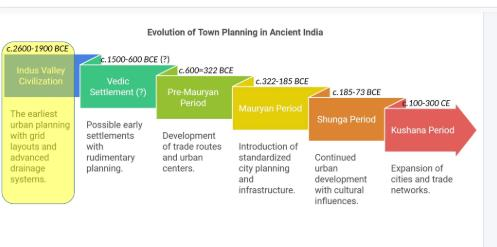

<!-- page 2 -->

VIJAY KUMAR, GEC During the Mughal period (1526-1800CE) the growth of capital cities, building of forts, large residences and buildings, palaces and mosques became essential features of cities like Agra, Delhi, Sikandra, Shahjahanabad in the north and Hyderabad and Ahmedabad furtherSouth. Urban Planning under British Rule in India During the colonial era, up to the early 20th century, cities were consciously laid out for 4 military and political dominance.The concerns of public health and sanitation, spatial and social segregation, colonial dominance, and control were the underlying ideas of colonial planning in India TOWN PLANNING SYSTEM OF INDUS VALLEY CIVILIZATION The Indus Valley Civilisation, also known as the Harappan Civilisation Indus Valley Civilisation also referred to as Harappan civilization and Saraswati Sindhu Civilization. It was situated between Indus River and the Ghaggar - Hakra River ( Pakistan and North Western India). Mohenjodaro was one of the major settlements in this area The origins of urban planning in India can be traced to the planned towns of Mohenjodaro and Harappa belonging to the Indus Valley Civilisation as early as 2500 BC(Ramachandran 1989). Cities and towns werealso built around forts and centres of trade and commerceat various periods in the history of India. Archaeological Survey of India has documented town planning structure dating back to 2600 BCE. Sindhu-Saraswathi.  main cities were  Harappa (Punjab, Pakistan), Mohenjo-Daro (Sindh, Pakistan), Dholavira, Lothal, and Surkotada (Gujarat, India), Kalibangan and Banawali (Rajasthan, India), and Rakhigarhi (Haryana, India) are the major cities in the Harappan period. KEY ASPECTS OF ANCIENT TOWN PLANNING/ IN INDUS VALLEY CIVILISATION 1. Strategic Site Selection: Town placement considered factors like water bodies, wind orientation, and topography to ensure sanitary conditions and climate advantage. 2. Grid-Pattern Layouts: Cities were meticulously laid out with streets intersecting at right angles, forming blocks. Streets were laid out in a straight line, intersecting at right angles (north-south and east-west), dividing the city into well-defined rectangular or square blocks. 3. Division of the City (Zoning): Cities were generally divided into two main parts: an elevated Citadel (or Acropolis) for public buildings, granaries, and the ruling class, and a Lower Town for residential and commercial purposes 4. Zoning and Allocation: Cities were often zoned, with specific areas allocated for markets, religious institutions, and residential quarters, sometimes based on social classes or professions. 5. Organized Residential Areas: Houses were arranged in an orderly manner, with distinct quarters for different social groups or professions. 6. Public Buildings and Facilities: Public baths, wells for communal water supply, markets, and temples were integral parts of the planned city 7. Water Management: Planning included well-structured water supply systems, with wells and sometimes public baths for managing water resources for residents 8. Advanced Drainage and Sanitation: Early civilizations developed systems to drain wastewater from houses into covered street drains, connected to soak pits to maintain hygiene and cleanliness. 9. Public Halls: Assembly halls (Sabha) were crucial components for community gatherings and events, as described in texts like the Vastu-shastra texts. 10. Granaries: Large granaries were essential for storing food, ensuring the city's food security. 11. Construction Materials: Uniformly sized, baked bricks were commonly used for building walls, streets, and drainage systems. 12. Fortifications: Cities were often fortified with protective moats or walls to enhance security against floods and other threats. 13. Moats: Some plans included moats around the city walls for added defense.

**Table 1 (page 2):**

| Post-independence period: (after 1947) •after independence, jawaharlalnehru was appointed as the first prime minister of india. |
| --- |
| he invited le corbusier to visit india and develop cities |

**Table 2 (page 2):**

|  |  |  |
| --- | --- | --- |
|  | 2 |  |
|  |  |  |

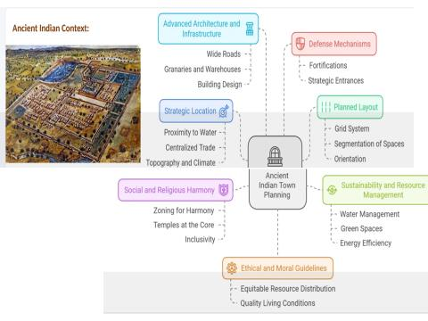

<!-- page 3 -->

VIJAY KUMAR, GEC TOWN PLANNING IN HARAPPA 1. WELL PLANNED TOWNS ;-Main and smaller streets – cut at right angleMain streets – parallelStraight and wide (about 30 feet) roadsCurved corners – easy passage for cartsPaved with baked bricks 2. BUILDINGS Skillful builders Dwelling houses – houses along street side.Public buildings – Great Granary, Great Bath, Assembly Hall 3. DWELLING HOUSES large blocks street side double - storeyed flat roofs. different sizes palaces to two room houses very good quality bricks (4,500 bricks)Courtyard surrounded by rooms, a bathroom, a kitchen, a well, narrow staircase = a house 4. PUBLIC BUILDINGS The Great Granarya large building to store surplus food grains ,2 rows of 6 granaries, close to the river bank – water transportation of grains.circular brick platforms – threshing grain, furnaces – metal workers – produced a variety of objects 5. PUBLIC BUILDINGS The Great Bath ;- Mohenjodaro  large swimming pool,six entrances,central bathing pool,galleries,dressing rooms, flights of steps to its bottom, burnt bricks ,watertight – bitumen lining, well – source of water  drainage,ceremonial bath 6. THE ASSEMBLY HALL  Mohenjodaro pillared hall thick walls 20 pillars – burnt/baked bricksfor an assembly/prayer or just a palace 7. GRID LAYOUT:Streets were laid out in a precise grid pattern, with roads intersecting at right angles, dividing the city into distinct blocks. 8. DRAINAGE SYSTEM:An intricate network of underground drains, connected to individual houses, ran along the streets, demonstrating a sophisticated waste management system. 9. BRICK CONSTRUCTION :Buildings were primarily constructed using standardized baked bricks, indicating a high level of planning and construction techniques. 10. CITADEL AND LOWER TOWN:Many Harappan cities, including Harappa, were divided into a fortified citadel, likely the administrative center, and a lower town for residential purposes. 11. WELL-PLANNED STREETS:Wide main streets were intersected by smaller lanes, facilitating movement within the city. 12. Fortification Wall: • Defended important Early Harappan towns. examples in Rehman Dehri Tarakai Oda Kohtras. etc • Served defensive purposes for protection and strength 13. Gateways: • Cities had one or more gateways. some plain. some with unique significance • Varied design elements showcased the diversity of Harappan urban planning 14. Lothal Dockyard: • Identified as a tidal dock evidence of extensive trade with other civilizations • Connected Harappan cities to ancient courses of rivers for trade TOWN PLANNING IN MOHENJODARO

**Table 1 (page 3):**

|  |  |  |
| --- | --- | --- |
|  | 3 |  |
|  |  |  |

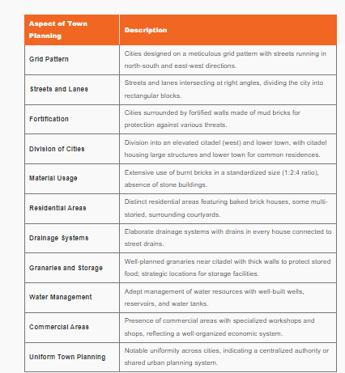

<!-- page 4 -->

VIJAY KUMAR, GEC 1. Mohenjo-daro, is an ancient planned city laid out on a grid of streets. An orthogonal street layout was oriented toward the north-south & east-east directions: the widest streets run north-south, straight through town; secondary streets run east- west, sometimes in a staggered direction. Secondary streets are about half the width of the main streets; smaller alleys are a third to a quarter of the width of the main streets 2. Mohenjodaro - City Layout and Organization Mohenjodaro city was built on a high platform which also followed the well-planned layout. It covered almost 250 acres. The Mohenjodaro city was divided into two parts including the citadel and the lower city. The citadel was located on the west side of the main city. The citadel was an area that had all important buildings like a great bath, assembly hall, and great granary. Lower Town was a large area that was the main residential area. There were so many marketplaces and workshops. It was a major commercial place also. The lower city was surrounded by a big and high wall that protected the lower city from any invasion. There were multiple gateways found in the wall which were mainly used for entry and exit purposes. 3. Mohenjodaro - Street Planning The Street Planning of the city was in a grid pattern. It formed a well defined structure, those were straight and narrow. The main streets were more wide and lanes were present there. 4. Mohenjodaro - Drainage System Mohenjodaro's Drainage System was an incredible feature. The drains were made of baked bricks which had a flat base. These drains were built around 50 cm below the road. The waste water was managed by the pipelines that were connected to the chutes. These drains were covered which is the prove of the advanced sanitation system It is a fact that these drains are still in work. 5. Mohenjodaro - Residential Planning All houses in the city were built with baked bricks. All houses followed the same unique style of architecture. These houses were multi-storeyed those had flat roofs. They built up in a systematic way and each house was separated by the narrow lanes. Most of the houses had their private well and own bathrooms. 6. Mohenjodaro - Public Buildings and Amenities There were so many public buildings present in the city of Mohenjodaro. The Great Bath was a major public structure. It had a large tank that was made of bricks. It was sealed with the waterproof facilities. The Great Bat was used as the communal swimming pool and sometimes used for rituals. The Great Granary was constructed for food storage and food distribution. There was an Assembly Hall that was important for the different administrative and religious activities. TOWN PLANNING IN MAURYAN PERIOD Of various scriptures from ancient times in India, the Kautilya’s Arthashastra is one which elaborates on town planning

**Table 1 (page 4):**

|  |  |  |
| --- | --- | --- |
|  | 4 |  |
|  |  |  |

<!-- page 5 -->

VIJAY KUMAR, GEC In a capital, the city was of geometrical form. Normally square so as to allow its layout to confirm to the cosmological principles of urban planning It was surrounded by a series of moats fed by a perennial source of water containing crocodiles An earthen rampart surrounded by brick built parapets and towers On each side it is recommended that 3 gates shall be located Three royal roads to run east-west and three roads north-south dividing the interior of city into 16 wards The kings palace is situated in two north-central wards Around it the houses of four castes: 1.  North – Brahman, 2.  South – Vaishya, 3. East – Kshatriya, 4.  West - Sudra In the northern, area as well as the homes of Brahmans were to be located the residences of ministers to the crown, the royal tutelary deity of the city, tanks, monasteries, ironsmiths and jewellers. In the eastern area were to be located the elephant stables, store houses, the royal kitchen, expert artisans, troops and the: treasury. •To the south the substantial houses of merchants, warehouses and workshops, restaurants, timberyards, stables, and the arsenal were to be located; while in the west as well as the houses of the lower classes there were to be various groups of artisans working on textiles, skins, mats, weapons and other goods required by the court and other inhabitants of the city. Around the central crossroads of the city temples to various gods were to be built and commemorative pillars erected to successive kings. Between the houses and the defensive rampart a road encircles the city, to facilitate movements of troops, chariots etc., and temples of guardian deities were to- be located at each corner of the built-up area. The city as described thus functioned primarily as an administrative centre, with most of its activities centred on the needs of the royal palace, the court, the priests, the army and the considerable bureaucracy with which the king surrounded himself. Cities should be square in structure. They should have six main towns, divided by six main roads. Three roads should go from east to west, remaining three from north to south. Similarly, as we sec in my civilization, different parts arc made on the basis of different occupations of the people. Temples should be built in the middle of the

**Table 1 (page 5):**

|  |  |  |
| --- | --- | --- |
|  | 5 |  |
|  |  |  |

<!-- page 6 -->

VIJAY KUMAR, GEC ANCIENT TOWN CLASSIFICATION 1. Dandaka: A rectangular or square town with a grid of parallel streets intersecting at right angles. 2. Nandyavarta: An oblong or square town with parallel streets radiating from a central point, creating a swirling design. 3. Sarvatobhadra: A large square town with a central temple and a layout that is accessible from all sides. 4. Swastika: A design based on the Swastika symbol, with roads and streets arranged in a crossing pattern. 5. Prastara: A square or rectangular layout divided into different sized sections. 6. Padmaka: A circular or polygonal town with concentric streets, resembling a lotus. 7. Karmuka: A semi-circular layout, often used for towns located along a coastline. 8. Chaturmukha: A square or rectangular layout divided into four sections by s i) Dandaka Dandaka is a Sanskrit term refers to a type of town plan shape like staff or rod Town plan provided for formation of small town and village two gates and generally adopted for streets are straight and cross each other at right angles at the center Village has 4 gates on four sides Village was rectangular / square Width of the street varies from one - five danda , approximately 192 cm 2 transverse street at the extremities have single row of houses The village offices located in the east. The female deity/ chamadevata - located outside the village and the male deities in the northern portion Town offices and panchyats are located in the eastern portion of the town. This type of town is considered auspicious for brahmins. it may contain 12,24,50,108,or 300 Brahmin families This type of town plan generally adopted for small  towns and villages

**Table 1 (page 6):**

|  |  |  |
| --- | --- | --- |
|  | 6 |  |
|  |  |  |

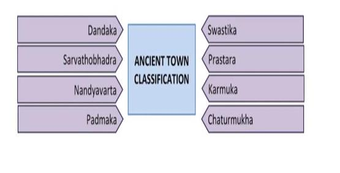

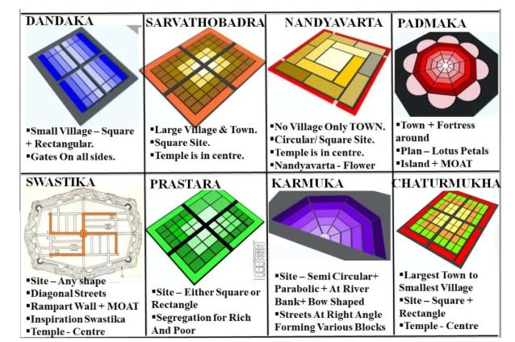

<!-- page 7 -->

VIJAY KUMAR, GEC ii) Sarvathobadra Sarvatobhadra is Sanskrit term refers to a town plan shape like an umbrella.  Literally means bliss(complete happiness ) full for all. In ancient Indian town planning, the umbrella shape symbolized protection and shelter. The Sanratobadra town plan was characterized by Its circular shape and radiating streets. which provided a sense of harmony and balance to the built environment. This type of plan was often used in the design of religious and spiritual structures. such as temples and ashrams. where people sought refuge and peace. The circular shape of the Sarvalobadra plan was also believed to promote positive energy and to enhance the functionality of the structures This type of town plan is applicable to larger villages and towns, which have to be constructed on a square sites. The whole town should fully be occupied with HOUSES of various descriptions that should be inhabited by all classes of people. According to this plan, the whole town should be fully occupied by houses of various descriptions and inhabited by all classes of people. The temple dominates the village iii) Nandyavarta Nandyavarta is a Sanskrit term that refers to a type of town plan that is circular with a central square and streets radiating outwards. This type of town plan was commonly used in ancient India. particularly in the design of cities and  large settlements. The circular shape of the Nandyavarta town plan symbolized unity and completeness, while the central square served as a gathering place for the community. Mainly used for construction of TOWNS and not villages. Adopted for sites which are either circular or square in shape with 3000- 4000 houses. The streets run parallel to the central adjoining streets with the temple of the presiding deity in the center of the town. Temple of the presiding deity at the center of the town. This name is derived from a flower, the form of which is followed in this layout.

**Table 1 (page 7):**

|  |  |  |
| --- | --- | --- |
|  | 7 |  |
|  |  |  |

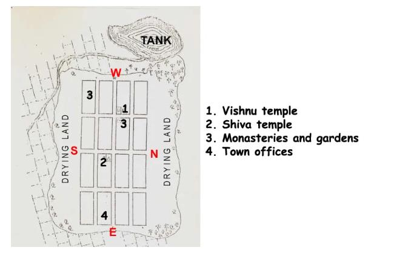

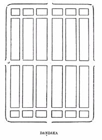

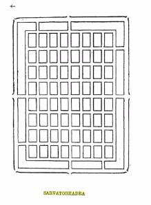

<!-- page 8 -->

VIJAY KUMAR, GEC iv) Padmaka (Lotus Petals) Padmaka is a Sanskrit term that refers to a type of town plan shaped like a lotus flower. Pattern of the PLAN resembles petals of lotus radiating outwards from the center In ancient Indian town planning, the lotus flower was a symbol of purity, enlightenment, and beauty. The Padmaka town plan was characterized by its circular shape, with streets radiating outwards in a petal-like pattern. This type of plan was often used in the design of religious and Spiritual This type of plan was practiced for building of the TOWNS with fortress all around. .The city used to be an island surrounded by water. No scope for expansion. v) Swastika Swastika is an ancient Hindu symbol that is widely used in Hindu architecture and town planning. The word “swastika” comes from the Sanskrit word “svastika,” which means “good fortune” or “well-being.” The symbol consists of four arms that are bent at rignt angles. arranged in a cross-like pattern. The arms are typically of equal length and can be arranged clockwise or counterclockwise. Based on mystic figure swastika. There are two streets passing through center. Traversing streets are planted in clock wise direction. Ramparts defend the village and a ditch is to enclose these rampart. There are eight gates . Kings palace should be erected in the four cardinal direction, in the cell of aryama or others. Temple at the center Swastika type of plan contemplates some diagonal streets dividing the site into certain rectangular plots. The site need not be marked out into a square or rectangle and it may be of any shape. A rampart wall surrounds the town, with a moat at its foot filled with water. Two main streets cross each other at the center, running south to north and west to east This type of plan contemplates some diagonal streets dividing the site into certain triangular plots. The site may be of any shape. The town is surrounded by a rampart wall. with a MOAT at its foot. Two main streets cross each other at the center running north to south and west to east.

**Table 1 (page 8):**

|  |  |  |
| --- | --- | --- |
|  | 8 |  |
|  |  |  |

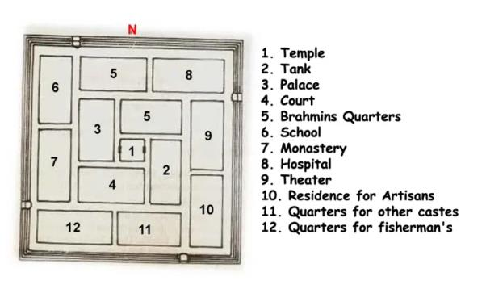

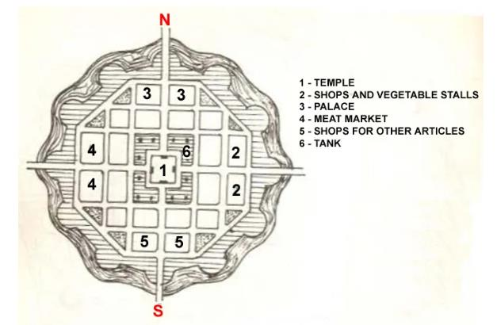

<!-- page 9 -->

VIJAY KUMAR, GEC vi) Prastara Prastara is a Sanskrit term that refers to the arrangement of tiles or stones used in the construction of floors or pavements. In ancient Indian architecture and town planning, the prastara was an important decorative element that was used to create intricate and beautiful patterns on the floors of buildings. « The characteristic feature of this plan is that the site may be either square or rectangular but not triangular or circular. « The sites are set apart or the very rich, rich, middle class and poor. « The size of the site increases according to the capacity of each to purchase or build upon. « The main roads are much wider when compared to those of other patterns. « The town may or may not be surrounded by a fort. vii) Karmuka This refers to a town plan that is shaped like a bow. This plan is suitable for the place where the site of the town is in the form of a bow or semi-circular or parabolic and mostly applied for towns located at sea shores or riverbanks. « The main streets of the town run from north to south or east to west and the cross streets run at right angles to them. This divides the whole area into BLOCKS. « Female deity (the presiding deity) is installed in the temple built in any convenient place. viii) Chaturmukha Chaturmukha is a Sanskrit term that refers to a building or structure that has four faces or entrances. In ancient Indian town planning and architecture. Chaturmukha structures were used for a variety of purposes, including as temples, gateways, and other religious or secular buildings. The four faces of a Chaturmukha structure symbolized the four cardinal directions. and were believed to provide protection and access to the building. This is applicable to all types of towns (from the largest town to the smallest village). The site may be either square or rectangular having four faces.

**Table 1 (page 9):**

|  |  |  |
| --- | --- | --- |
|  | 9 |  |
|  |  |  |

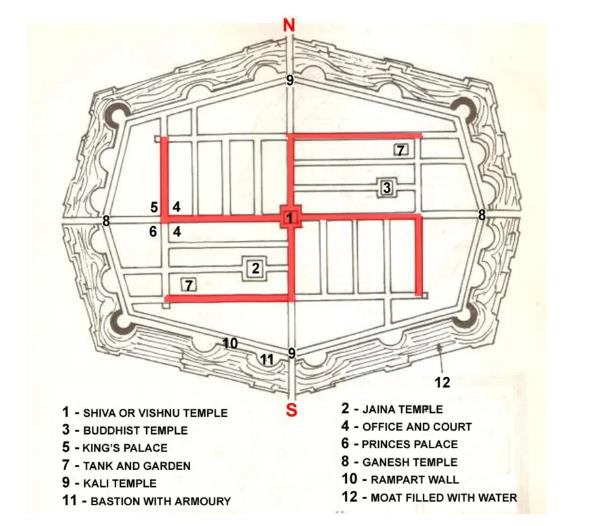

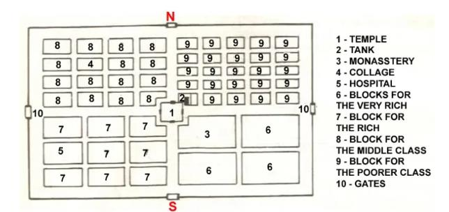

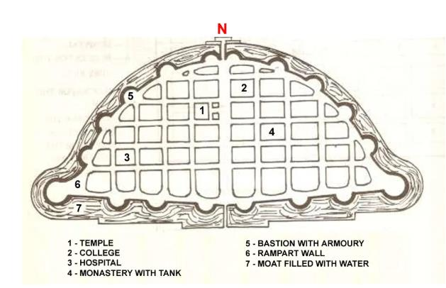

<!-- page 10 -->

VIJAY KUMAR, GEC The town is laid out east to west lengthwise with four main streets. The temple of the presiding deity is always at the center. ANCIENT INDIAN ARCHITECTURE Architech Derived from the Latin word ‘tekton’ which means the builder Refers to construction and designing of buildings Ancient Indian Architecture dates back to the Indian Bronze Age until about 800 CE. By the time India reached this point, Buddhism had significantly diminished, Hinduism had predominated, and religious and secular architecture styles had developed, with significant regional variations. The Indus Valley Civilization saw the emergence of its first cities during the Bronze Age. Northern Black Polished Ware and the construction of walled settlements signaled the beginning of urbanization in the Gangetic plains as early as 1200 BC. The use of stone in Indian architecture and the circulation of Indian currency were characteristics of the Mahajanapada era. The Mauryan era is regarded as the start of India’s classical building era 1. Ancient Indian architecture is divided into five major sub-parts: 2. Harappan Art and Architecture 3. Mauryan Art and Architecture 4. Post Mauryan Architecture 5. Gupta Architecture 6. South Indian Architecture Ancient Indian architecture is defined by several unique features: Symbolism and ornamentation: Designs are imbued with deep spiritual significance, representing cosmic order and religious themes. Structures are adorned with elaborate carvings, sculptures, and painted motifs depicting gods, mythological stories, and daily life. Mathematical precision: Ancient texts like the Vastu Shastra provided detailed architectural guidelines for harmonious proportions and spatial layouts, often based on complex mathematical and geometric principles. Climate responsiveness: Traditional buildings incorporated features to adapt to India's climate, such as thick walls for insulation, courtyards for natural ventilation, and jharokhas (overhanging balconies) for shade. Influence of religion: The architecture is deeply shaped by the religious beliefs of Hinduism, Buddhism, and Jainism. The distinct structural forms of stupas, viharas, and temples all served a religious purpose. Local materials: Construction primarily used locally available materials like mud, wood, brick, sandstone, and granite, leading to significant regional variations in style. Major styles and periods Indus Valley Civilization (c. 3300–1300 BCE) This period established a foundation for Indian urban planning.

**Table 1 (page 10):**

|  |  |  |
| --- | --- | --- |
|  | 10 |  |
|  |  |  |

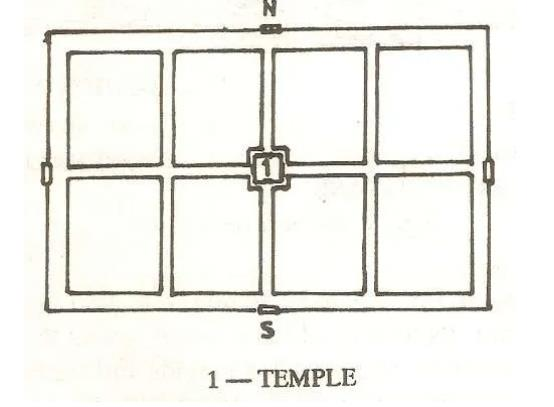

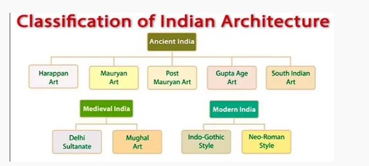

<!-- page 11 -->

VIJAY KUMAR, GEC Key features: Cities like Mohenjo-Daro and Harappa were laid out in a grid pattern with standardized baked bricks, advanced drainage systems, and public baths. Notable example: The Great Bath at Mohenjo-Daro, featuring an advanced water system. Mauryan Period (c. 322–185 BCE) During this era, under Emperor Ashoka, stone became a prominent material, and religious structures flourished. Key features: Construction of rock-cut caves, monolithic stone pillars with edicts (Ashoka Pillars), and large stupas. Notable example: The Great Stupa at Sanchi, originally commissioned by Ashoka, and the rock-cut Barabar Caves. Rock-cut architecture (c. 3rd century BCE onwards) This unique style involved carving structures directly out of solid rock, showcasing remarkable craftsmanship. Key features: Cave complexes were used as residences (viharas) and prayer halls (chaityas) by Buddhist, Hindu, and Jain monks. Notable examples: The Ajanta and Ellora Caves feature intricate murals and sculptures, while the monolithic Kailasa Temple at Ellora was carved from a single rock. Temple architecture (c. 4th–12th centuries CE) During the Gupta and medieval periods, distinct temple architecture styles emerged, codified in texts like the Shilpa Shastras. Nagara style (North Indian): Key features: Characterized by a curvilinear tower (shikhara) over the sanctuary (garbhagriha). Notable example: Kandariya Mahadeva Temple in Khajuraho. Dravida style (South Indian): Key features: Defined by towering gateway structures (gopurams) and a pyramidal, multi-tiered tower (vimana). Notable example: Brihadeeswarar Temple in Thanjavur and the Shore Temple at Mahabalipuram. Vesara style (Mixed): Key features: A hybrid of Nagara and Dravida traditions, with features from both. It flourished under the Chalukya and Hoysala dynasties in the Deccan region. Notable example: Hoysaleswara Temple at Halebidu TEMPLE ARCHITECTURE Historically, temples in India served as centres of worship, spiritual practice, and community gatherings. Initially, they were built as simple structures and later evolved into more elaborate and intricate architectural marvels The architectural principles of temples in India are described in ShilpaShastras and Vastu Sastras. While sandstone is the commonest building material, a grey to black basalt can be seen in some of the tenth to twelveth century temple sculptures Rich in art and architecture, temples became bastions of cultural preservation. Sculptures, paintings, and literature flourished within their walls, reflecting the cultural ethos of the times. The temple architecture has evolved over the ages and the style changes along with the changing dynasties and region. While the architecture of Hindu temples varies from region to region, the major components of a temple remain constant literally means ‘womb-house’ and is a cave like sanctumGarbhagriha is made to

**Table 1 (page 11):**

|  |  |
| --- | --- |
| Garbhagriha | • literally means ‘womb-house’ and is a cave like sanctumGarbhagriha is made to house the main icon (main deity) |
|  |  |

**Table 2 (page 11):**

| • literally means ‘womb-house’ and is a cave like sanctumGarbhagriha is made to |
| --- |
| house the main icon (main deity) |

**Table 3 (page 11):**

|  |  |  |
| --- | --- | --- |
|  | 11 |  |
|  |  |  |

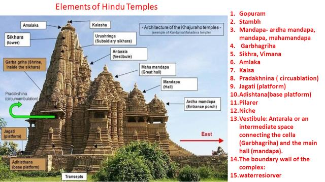

<!-- page 12 -->

VIJAY KUMAR, GEC It is the entrance to the temple May be a portico or colonnaded (series of columns placed at regular intervals) hall Some temples have multiple mandapas in different sizes named as  Ardhamandapa, Shikhara They are mountain like spire of a free standing temple Shikhara is found in North Indian temples and Vimana is found in South Indian Shikhara has a curving shape while vimana has a pyramidal like structure CLASSIFICATION OF INDIAN TEMPLE ARCHITECT There are three broad styles of Indian temple architecture: 1. Nagara (northern style), 2. Vesara (mixed style), and 3. Dravida (southern style). Nagara Nagara School of Architecture Style of temple architecture that became popular in northern India Nagara, or North Indian, temple architecture originated in northern India in the 5th century AD during the Gupta period. Prominent features → Shikaras (Spiral roofs), Garbhagriha (sanctum) & Mandap (pillared hall) The three main distinctive features of Nagar style is Shikhara (Curvilinear tower), Garbhagriha (Sanctum Sanctorum), Mandapa (Entrance Hall) The garbhagriha is always located directly under the tallest tower. In Nagara style, it is common for an entire temple to be built on a stone platform with steps leading up to it. It's characterized by tall, pyramidal towers called shikharas, which are topped by a bulbous finial called a kalasha.

**Table 1 (page 12):**

|  |  |  |  |  |  |
| --- | --- | --- | --- | --- | --- |
| Mandapa |  |  | • It is the entrance to the temple • May be a portico or colonnaded (series of columns placed at regular intervals) hall that incorporate space for a large number of worshipers • Some temples have multiple mandapas in different sizes named as Ardhamandapa, Mandapa and Mahamandapa |  |  |
|  |  |  |  |  |  |
|  |  |  |  |  |  |
| Shikhara or Vimana |  |  |  | • They are mountain like spire of a free standing temple |  |
|  |  |  |  | • Shikhara is found in North Indian temples and Vimana is found in South Indian |  |
|  |  |  |  | temples |  |
|  |  |  |  | • Shikhara has a curving shape while vimana has a pyramidal like structure |  |
|  |  |  |  |  |  |
|  |  |  |  |  |  |
|  | Amalaka |  |  | a stone disc like structure at the top of the temple shikara |  |
|  |  |  |  |  |  |
|  |  |  |  |  |  |
|  | Kalasha |  |  | topmost point of the temple above Amalaka |  |
|  |  |  |  |  |  |
|  |  |  |  |  |  |
| Antarala (vestibule) |  |  | a transition area between the Garbhagriha and the temple’s main hall (mandapa) |  |  |
|  |  |  |  |  |  |
|  |  |  |  |  |  |
|  | Jagatia |  |  | raised platform for sitting and praying |  |
|  |  |  |  |  |  |
|  |  |  |  |  |  |
|  | Vahana |  |  | vehicle of the temple’s main deity along with a standard pillar or Dhvaj |  |
|  |  |  |  |  |  |

**Table 2 (page 12):**

| • It is the entrance to the temple |
| --- |
| • May be a portico or colonnaded (series of columns placed at regular intervals) hall |
| that incorporate space for a large number of worshipers |
| • Some temples have multiple mandapas in different sizes named as Ardhamandapa, |
| Mandapa and Mahamandapa |

**Table 3 (page 12):**

| Shikhara or |
| --- |
| Vimana |

**Table 4 (page 12):**

|  |  |  |
| --- | --- | --- |
|  | 12 |  |
|  |  |  |

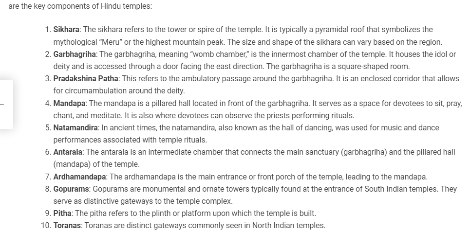

<!-- page 13 -->

VIJAY KUMAR, GEC does not usually have elaborate boundary walls or gateways. style also includes intricate carvings and a curved profile that reflect Hindu cosmology and religious symbolism Thus the two major characteristics of this style are the cruciform ground plan and the curvilinear tower subdivisions of Nagara temples depending on the shape of the shikhara Rekha-Prasadatype or Latinatype This type of temple has square shikhara at the base and its walls curve slowly inward towards the top. They are mainly used to house the main garbhagriha. Phamsana type – Phamsana buildings tend to be broader and shorter than Latina ones. Their roofs are composed of several slabs that gently rise to a single point over the centre of the building, unlike the Latina ones which look like sharply rising tall towers. Phamsana roofs do not curve inward. Instead, they slope upwards on a straight incline. Phamsana design is used for the mandapas. Valabhi type – These are rectangular buildings with a roof that rises into a vaulted chamber. The edge of this vaulted chamber is rounded, like the bamboo or wooden wagons that would have been drawn by bullocks in ancient times. They are usually called wagon vaulted buildings . Dravida (southern style). The temple is enclosed within a compound wall. Gopuram: The entrance gateway in the centre of the front wall. Vimana: The shape of the main temple tower. It is a stepped pyramid that rises up geometrically (unlike the Nagara style Shikhara that is curving). In the Dravida style, shikhara is the word used for the crowning element at the top of the temple (which is shaped like a stupika or octagonal cupola). At the entrance to the garbhagriha, there would be sculptures of fierce dvarapalas guarding the temple. Unlike Nagara style, at some of the most sacred temples in South India, the main temple in which the garbhagriha is situated has, in fact, one of the smallest towers. Generally, there is a temple tank within the compound. Subsidiary shrines could be found wither within the main tower or beside the main tower. Vimana: A stepped pyramid that rises geometrically over the sanctuary Gopuram: A large gateway or entrance to the temple compound Garbhagriha: A square inner sanctum where the deity is worshipped Compound wall: A large wall that encloses the temple Water tank: A tank within the temple compound Dvarapalas: Sculptures of fierce guardian deities at the entrance to the garbhagriha It is characterized by: its use of granite, its intricate carvings, and its towering gopurams (gateway towers). There are 5 subtypes of Dravida Architecture temples. Kuta or Caturasra: square-shaped Shala or Ayatasra: rectangular-shaped Gaja-prishta or vrittayata or elephant-backed: elliptical Vritta: circular Ashtasra: octagonal

**Table 1 (page 13):**

|  |  |  |
| --- | --- | --- |
|  | 13 |  |
|  |  |  |

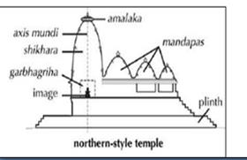

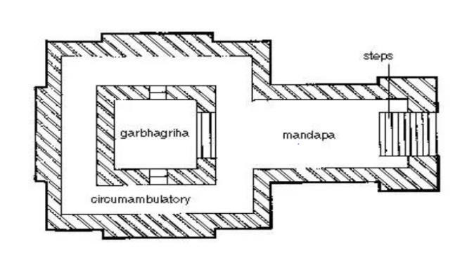

<!-- page 14 -->

VIJAY KUMAR, GEC Vesara Style of Architecture Vesara" refers to a hybrid style of Indian temple architecture that combines elements from both the Nagara (North Indian) and Dravida (South Indian) styles, essentially creating a mixed architectural style most prominent in the Deccan region, particularly in the state of Karnataka; it is often described as a "fusion" or "hybridized" style, showcasing a blend of features from both traditions. Origin: This style is believed to have developed in the Karnataka region, primarily under the patronage of the Chalukya and Hoysala dynasties. Features: Vesara temples incorporate elements like the Dravidian plan with the Nagara style of shikhara (tower), creating a unique visual blend. One of the most important features of Vesara architecture is that they have Nagara architectural style Shikara and Dravida architectural style Mandaps. Antarala (Connecting Passage): A narrow Antarala (vestibule) connects the Shikhara and Mandapa, forming a seamless transition between the two architectural components. Absence of Ambulatory Passageways: Unlike other styles, Vesara temples often lack circumambulatory pathways around the garbhagriha (sanctum sanctorum). Detailed Ornamentation:Intricate carvings on pillars, walls, and ceilings depicting mythological stories, floral patterns, geometric designs, and depictions of daily life. Sculptures highlight deities, celestial beings, and dancers, showcasing remarkable craftsmanship. Multi-Tiered Structure: Temples have multi-tiered vimanas, blending verticality and horizontal proportions for visual harmony. Stellate or Star-Shaped Plan: Many temples, especially those built by the Hoysalas, feature a star-shaped ground plan for aesthetic appeal and structural complexity. Material Usage: Primarily constructed using soapstone and sandstone allowed for fine detailing and intricate sculptures. Decorative Doorways:Elaborate carvings adorn the temple entrances, often flanked by dwarapalas (door guardians). Multiple Shrines (Trikutachala Layout): Some temples feature multiple shrines with a common Mandapa, a hallmark of the Vesara style. Low Plinths with Carvings: Temples are built on low platforms (jagati) adorned with friezes depicting scenes from epics like the Mahabharata and Ramayana. Use of Sculpted Pillars: Pillars inside the Mandapa are heavily ornamented, often featuring lathe-turned designs, making them both functional and decorative. Focus on Symmetry and Proportions: The temples emphasize balance between horizontal and vertical elements, achieving a harmonious visual appe

**Table 1 (page 14):**

|  |  |  |
| --- | --- | --- |
|  | 14 |  |
|  |  |  |

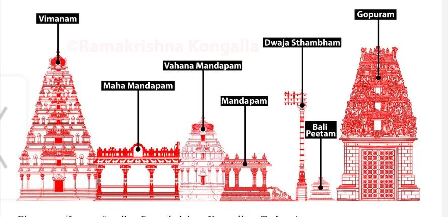

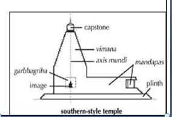

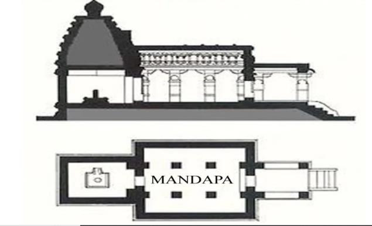

<!-- page 15 -->

VIJAY KUMAR, GEC VASTU SHASTRA The term is derived from Sanskrit words Vastu (shelter or house) and Shastra (science, doctrine, or teaching). Vastu Sastra; The word Vastu is derived from “VAS” that is “to reside” Sastra sacred scripture. Vastu: Means "shelter" or "house" Shastra: Means "science", "doctrine", or "teaching The foundational texts of Vastu Shastra are traditionally attributed to the divine architect Vishwakarma and the mythical sage Maya Muni. Vastu Shastra is an ancient Indian system of architecture that aims to create harmonious living spaces. Vastu Shastra is an ancient Indian science of harmony and prosperous living by eliminating negative and enhancing positive energies around us. It's based on the idea of combining the five elements of nature earth, water, fire, air, and space or aether to create a pleasant environment What are the goals of Vastu Shastra? 1. To create and attract positive cosmic energy 2. To enhance well-being and prosperity 3. To block negative energies 4. To invite prosperity and fortune 5. To boost health and wealth 6. To stabilize relationships 7. To increase job and business opportunities History /Origin of Vastu Shastra The origin of Vastu Shastra evolved during Vedic times in India. Vastu Shashtra developed between 6000 BCE to 3000 BCE. Origin -in 4000 B.C.-Indus Civilisation is proof of it

**Table 1 (page 15):**

|  |  |  |
| --- | --- | --- |
|  | 15 |  |
|  |  |  |

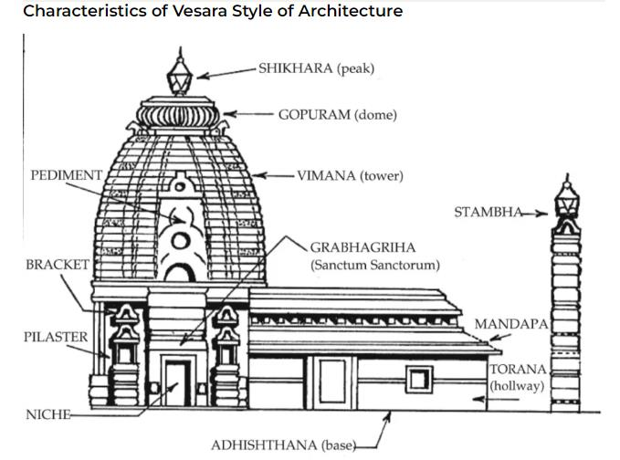

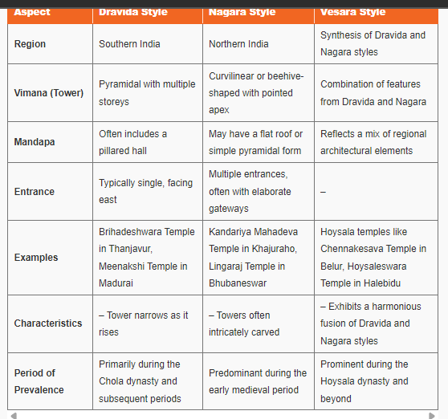

<!-- page 16 -->

VIJAY KUMAR, GEC The mention of Vastu Shastra can be found in ancient scriptures like RIGVEDA, ATHARVAVEDA, RAMAYANA,MAHABHARATA, The art of Vastu originates in Sthapatyaveda, a part of the Atharvaveda, which emerged as a system of knowledge involving the connection between man and his buildings – in other words – architecture. Here, Vastu Shastra arises to teach the art of living, designing building in harmony with nature and stimulating positive energy. Sthapatya Veda could be the theory while Vaastu Shastra is the application of this knowledge, the “science of architecture”. first used by Indian maharajas and later on it spread in whole world. Its concepts transfers to Tibet, China and Japan where it provided the base for development of what is now called FENG SHUI. Component / Elements of Vaastu Shastra: Vastu Shastra is based on the five essential elements – 1. Prithvi (earth), 2. Agni (fire), 3. Tej (light), 4. Vayu (wind) and 5. Akash (ether), which are known as panchabhutas. The whole universe including the earth and the human body is considered to be made out of these five elements that affect the cosmic forces and the forms of energies Light or Agni – Enough natural light to live comfortably (essential to create energy.) Vayu, or air– is continuously ventilated throughout the house (essential to sustain energy.) Water or Jal– For hydration and survival (essential for life.) Earth or Prithvi– Our inside organs are impacted by the magnetism of the Earth’s poles. Aakash. Energy is drawn from space, Basic Principles of Vaastu Since the whole universe is a composition of five basic elements: Fire, Air, Space, Earth and Water. Through these, our body receives Internal Energies in the form of Proteins, Carbohydrates, Fats etc. and External Energies in the form of Heat, Light, Sound, Wind and so on . The basic principles of Vaastu enables us to achieve balance among these ; giving more flexibility of body & mind for a better life . When the harmony between these elements gets disturbed our energies get dissipated in different directions leading to stress, tension and ill health and our peace of mind is destroyed. We then have to redirect our Energies subjectively as well objectively , so as to achieve an equilibrium between Internal / External Energies, to attain a healthy body and a happy mind leading to health, wealth, happiness, prosperity and success . The principles of Vastu Shastra include: 1. Orientation: The direction a building faces is important, with east being considered ideal for the entrance. 2. Shape: Rooms should be square or rectangular.

**Table 1 (page 16):**

|  |  |  |
| --- | --- | --- |
|  | 16 |  |
|  |  |  |

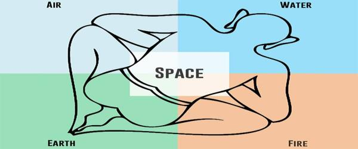

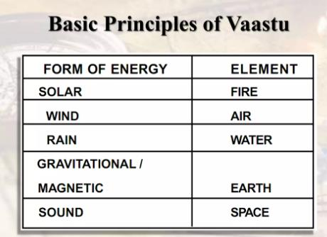

<!-- page 17 -->

VIJAY KUMAR, GEC 3. Lighting: Rooms should be well-lit and bright. 4. Colors: Light and neutral colors are believed to promote a feeling of calm. 5. Mirrors: Mirrors should reflect light into a room, but not cluttered spaces. 6. Furniture: Heavy furniture should be placed in the southwest direction. 7. Water: Water features like fountains and aquariums should be avoided in bedrooms. 8. Dining: The dining space should be near the kitchen, not the main door. 9. Vastu Purusha Mandala: A guiding blueprint that corresponds each square of a mandala to a part of the Vastu Purush's body. 10. Directional influence: Each direction is governed by a specific Vedic deity, which influences the energy associated with that direction. TYPES OF VASTU Residential Vastu Residential Vastu or Vastu for the house aims at creating positive energy in the residential structure of a house or a building so that its occupants can experience benefits from energies like magnetic, thermal, cosmic, light and wind of the surrounding nature of the property. Commercial Vastu Commercial Vastu principles are applied in commercial properties or business properties with the sole objectives, such as –To reap profitable business gains. To engage in commercial activities like selling products or services. To manifest transparency and flow of positive energy at workplaces. It creates an aura of energetic and hardworking ambience It boosts awareness and workforce productivity. Industrial Vastu Industrial Vastu principles are applied to ensure that your factory or commercial establishments reach their maximum profitable growth by yielding considerable production with the highest quality standards. Spiritual/Religious Vastu Spiritual or religious Vastu refers to the application of Vastu principles in places, like temples, asylums, and other spiritual/educational establishments to ensure their proper wellbeing and positive growth in the long run. Muhurta Vastu Muhurta Vastu, also known as Muhurta Shastra, is an essential aspect of Vastu Shastra that focuses on identifying auspicious moments for various activities. Yantra Vastu Yantra Vastu is an ancient practice that uses mystical designs to draw prosperity, good fortune, success, protection, and good health. Yantras are diagrams that are highly regarded and venerated as representations of heavenly forces. Planning of a building according to Vaastu pre-supposes certain principles. Aspect: The manner of arrangement or peculiarity of arrangement of the doors and windows in the external walls of the building is termed as aspect. Furniture requirement: Furniture requirement: While planning a building, furniture arrangements must be shown to justify the size of a room. Roominess: Room should have all proportional dimensions. A square room has no advantage and a rectangular room of the same floor area gives a better outlook. Similarly height also plays an important role Privacy: Privacy is the screening provided for the individuals from the others. It is different from seclusion. Grouping: Grouping is the planning of two or more related rooms in proximity of each other. It minimizes the circulation and at the same time improves the comfort, privacy and convenience of the inmates of the house Sanitation: It is the provision and upkeep of the various components of a house to keep the inmates cheerful and free from disease. Flexibility: Flexibility means that a room which is planned for one function can be used for other, if so required. Elegance: Elegance is the grand appearance of a building attained mainly owing to the elevation which in turn depends on the plan. Selection of site for the building greatly affects the elegance. Economy: The building should have minimum floor area with maximum utility. It will reduce cost and hence will be economical. Practical considerations

**Table 1 (page 17):**

| 1 | Aspect: | Aspect: The manner of arrangement or peculiarity of arrangement of the doors and windows in the external walls of the building is termed as aspect. |
| --- | --- | --- |
| 2 | Prospect | Prospect: It is to enrich the outside view . |
| 3 | Furniture requirement: | Furniture requirement: While planning a building, furniture arrangements must be shown to justify the size of a room. |
| 4 | Roominess: | Roominess: Room should have all proportional dimensions. A square room has no advantage and a rectangular room of the same floor area gives a better outlook. Similarly height also plays an important role |
| 5 | Privacy: | Privacy: Privacy is the screening provided for the individuals from the others. It is different from seclusion. |
| 6 | Grouping: | Grouping: Grouping is the planning of two or more related rooms in proximity of each other. It minimizes the circulation and at the same time improves the comfort, privacy and convenience of the inmates of the house |
| 7 | Circulation: | Circulation: Circulation is the access into or out of a room. |
| 8 | Sanitation | Sanitation: It is the provision and upkeep of the various components of a house to keep the inmates cheerful and free from disease. |
| 9 | Flexibility: | Flexibility: Flexibility means that a room which is planned for one function can be used for other, if so required. |
| 10 |  | Elegance: Elegance is the grand appearance of a building attained mainly owing to the elevation which in turn depends on the plan. Selection of site for the building greatly affects the elegance. |
| 11 | Economy: | Economy: The building should have minimum floor area with maximum utility. It will reduce cost and hence will be economical. Practical considerations |

**Table 2 (page 17):**

|  |  |  |
| --- | --- | --- |
|  | 17 |  |
|  |  |  |

<!-- page 18 -->

VIJAY KUMAR, GEC

### Organised under Five Heads

TOWN PLANNING CIVIL ARCHITECTURE TEMPLE ARCHITECTURE ARTISTIC OTHERS •Site selection •Designs of towns, villages, capital city •Land use pattern (Zoning) •Palace •Houses •Forts •Public building • Theater •Library •Meeting Halls •Other public infrastructure •Temples •Components of a temple •Iconography (idol making) •Paintings •Furniture, doors •Sculptures •Qualification of a Sthapati •Choice of material (wood) •Site planning (Vastupurusa mandala) APPLICATION OF VASTUSASTRA 1. site planning 2. proportionate measurements 3. doctrine of orientation 4. planning of residential space according to directions 5. designing of building 6.  aesthetics of the building 7. to remove defect in structure 8. building such as houses, buildings, forts, bungalows, cities, and industries THE BENEFITS OF VASTU SHASTRA The potential disadvantages include: Vulnerability: The northeast is also associated with water, so a main gate in this location could potentially be more susceptible to flooding or other water-related issues, depending on the specific site conditions. Feng Shui conflicts: In some cases, the northeast gate placement may conflict with the optimal Feng Shui configuration for the overall layout and energy flow of the property. A skilled Vasthu practitioner would need to evaluate the full context. Access challenges: Depending on the property layout, placing the main entrance in the northeast may create inconvenient access or circulation issues for residents, especially if it is not the most direct route from common approach points. Difficult to apply always VASTU SHASTRA IS USED IN MODERN ARCHITECTURE Orientation:Placing the building in an optimal direction (like east or north facing) to maximize natural light and positive energy flow. Entrance Placement:Locating the main entrance in the north, east, or northeast direction, considered auspicious in Vastu. Room Placement:Placing specific rooms like the living room (northwest), master bedroom (southwest), kitchen (southeast) according to Vastu guidelines. Natural Ventilation:Designing spaces with proper air circulation to ensure fresh air throughout the building.

**Table 1 (page 18):**

|  |  |  |
| --- | --- | --- |
|  | 18 |  |
|  |  |  |

<!-- page 19 -->

VIJAY KUMAR, GEC Lighting Design:Utilizing natural light and strategically placing artificial lighting to enhance the positive energy within a space. Sustainable Materials:Incorporating eco-friendly building materials that align with Vastu's emphasis on natural elements. Landscaping and Water Features ;-The integration of nature into building designs is another aspect where Vastu Shastra in modern architecture plays a role. Water features like fountains or ponds are often incorporated into designs because water is considered a symbol of wealth and prosperity in Vastu Balancing the Five Elements;-The concept of balancing the five elements—earth, water, fire, air, and space—is central to Vastu Shastra. In modern architecture, this can be achieved through the thoughtful use of colors, materials, and designs. stress-Free Living and Working Spaces;-Vastu Shastra in Modern Architecture promotes the idea that spaces should be designed to reduce stress and enhance mental well-being. In today’s fast-paced world, stress-free living and working environments are more important than ever APPLICATION OF  VASTU SHASTRA IN DAILY PRACTICES Vastu Shastra is applied in daily life to enhance health, attract prosperity, foster peace and harmony, and boost overall energy by balancing the five elements (earth, water, fire, air, space) with natural forces and universal energies 1. ToPromotes Health: Vastu principles aim to create surroundings that support physical and mental well-being by improving energy circulation and promoting a healthy environment. 2. To Attracts Prosperity and Success: By aligning with cosmic energies, Vastu-compliant spaces are believed to invite financial stability and new opportunities, leading to success. 3. To Enhances Peace and Tranquility: Harmonizing living spaces with natural forces helps to reduce stress, anxiety, and promote a calm, positive atmosphere. 4. To Boosts Energy Levels: Proper Vastu design ensures a smooth flow of positive energy within a home or workspace, which can increase overall vitality and focus. 5. To Strengthens Relationships: A balanced Vastu environment fosters better understanding, cooperation, and stronger bonds among family members and colleagues. 6. To enhance work productivity- workspace with positive energy can significantly influence your work efficiency and focus ultimately productivity. Incorporating the wisdom of Vastu Shastra into your daily life isn’t just about tradition— 7. For Financial Growth:Aligning your home and office according to Vastu principles can attract financial prosperity and wealth. 8. To Eliminates Negativity:Following Vastu guidelines helps in removing negative energies from your surroundings, creating a positive and peaceful atmosphere. 9. For Harmony with Nature:Vastu promotes a balance between the building and natural forces, such as the sun, wind, and water, resulting in a more stable and peaceful living space. 10. Academic Growth-a harmonious, well-organized environment, aligned with specific directions and energies, can enhance a student's focus, concentration, and overall ability to learn and succeed JYOTISHA DEFINITION The movement of planets (grahas) in different houses and rashis play a very decisive role in human life. Placement of grahas in different houses of the birth chart give indications about some future events The promises reflected in a birth chart may be fulfilled only in the dasha/ antardasha of the planets showing that promise Each House is associated with a particular set of stars and a particular planet, and there is precision in their movement and hence there is a net effect on the living beings on earth The exact time of fulfilment of these promises depends on the motion of planets in different houses of the horoscope.

**Table 1 (page 19):**

|  | ultimately productivity. Incorporating the wisdom of Vastu Shastra into your daily life isn’t just about tradition— |
| --- | --- |
| it’s about creating a space that naturally supports your goals, focus, and well-being. Whether you’re working from home |  |
| or in a corporate setup, small changes like adjusting your desk position, improving natural lighting, or adding calming |  |
| colors can have a surprisingly powerful impact. These shifts help clear mental blocks, reduce stress, and ultimately make |  |
| you more productive throughout the day. |  |

**Table 2 (page 19):**

|  |  |  |
| --- | --- | --- |
|  | 19 |  |
|  |  |  |

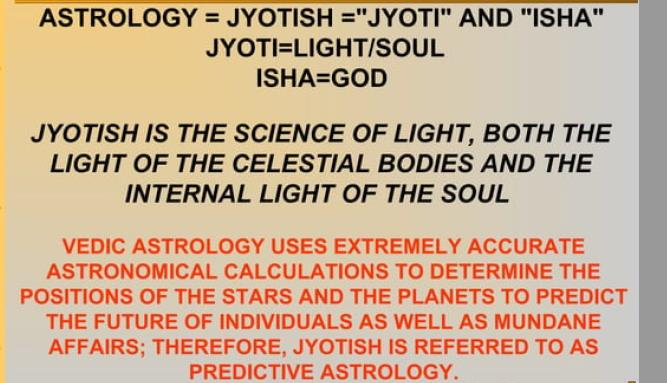

<!-- page 20 -->

VIJAY KUMAR, GEC Every being born on the surface of the earth at a given time and place have certain permanent characteristics (C’) and certain characteristics which change with time/place/people (C”). Effective Personality = C = C’+iC” We readily believe that the Dielectric Constant (E) is a complex number E’ is the real and E” is imaginary and the equation is E = E’ + iE” INDIAN ASTROLOGY Indian astrology is also known as Hindu astrology and Vedic astrology. Hindu astronomy is called Jyotisha in Sanskrit. It means the Science of Light or of celestial Objects. Indian astrology is based on the knowledge gained by ancient Indian sages and saints regarding the movements of the planets and the influences that these movements and positions have on our daily lives.  The present and future positions of the planets are compared with those of your birth chart to predict your future.  This is the basis of Indian Astrology Origin Of Indian Astrology Indian Astrology roots originate from the oldest scriptures of Hinduism, “Vedas” which is why it’s also known as Vedic astrology. Indian Astrology’s roots date back to the ancient Vedic period from 1500 BCE – 500 BCE. 1. Rigveda is the Oldest Vedic text mentioning many astrological concepts. 2. There are many planetary movements and rituals mentioned in Yajurveda (1200 BCE). 3. There are many ancient astrology concepts mentioned in Samveda such as Nakshatra, Rashi, and Grahas. The sage Maharshi Bhrigu compiled the first Vedic astrological text named Bhrigu Samhita (Catarino, 2018), one of the great seven sages who is considered the “Father of Hindu astrology”. Lagadha Muni compiled the Vedanga-Jyothisha (1400 B.C.) which is considered as the emblematic text of Indian astronomy and astrology; The Vedas and Astrology The Vedas mention two essential branches of astrology: Siddhanta (astronomy) and Samhita (mundane astrology). Siddhanta focused on accurate astronomical calculations, Marriage Predictions while Samhita involved using celestial events to predict natural disasters, rainfall, and other significant occurrences. Basic Principles Indian Astrology is based on the concept of the positions of celestial Bodies such as planets, stars, planetary combinations, and constellations which influence human affairs, life, and destiny. The main logic of Indian astrology is rooted in ancient Hindu scriptures such as philosophical principles, astrological principles, calculation and interpretation, holistic approach, and predictive techniques. The basic premise of Vedic astrology is that all things are linked. An individual’s karma or fortune is determined by a pre-arranged cosmic design. An individual is a soul incarnating in a body at a specific place and a particular time; a person’s life is a reflection of the greater whole into which he /she is born. In Vedic Astrology there is greater emphasis placed on the Moon than on the Sun. The moon represents the mind; it is an agency of perception and consequently is a major determining factor in a person’s interactions with the world Four main philosophical principles play major logical roles in Indian Astrology such – 1. Cosmic Connection: The universe is interconnected, and celestial events or Nakshatra impact human life. 2. Karma Theory: Past actions influence present and future circumstances. 3. Dharma: Indian Astrology guides individuals toward their rightful path and duties. 4. Five Elements: The balance of earth, water, fire, air, and ether influences human life. Astrological Principles Of Indian Astrology -: These are the four main astrological principles of Indian astrology that influence human affairs – 1. Bhava Or Houses: 12 sections of the birth chart representing life aspects. 2. Grahas Or Planets: Represent emotions, intellect, and energies. 3. Rashis Or Zodiac Signs: Influence personality and life events or humans. 4. Nakshatras (Lunar Mansions): Subdivide zodiac signs, providing deeper insight. The six Angas of Vedic Astrology are the following Ganita: Mathematical calculations connected with the movement and positions of the planets within the Zodiac. 2. Gola: Spherical astronomy, resulting from the spherical shape of the planets and their movements around their axes and orbits. 3. Jataka: Radical Astrology, or analysis of the birth chart, which includes all the general rules of horoscope reading. 4. Praśna: Query Astrology or analysis of charts erected for the time and place of putting a question before the astrologer. 5. Muhurta: Analysis of favourable and unfavourable moments to begin any activity. 6. Nimitta: Reading of omens, bodily signs, behavior or humans, animals and natural phenomena. Key Concepts: Navagraha (Nine Planets): Jyotisha incorporates the influence of the nine planets, including Surya (Sun), Chandra (Moon), and other celestial bodies on human lives. Zodiac: It utilizes the sidereal zodiac, a system based on the actual position of stars, rather than the tropical zodiac used in Western astrology.

**Table 1 (page 20):**

|  |  |  |
| --- | --- | --- |
|  | 20 |  |
|  |  |  |

<!-- page 21 -->

VIJAY KUMAR, GEC Nakshatras: The lunar mansions (Nakshatras) are a part of the system, providing additional layers of astrological analysis. Dasha System: Jyotisha employs the dasha system for predicting events based on planetary periods, and understanding karmic influences. Zodiac: It utilizes the sidereal zodiac, a system based on the actual position of stars, rather than the tropical zodiac used in Western astrology. In Indian astrology, known as Jyotish, there are 12 zodiac signs, called Rashis, based on the sidereal zodiac. Vedic astrology also uses 27 Nakshatras (lunar mansions) to provide more detailed insights, and each Rashi is ruled by a planet and associated with one of the four elements, influencing personality and destiny. Mesha (Aries):Governed by Mars, known for being a leader and adventurous. Vrishabha (Taurus):Ruled by Venus, associated with stability and a love for comfort. Mithuna (Gemini):Ruled by Mercury, known for adaptability and intellect. Karka (Cancer):Ruled by the Moon, representing emotional intuition and a focus on family. Simha (Leo):Ruled by the Sun, symbolizing confidence and creativity. Kanya (Virgo):Ruled by Mercury, characterized by analytical and detail-oriented traits. Tula (Libra):Ruled by Venus, seeking balance and harmony. Vrischika (Scorpio):Ruled by Mars and Ketu, signifying intensity and transformation. Dhanu (Sagittarius):Ruled by Jupiter, connected to wisdom and adventure. Makara (Capricorn):Ruled by Saturn, associated with ambition and discipline. Kumbha (Aquarius):Ruled by Saturn and Rahu, representing innovation and humanitarianism. Meena (Pisces):Ruled by Jupiter, linked to spirituality and compassion Nakshatras: The lunar mansions (Nakshatras) are a part of the system, providing additional layers of astrological analysis. Ecliptic Divisions:They represent 27 equal divisions of the ecliptic(a great circle on the celestial sphere representing the sun's apparent path during the year, ), with each Nakshatra spanning 13 degrees and 20 minutes of a 360-degree circle. In Indian astrology, there are 27 Nakshatras, which are the 27 divisions or sectors of the ecliptic, the path the Moon travels across the sky. The Moon completes a journey through all 27 Nakshatras in approximately 27 days, with each Nakshatra being a specific group of stars. Each Nakshatra has a unique name, characteristics, and a presiding deity, and plays a significant role in Vedic astrology lunar zodiac is divided into 27 equal parts, each part called a nakshatra. Every nakshatra is sub-divided into four quarters. Dasha System: Jyotisha employs the dasha system for predicting events based on planetary periods, and understanding karmic influences. Dasha (Sanskrit for "state" or "condition") refers to planetary periods that govern specific durations of a person's life, influencing events and phases of their personal journey Each Dasha is a time when a particular planet's influence is active, manifesting its unique characteristics and associated events in an individual's life. Dashas serve as a crucial tool in Vedic astrology to understand when certain planetary influences will be active, guiding individuals to navigate life's opportunities and challenges. Purpose of Jyotisha Timekeeping and Calendars: Jyotisha played a crucial role in developing and maintaining the Vedic calendar, which was essential for scheduling religious ceremonies and agricultural practices. Vedic Rituals: The primary purpose of Jyotisha was to ascertain the correct time for performing Vedic rituals and sacrifices, ensuring they were conducted during auspicious periods. Study of Celestial Bodies: Jyotisha involved the study of the movements of the sun, moon, planets, and stars, aiming to understand their influence on human affairs and the cosmos. Vedangas: Jyotisha is one of the six Vedangas, or auxiliary disciplines, used to support Vedic rituals.

**Table 1 (page 21):**

|  |  |  |
| --- | --- | --- |
|  | 21 |  |
|  |  |  |

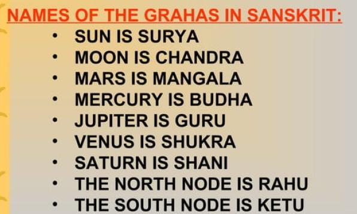

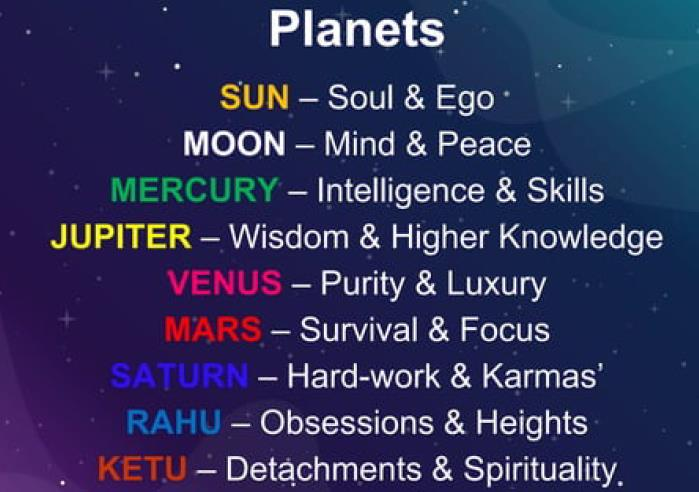

<!-- page 22 -->

VIJAY KUMAR, GEC Predictive Techniques: Jyotisha developed predictive techniques, such as Dashas (planetary and sign-based time periods) and Vargas (harmonic divisions of the horoscope), to understand the timing of events and karmas. Life Decisions:Astrological insights are used to help with important life decisions, such as choosing a suitable partner, making professional choices, or deciding on a new home. Influence on Human Life: Jyotisha, as Vedic astrology, focused on the influence of celestial bodies on human lives, including personality, relationships, and life events. TYPES Relationship astrology ;-deals with relation among two peoples and determined by the type of energy among their relations Vocational Astrology ;- is key to reveal the ideal career for you. Financial Astrology ;-is also known as business astrology which is used to determine stock market position, business opportunities. Medical Astrology ;-is an ancient technique used for diagnosis and treatment of diseases. Natal Astrology;- It helps to predict how your life journey will go through in upcoming years and what changes will occur in different phase of your life. Psychological Astrology;-, is one of the most useful tools to discover one's hidden talents and bring one's true self back to the light, Numerology  ;-is number based astrology. It is the numerical calculation of numbers associated with you or your date of birth. Nadiastrology ;- It is based on the belief that the past, present and the future lives of all humans were foreseen by Dharma sages in ancient time Electional :- selecting the best time and day for events-marriage, inauguration , sign of such important documents. Horary :- Answering the specific question Esoteric:-Dealing with spiritual matters Mundane :- it related to word affair On the basis of location Indian astrology It is ancient astrology, also called Jyotishi and Vedic Astrology in Hindu religion. Western astrology This is also a popular type of astrology. Western Astrology mainly revolves around the moment of the sun. Tropical astrology Tropical astrology is a kind of astrology which indicates about the orientation of the Earth relative to the Sun and other planets available in the solar system. Arab and Persian astrology Arab and Persian astrology is a special type of astrology which is used to dig out the accurate time of prayers. Horoscopic Astrology Horoscopic astrology is a form of astrology that uses horoscope as main factor to identify various possibility in individual life. Chinese Astrology The Chinese zodiac is a classification scheme that assigns an animal and its reputed attributes to each year in a repeating 12-year cycle. The 12-year cycle is an approximation to the 11.86-year orbital period of Jupiter, the largest planet of the Solar System Astrology Pros 1. Astrology can be a helpful tool for understanding oneself and others, as it can provide valuable insights into personality, behavior, and relationships. 2. Additionally, astrology can be used as a form of divination, whereby one can gain guidance and insight into the future. Some of the other advantages and pros of astrology include: 3. It can provide valuable insights into personality, behavior, and relationships 4. It can be used as a form of divination, whereby one can gain guidance and insight into the future 5. It can be helpful in making decisions about important life choices 6. It can be fun and interesting to explore 7. There is a rich history and tradition associated with astrology 8. Astrology is the study of planets and stars and their influences on human lives. Astrology Cons 1. For one, it is often used to make predictions about people’s lives and future events, which can be inaccurate and misleading. 2. Additionally, astrology can be used to manipulate and control people, as it can be used to tell them what they want to hear or to exploit their fears. 3.  Finally, astrology can be used as a form of divination, which is a practice that is often associated with witchcraft and the occult. 4. Astrology cannot predict the future 5. Astrology is scientifically contradictory 6. Astrology is irrational 7. Astrology may not always be accurate 8. Astrology is not reliable JYOTISHA RELEVANCE IN PRESENT DAY 1.Personal Growth and Self-Awareness:

**Table 1 (page 22):**

|  |  |  |
| --- | --- | --- |
|  | 22 |  |
|  |  |  |

<!-- page 23 -->

VIJAY KUMAR, GEC Understanding Strengths and Weaknesses: Jyotish can help individuals identify their inherent strengths and weaknesses, promoting self-awareness and self- acceptance. Purpose and Dharma: It can provide insights into one's life purpose (Dharma) and help individuals align their actions with their true potential. Navigating Life's Challenges: Jyotish can offer guidance on how to approach challenges and make decisions that align with one's karmic path and life goals. Spiritual Development: Jyotish can be a tool for spiritual growth, helping individuals understand their connection to the cosmos and their place in the universe. 2. Relationship Dynamics: Compatibility Analysis: Jyotish can be used to understand relationship dynamics and potential challenges or strengths between individuals. Improved Communication: By understanding the astrological influences of others, individuals can tailor their communication and interactions for better understanding and empathy. Navigating Interpersonal Relationships: Jyotish can help individuals navigate complex relationships, whether romantic, familial, or professional 3. Decision-Making and Timing: Choosing Favorable Times: Jyotish can be used to identify auspicious times for important events, such as weddings, business ventures, or major purchases. Career Guidance: Jyotish can offer guidance on career paths and timing for career transitions or promotions. Making Informed Choices: By understanding the influence of planetary transits, individuals can make more informed decisions and align their actions with favorable cosmic energies. 4. Cultural Significance: Traditional Wisdom: Jyotish is rooted in ancient traditions and offers a unique perspective on the universe and human existence. Cultural Identity: For many, Jyotish is an integral part of their cultural identity and provides a sense of belonging and connection to their heritage. 5.marriage compatibility needs to be verified specially when the overall status and personality of female has changed in modern times compared to male dominated society. 6.Career selection needs a much deeper eye with versatile options available than pushing based on family background or social compulsions. 7.Investment decisions need to go beyond sticking to buying land or jewels or say other luring opportunities. The ancient Indian literature COMPARISION BETWEEN ASTRONOMY AND ASTROLOGY

**Table 1 (page 23):**

|  |  |  |  |  |  |  |  |  |
| --- | --- | --- | --- | --- | --- | --- | --- | --- |
|  | PATICULAR |  |  | ASTRONOMY |  |  | ASTROLOGY |  |
|  |  |  |  |  |  |  |  |  |
|  |  |  |  |  |  |  |  |  |
| DEFINITION |  |  | Astronomy is the study of celestial objects, space, and the universe as a whole |  |  |  | Astrology is the study of movement and position of |  |
|  |  |  |  |  |  |  | celestial objects and their supposed influence on the |  |
|  |  |  |  |  |  |  | lives of human beings |  |
|  |  |  |  |  |  |  |  |  |
|  |  |  |  |  |  |  |  |  |
| GOAL |  |  | To understand the universe and its physical laws through evidence-based inquiry. |  |  |  | To provide personal guidance and predict the future |  |
|  |  |  |  |  |  |  | by correlating celestial events with personal fates |  |
|  |  |  |  |  |  |  | and experiences. |  |
|  |  |  |  |  |  |  |  |  |
|  |  |  |  |  |  |  |  |  |
| TYPES OF SCIENCE |  |  | Astronomy is a branch of science |  |  | astrology is considered a pseudoscience |  |  |
|  |  |  |  |  |  |  |  |  |
|  |  |  |  |  |  |  |  |  |
| BRACES OF STUDY |  |  | Studies theoretical astronomy, observational astronomy. astrophysics. astrochemistry |  |  | General astrology. autarchic astrology. interrogatory astrology |  |  |
|  |  |  |  |  |  |  |  |  |
|  |  |  |  |  |  |  |  |  |
| Method |  |  |  | relies on a variety of tools and techniques to |  |  | uses a variety of methods to interpret the positions |  |
|  |  |  |  | study celestial objects, including telescopes, |  |  | of celestial bodies, including horoscopes, birth |  |
|  |  |  |  | spectroscopy, and computer simulations. |  |  | charts, and astrological readings. |  |
|  |  |  |  |  |  |  |  |  |
|  |  |  |  |  |  |  |  |  |
| PURPOSE |  |  | To explain how the universe came to be, how the universe is, and how it will be |  |  | to interpret how celestial bodies meet affect human behavior and affairs individually or collectively |  |  |
|  |  |  |  |  |  |  |  |  |
|  |  |  |  |  |  |  |  |  |
| BENIFIT |  |  | To improvement of the quality of Life in terms of science and technology |  |  | Improvement of the quality of life-based on character and personality |  |  |
|  |  |  |  |  |  |  |  |  |
|  |  |  |  |  |  |  |  |  |
|  | CARRER |  |  | Doctorate degree. scientists |  |  | Enthusiasts, practitioners |  |
|  |  |  |  |  |  |  |  |  |

**Table 2 (page 23):**

| Astronomy is the study of celestial objects, |
| --- |
| space, and the universe as a whole |

**Table 3 (page 23):**

| To understand the universe and its physical |
| --- |
| laws through evidence-based inquiry. |

**Table 4 (page 23):**

| Studies theoretical astronomy, observational |
| --- |
| astronomy. astrophysics. astrochemistry |

**Table 5 (page 23):**

| General astrology. autarchic astrology. interrogatory |
| --- |
| astrology |

**Table 6 (page 23):**

| To explain how the universe came to be, |
| --- |
| how the universe is, and how it will be |

**Table 7 (page 23):**

| to interpret how celestial bodies meet affect human |
| --- |
| behavior and affairs individually or collectively |

**Table 8 (page 23):**

| To improvement of the quality of Life in |
| --- |
| terms of science and technology |

**Table 9 (page 23):**

| Improvement of the quality of life-based on |
| --- |
| character and personality |

**Table 10 (page 23):**

|  |  |  |
| --- | --- | --- |
|  | 23 |  |
|  |  |  |

<!-- page 24 -->

VIJAY KUMAR, GEC VEDAS Vedas: Vid = to know, vision, to exist The Vedas, meaning “knowledge,” are the oldest texts of Hinduism The word 'Veda, is generally derived from the Sanskrit root  (vid - to know). The word Veda can be derived from five verbal roots. These mean to exist, to know, to discriminate, to obtain, and to make known. Veda indicates a vast body of knowledge concerning the eternal spiritual values and principles and practices for gainful and happy living revealed to the rsis through their deep meditation. The Vedas are not merely considered as scriptures but as the fountainhead of Indian culture and human civilisation. The Vedas are a collection of  Mantras or  Sooktas, which contain Eternal Universal Truths explaining everything happening in this Universe. HISTORY OF VEDAS: Vedas are more than 5000 years old, during the earlier years it was not in written form = SRUTI The Vedas are among the oldest sacred texts They began as an oral tradition that was passed down through generations before finally being written in Vedic Sanskrit between 1500 and 500 BCE The Vedas are a collection of hymns and other religious texts composed in India between about 1500 and 1000 BCE. The bulk of the Rigveda Samhita was composed in the northwestern region (Punjab) of the Indian subcontinent, most likely between c. 1500 and 1200 BCE, although a wider approximation of c. 1700–1100 BCE has also been given. The other three Samhitas are considered to date from the time of the Kuru Kingdom, approximately c. 1200–900 BCE. Rigveda : roughly around 1700-1100 BCE The Samaveda is believed to have been compiled between 1200 and 1000 BCE. The Yajurveda  originated in India during the Vedic period, likely between 1200 and 800 BCE. Atharvaveda : 900 BCE the Supreme VEDAS CLASSIFICATION Sage Veda Vyasa – 3000 – 5000 BCE compiled the Vedas and recorded it. He categorized the Vedas into FOUR parts and taught it to his students – which became FOUR schools of study Rig-Veda - Rishi Paila and subsequently his students Yajur Veda – Rishi Vaishampayana and subsequently his students Sama Veda – Rishi Jaimini and subsequently his students Atharva Veda – Rishi Sumantu and subsequently his students 1. Rig-Veda “Knowledge of the Hymns of Praise” 2.  Sama-Veda “Knowledge of the Melodies” 3.  Yajur-Veda “Knowledge of the Sacrificial formulas” 4. Atharva-Veda “Knowledge of the Magic formulas STRUCTURE OF VEDA

**Table 1 (page 24):**

|  |  |  |
| --- | --- | --- |
|  | 24 |  |
|  |  |  |

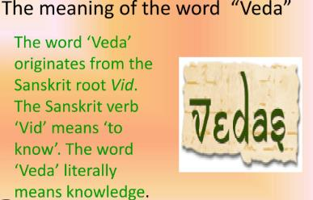

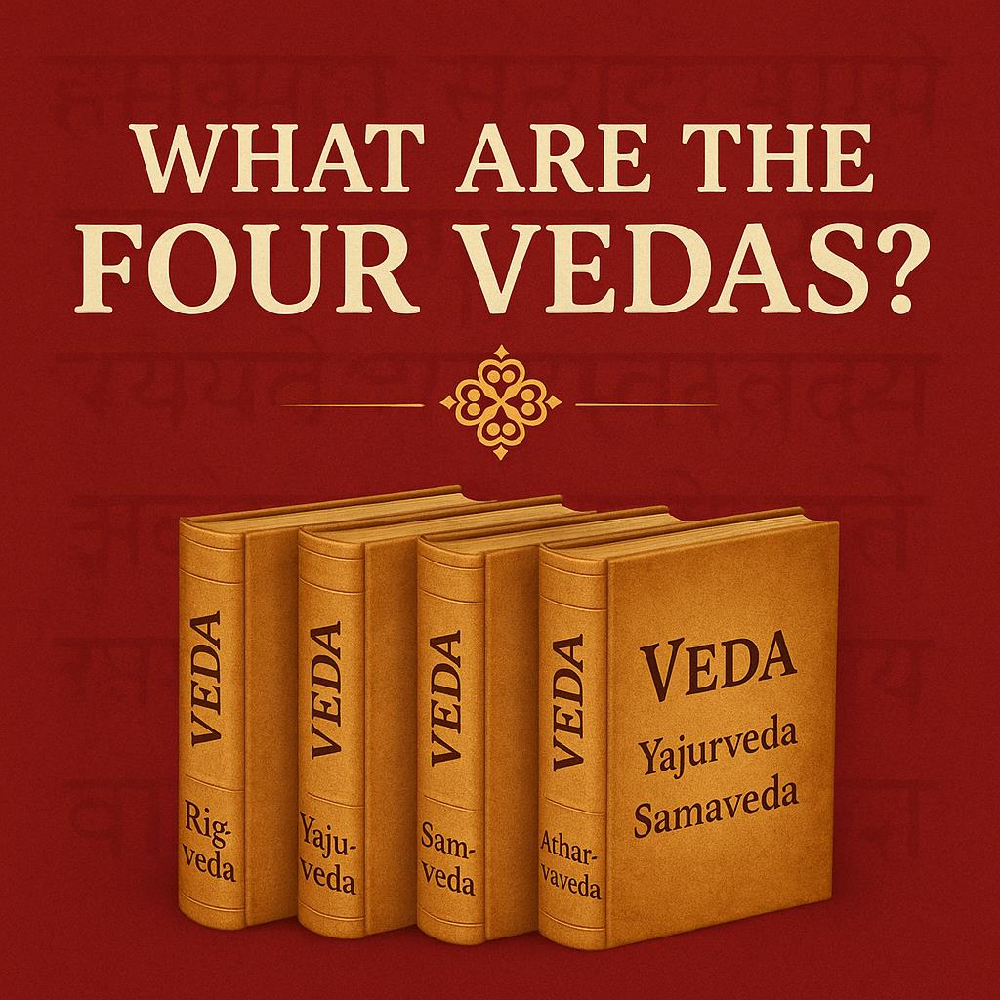

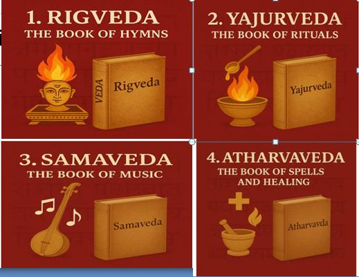

<!-- page 25 -->

VIJAY KUMAR, GEC Śikṣā — Phonetics and pronunciation: the science of sacred sound Kalpa — Ritual procedure: codifying sacred action Vyākaraṇa — Grammar: analyzing the structure of divine language Nirukta — Etymology: uncovering the primal meanings of words Chandas — Prosody: studying rhythm and meter as cosmic order Jyotiṣa — Astronomy and astrology: measuring time and celestial rhythm RIGVEDA Ṛc (ऋच्): This part of the word means "praise" or "verse". Veda (वेद): This part means "knowledge" or "wisdom The RIG-VEDA “Wisdom of the Verses” The Rigveda is a word that means Praise Rigveda (hymns and mantras), Main Focus: Worship and praise of gods. Use: Recited during prayers and yagnas(Vedic fire rituals) The Rigveda was traditionally passed down through oral tradition and was only written down in the later Vedic period Rigveda: The oldest and most important Veda, composed around 1500–1200 BCE. It is both the oldest known Vedic Sanskrit book and the oldest form of the Veda It is the most ancient literally record. It is a collection of 1,028 hymns arranged into ten books (mandalas) dedicated to deities like Indra, Agni, and Varuna. Hymns (Suktas): The Rigveda is a collection of 1,028 hymns, called Suktas, made up of verses called riks or Mantras. Mandalas (Books): These hymns are organized into 10 books or Mandalas.

**Table 1 (page 25):**

|  |  |  |
| --- | --- | --- |
|  | 25 |  |
|  |  |  |

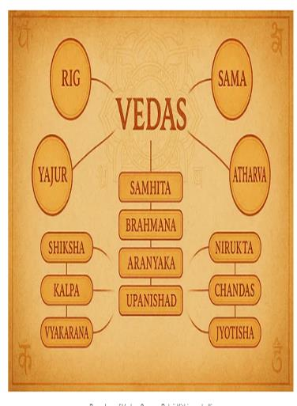

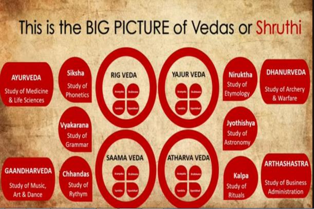

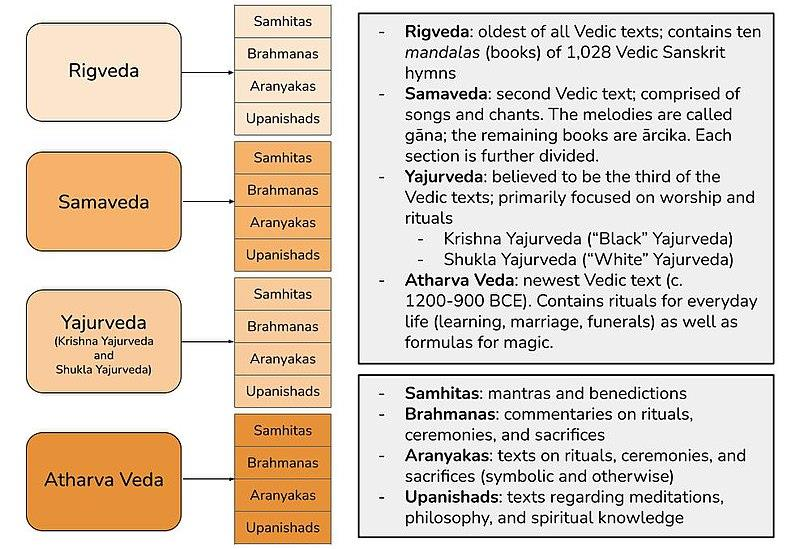

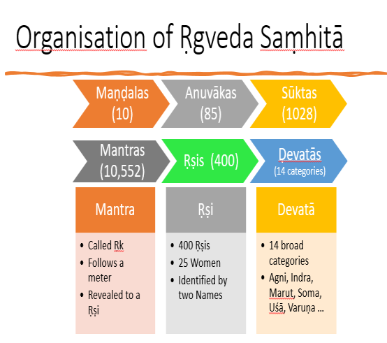

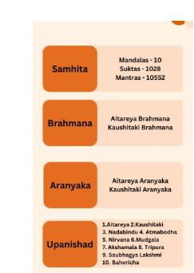

<!-- page 26 -->

VIJAY KUMAR, GEC SAMA-VEDA The Samaveda is one of the four Vedas in Hinduism and is considered to be the second oldest after the Rigveda. Sama” it means “melody,” and as always “veda” means “knowledge.” The SAMA-VEDA "Wisdom of the Chants” liturgical works consisting primarily of selections from the Rig Veda. It is the collection of melodies and chants, and is also called the book of song. It is basically the words of the rig veda put to music .It is believed to have been composed between 1200 -900 BCE in the north-western region of the Indian subcontinent The Sama Veda, also known as the ‘Book of Chants’, consists of 1549 hymns Indian traditional dance and music are said to have originated from the Samaveda Except for 75 verses, which are entirely derived from the Rigveda, there are 1549 verses Indian traditional dance and music are said to have originated from the Samaveda Two Primary Parts: Archik Samhita: Contains the collection of hymns or richas. It is divided into Purvarchik and Uttararchik. Gaana Samhita: These are the songbooks, which contain the specific musical notations for the hymns found in the Archik Samaveda, like the other Vedas, is traditionally divided into four main sub-components: 1. Samhita (mantras and hymns), 2. Brahmana (commentaries on rituals), 3. Aranyaka (texts on forest life and symbolic sacrifices), and 4. Upanishads (philosophical and spiritual texts). Key Characteristics Melodic Chants (Samans): The defining feature of the Sama Veda is its emphasis on melodic chanting, with the word "Sama" meaning song or melody. Ritual Application: It was specifically compiled for the Udagatr priest to chant during the Soma-sacrifice ceremonies. Rig Veda Connection: Most of its hymns are derived from the Rig Veda, with the texts arranged in a musical format. Foundation of Indian Music: It is considered a cornerstone for the development of Indian classical music, influencing the concepts of raga (melody) and tala (rhythm). YAJUR-VEDA The name comes from sanskrit word “Yajus” meaning “worship” and “Veda” meaning knowledge. Yajurveda is a ancient Hindu scriputre devoted to the worship of God. Yajurveda is one of the four Vedas . This Veda is primarily of prose mantras for worship rituals. It is an ancient Vedic Sanskrit text with a compilation of ritual offering formulas that were said by a priest while an individual performed ritual actions such as those before the yajna fire The exact century of Yajurveda's composition is unknown and estimated by scholars to be around 1200 to 1000 BCE, contemporaneous with Samaveda and Atharvaveda. The earliest and most ancient layer of Yajurveda samhita includes about 1,875 verses, that are distinct yet borrow and build upon the foundation of verses in Rigveda. The middle layer includes the Satapatha , Brahmana, one of the largest brahmana txt in vedic collection The Yajurveda is well-known for emphasizing ritual and yajna performance, which were seen to be means of gaining the gods’ favor and establishing a connection with them. Hymns and mantras honoring numerous gods and goddesses, such as Indra, Agni, and Soma, are also found in the Yajurveda The Yajurvedais broadly grouped into two – 1. "black" or "dark" (Krishna) Yajurveda and 2. "white" or "bright" (Shukla) Yajurveda. The term "black" implies "the un- arranged, unclear, motley collection" of verses in Yajurveda, in contrast to the "white" which implies the "well arranged, clear" Yajurveda. The black Yajurveda has survived in four recensions (remaining out of 86), while two recensions (remaining out of 16) of white Yajurveda have survived into modern times. The WhiteYajurveda separates the Samhita from its Brahmana(the Shatapatha Brahmana), the Black Yajurveda intersperses the Samhita with Brahmana commentary The KRISHNA Yajurveda Samhita is reputed to have 85 Sakhas.  In reference to the verses of the Krishna Yajurveda being un- arranged, unclear and disparate, or dissimilar, the collection is too often referred to as Black Yajurveda. In contrast, the well-arranged and imparting a particular meaning, the ShuklaYajurveda is known as the white Yajurveda. Sukla Yajurveda has two Samhita available today: 1. Madhyandina Samhita 2. Kanva Samhita Krishna Yajurveda has four Sanhitas available today: 1. Taittiriya Samhita 2. Kathaka Samhita  3. Kapishthala Samhita 4. Maitrayani Samhita ATHARVA-VEDA The Atharvaveda is one of the four Vedas in Hinduism and is believed to have been composed between 1200-1000 BCE in the northwestern region of the Indian subcontinent Was added significantly later than the first three Samhitas, perhaps as late as 500 BC. The ATHARVA-VEDA “Wisdom of the Sacrifical Formulas“

**Table 1 (page 26):**

|  |  |  |
| --- | --- | --- |
|  | 26 |  |
|  |  |  |

<!-- page 27 -->

VIJAY KUMAR, GEC It addresses the daily problems of Vedic people. Atharvaveda focuses more on practical aspects of life, including healing, magic, and domestic rituals There are two extant Atharvaveda recensions: the Paippalada and the Saunakiya It includes 20 books, 6000 mantras, and 730 hymns/suktas. It consists of 20 books of hymns and prose, many of which reflect the religious concerns of everyday life. It is a collection of 20 books containing hymns, chants, spells and prayers; and involves issues such as healing of illnesses, prolonging life, black magic and rituals The Atharvaveda also contains invocations of many gods and goddesses and petitions for prosperity, long life, and success PARTICULAR RIGVEDA YAJUR VEDA SAMVEDA ATHARVAVEDA DEFINITION “RIG” MEANS “PRAISE” RIGVEDA MEANS “KNOWLEDGE VERSES” “YAJUS” MEANS “PRACTICE” “RITUAL” YAJURVEDA MEANS “KNOWLEDGE RITUALS” “SAMA” MEANS “MELODY” SAMAVEDA MEANS “KNOWLEDGE SONGS” “ATHAR” MEANS “FIRE,” NAMED AFTER ATHARVAN, WHO BROUGHT FIRE TO EARTH FROM THE HEAVENS ATHARVEDA MEANS “KNOWLEDGE OF FIRE” BUT MORE APTLY MEANS “KNOWLEDGEOF MAGIC” CONTENT HYMNS AND PRAYERS RITUALS, “VEDA SACRIFICES MUSIC, “VEDA CHANTS” OR “VEDA OF MELODIES SPELLS HEALING, PRACTICAL ASPECTS DAILY LIFE, INCLUDING HEALTH, MAGIC AND DOMESTIC RITUALS MAIN FOCUS WORSHIP AND PRAISE OF GODS. PERFORMING RITUALS THE RIGHT WAY SINGING VEDIC HYMNS HEALING, PROTECTION, AND DAILY LIFE. WRITTEN AROUND 1500 AND 1200 BCE BETWEEN 1200 AND 800 BCE 1200 AND 1000 BCE 1200 AND 800 BCE, OR SLIGHTLY LATER ORDER OLDEST AND SECOND OLDEST THIRD OLDEST YOUNGEST VEDA PARTICULAR RIGVEDA YAJUR VEDA SAMVEDA ATHARVAVEDA RECITED DURING PRAYERS YAGNAS. PRIESTS DURING YAJNAS AND PUJAS SUNG BY PRIESTS DURING SPECIAL RITUALS. CONTAINS EARLY IDEAS MEDICINE AYURVEDA STRUCTURE CONSISTS 1,028 HYMNS (SUKTAS) ORGANIZED INTO BOOKS (MANDALAS). PRIMARY SECTIONS: THE SHUKLA (WHIT E) YAJURVEDA AND THE KRISHNA (BLA CK) YAJURVEDA. 3,988 MANTRAS BOTH SHAKHAS COMBINED) COMPRISES 1,875 VERSES, MADE KANDAS ,730 HYMNS AND OVER 6,000 MANTRAS, COMPOSED IN POETIC AND PROSE FORMS., Significance Philosophical Insights:, Ritual Practices Ritual Precision, Ritualistic Tradition Musical Rituals, Liturgical Importance Practical Knowledge, Cultural Influence taught Rishi Paila Rishi Vaishampayana Rishi Jaimini Rishi Sumanthu

**Table 1 (page 27):**

|  |  |  |
| --- | --- | --- |
|  | 27 |  |
|  |  |  |

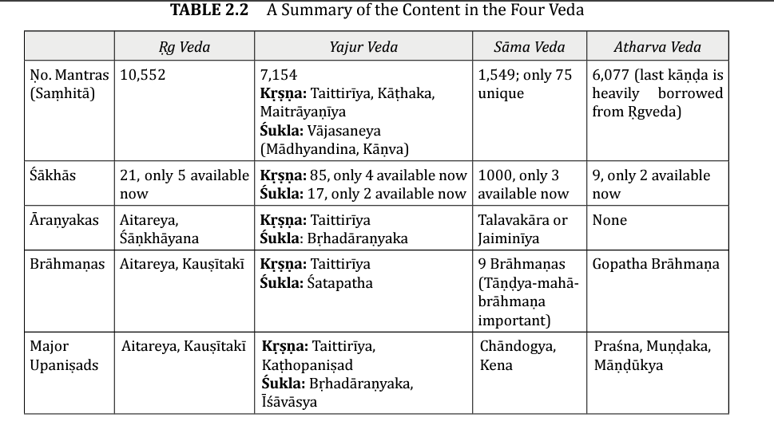

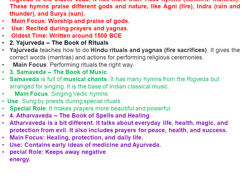

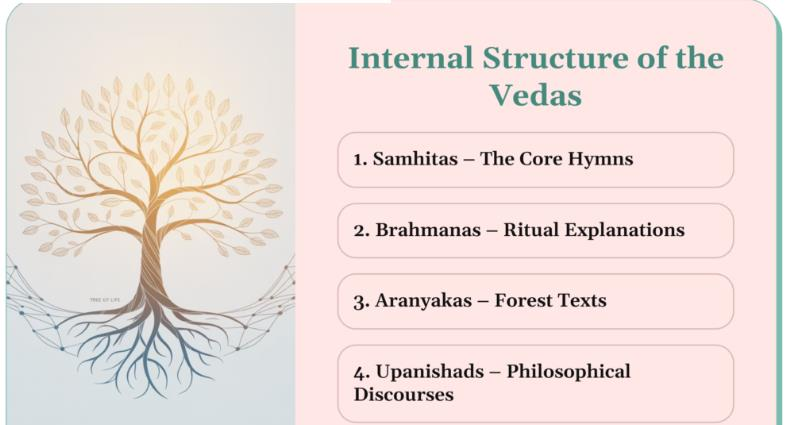

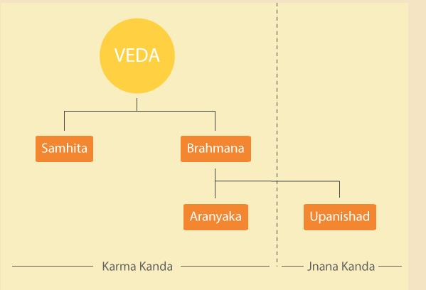

<!-- page 28 -->

VIJAY KUMAR, GEC SAMHITAS: The Saṃhitās are the oldest and most fundamental part of each of the four Vedas. The term saṃhitā literally means "put together" or "collection" and refers to the compilation of hymns, prayers, and mantras that form the core text of each Veda. Samhitas – The Core Hymns The Samhitas are the oldest layer of each Veda. They contain mantras and hymns recited during Vedic rituals. These are primarily invocations to deities, requesting blessings for health, prosperity, rain, and protection. The Samhitas form the ritual foundation of Vedic practice. BRAHMANAS The Brahmanas are ancient explanatory texts related to the mantras and hymns of the four Vedas. The Brahmanas are Vedic śruti works attached to the Samhitas (hymns and mantras) of the Rig, Sama, Yajur, and Atharva Vedas. ‘Contents of the Brahmanas 1. Vidhi: It comprises the instructions and warnings related to the performance of particular rituals. 2. Arthavada: It comprises the explanatory commentaries in relation to the Mantras and particular rituals. 3. Ninda or censure consists in criticism and, refutation of the opponents' views. 4.  Prashansha means eulogy, recommendation. 5. Purakalpa refers to the performance of sacrificial rites in former times. 6.  Parakriti means the achievements of others. 7. . Aitareya-brahmana: Describes soma sacrifices, agnihotra and soma yajna. Kaushitaki-brahmana: Details on food sacrifices, full moon, and seasonal sacrifices. Taittiriya-brahmana Describes the preparation of the alter Tandya-maha-brahmana (Panchavimsa brahmana): 25 chapters on conduct of Somayaga (from Samaveda) Shadvimsha-brahmana: 26 chapters, including origin of Agni and remedies for misfortunes. ARANYAKA Aranyakas: It forms the third part of the Vedas and discuss and interprets the ceremonies, from ritualistic to symbolic meta- ritualistic points of view.

**Table 1 (page 28):**

| Four Vedic Samhitas |
| --- |
| • Rigveda-Samhita = collection of the Riks |
| • Samaveda-Samhita= collection of the Samans |
| • Yajurveda-Samhita= collection of the Yajush It has two versions- A. Shukla-Yajurveda-Samhita B. Krishna-Yajurveda- |
| Samhita |
| 4.Atharvaveda-Samhita = collection of the Atharvan |
|  |
| Rigveda Saṃhitā: This is the oldest Veda, consisting of 1,028 hymns (sūktas) and 10,600 verses (ṛcs) dedicated to deities like |
| Indra, Agni, and Soma. |
| Yajurveda Saṃhitā: Known as the "book of rituals," it contains prose mantras and formulas for performing sacrificial rituals |
| (yajñas). It is divided into two major recensions, the Krishna (Black) Yajurveda and the Shukla (White) Yajurveda. |
| Sāmaveda Saṃhitā: This Veda consists mostly of hymns from the Rigveda, rearranged and set to music as melodies (sāmans) |
| for chanting during rituals. It is considered the foundation of Indian classical music. |
| Atharvaveda Saṃhitā: This collection contains hymns, charms, and spells for various aspects of daily life, such as healing and |
| protection from evil. It is a later compilation and differs in content and style from the other three Vedas |

**Table 2 (page 28):**

| Brahmanas: It is associated with Samhitas, explaining rituals and their meanings. It was composed between 900 BCE to 700 |
| --- |
| BCE. It is known as the Karma Kanda part of the Vedas. |
| The Brahmanas ( Sanskrit: ब्राह्मणम्, IAST: Brāhmaṇam) are Vedic śruti works attached to the Samhitas (hymns and mantras) of |
| the Rig, Sama, Yajur, and Atharva Vedas. |
| They are a secondary layer or classification of Sanskrit texts embedded within each Veda, which explain and instruct on the |
| performance of Vedic rituals (in which the related Samhitas are recited). In addition to explaining the symbolism and meaning |
| of the Samhitas, Brahmana literature also expounds scientific knowledge of the Vedic Period, including observational |
| astronomy and, particularly in relation to altar construction, geometry. |

**Table 3 (page 28):**

|  Aitareya-brahmana: Describes soma sacrifices, agnihotra and soma yajna. |
| --- |
|  Kaushitaki-brahmana: Details on food sacrifices, full moon, and seasonal sacrifices. |
|  Taittiriya-brahmana Describes the preparation of the alter |
|  Tandya-maha-brahmana (Panchavimsa brahmana): 25 chapters on conduct of Somayaga (from Samaveda) |
|  Shadvimsha-brahmana: 26 chapters, including origin of Agni and remedies for misfortunes. |

**Table 4 (page 28):**

|  |  |  |
| --- | --- | --- |
|  | 28 |  |
|  |  |  |

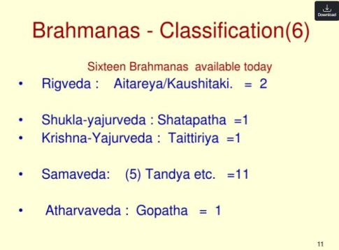

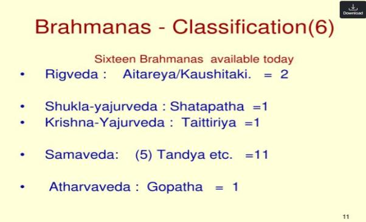

<!-- page 29 -->

VIJAY KUMAR, GEC The Aranyakas are a part of the ancient  Indian Vedas concerned with the meaning of ritual sacrifice. The Aranyakas are the concluding parts of the Brahamanas. It does not lay much stress on rites, rituals and sacrifices, but merely contain the philosophy and mysticism. The lead with the problems of soul, origin and elements of universe and the creation of universe. Aranyaka Literarily, it means 'Jungle‘ Provides description of Moral Science and Philosophy Provides details of hermits and saints who lived in Jungles Give stress on meditation Protests the system of 'Yajnas Aranyakas describe and discuss rituals from various perspectives Aranyakas, however, neither are homogeneous in content nor in structure Aranyakas are sometimes identified as karma-kanda , ritualistic action/sacrifice section, Main subjects : 1.  Theosophy (Brahmavidya)/ Meditation (Upasana) /Knowledge of breath (Pranavidya) 2.  Secret meaning of the sacrifices 3.  Stories & dialogues - Maitreyi &Yajnavalkya 4.  Bridge between Karma-kanda (Br.) & Jnana-kanda(Up.) 5.  Give geographical, historical, cultural points Aranyakas- Classification Seven Aranyakas available. Rigveda : Aitareya/Kaushitaki -2 Samaveda : Talavakara/ Chandogya -2 Shukla Yajurveda : Brihadaranyaka -1 Krishna Yajurveda : Taittiriya -2 No Aranyaka of Atharvaveda UPANISHAD Upa (near),ni(down), sad(to sit) means sitting near the teacher. Meaning is derived from "upa-ni-shad", which means sitting near a guru and receiving wisdom through a teaching-learning process Traditionally, the student sat down near the teacher to receive secret instruction, and in this way knowledge was passed down from teacher to student, linking each new generation back to the ancient tradition of the Upanishads. It is composed between 800 BCE and the end of the Vedic period. They are derived from the Aranyakas. It consists of philosophical works, including older principal Upanishads like Bṛhadaraṇyaka and Chandogya. It forms the foundations of the Hindu religion. Upanishads are Vedanta: End of the Vedas The Upanishads are known as the end section of the Vedas – jnana kanda – that deals with knowledge—knowledge of the ultimate reality. Collected by several seers and elders between 800-500 BCE, the Upanishads are a conclusion and accomplishment of an previous form of Hindu sacred texts called the Vedas. Issues deliberated in Upanaisads: Prime cause of Universe , Prime driving force of the universal activities, life, death, Post death life? , Spiritual meditation practices  supposed to be part of Vedic corpus Originally over 1180 Upanishads were Core Concepts: Key concepts include: Brahman: The ultimate, unchanging reality or cosmic principle that underlies the universe. Atman: The individual self, consciousness, or soul. Unity: A central teaching is the unity of Brahman and Atman, asserting that the self is one with the ultimate reality Major upanisads Ishaa – Philosophy of God and God realization Mandukya – Niraakaar(without form) aspect of god Prashna – Questions like root cause of universe, functioning of vital force of life Aitareya – Atman and births of atman are described

**Table 1 (page 29):**

|  |  |  |
| --- | --- | --- |
|  | 29 |  |
|  |  |  |

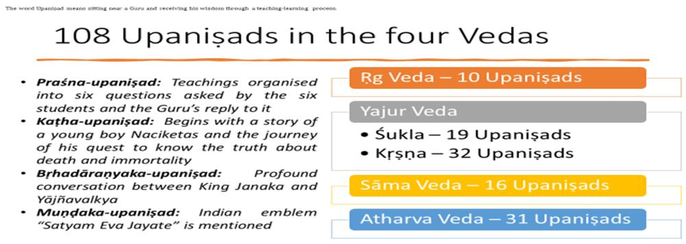

<!-- page 30 -->

VIJAY KUMAR, GEC Kaushitaki – Course for souls after death, doctrine of prana and moksha Katha – Q&A between Yama and Nachiketa Taittariya – Tells more about the creation of god Brhadaranyaka – Negation of all conceptions of self Chhandogya – Sacrifices and other forms of worship Kena – Sacrifices and other forms of worship 1. Isavasya Upanishad 2. Kena Upanishad 3. Katha Upanishad 4. Prasna Upanishad 5. Mundaka Upanishad 6. Mandukya Upanishad 7. Taittiriya Upanishad 8. Aitareya Upanishad 9. Chandogya Upanishad 10. Brihadaranyaka Upanishad Isavasya Upanishad is a small Upanishad consisting of 18 mantras and it belongs to Shukla Yajur Veda. There are 4 Vedas, of which one is Yajur Veda. And Yajur Veda itself has 2 divisions. One is known as Krishna Yajur Veda and the other as Shukla Yajur Veda. If you translate them then Krishna Yajur Veda means “black school” of Yajur Veda and Shukla Yajur Veda means “white school” of Yajur Veda. Isavasya Upanishad is one of the few Upanishads like Taittiriya Upanishad for which the Svara is still maintained and available for chanting. Svara means the intonation for chanting. This Upanishad is a Mantra Upanishad because it occurs in the mantra or the Samhita portion of the Vedas. So Isavasya can also be called a Samhitopanishad. Brihadaranyaka Upanishad which also belongs to Shukla Yajur Veda is a Brahmanopanishad, and is considered to be an elaboration of Isavasya Upanishad since generally a Brahmanopanishad is considered to be a commentary on the Samhitopanishad. So the 18 mantras of Isavasya Upanishad are elaborated in more than 400 mantras of Brihadaranyaka. From that we know that Isavasya is a very condensed Upanishad. Apart from Adi Shankara many other Acharyas (Teachers) have written commentaries on this Upanishad. It is one of the most popular and well known Upanishads. Even in the Dasopanishads verse where we enumerate the 10 main Upanishads we start with Isavasya. Because of the enumeration many people believe that Isavasya has to be studied first. But in fact this is a complicated Upanishad and has to be studied after some of the other Upanishads. This Upanishad gets it name because of the first portion of the beginning verse “Isavasyam Idam Sarvam”. The first two words are “Isa” and “Avasyam” and hence its called Isavasya. The first word is “Isa” so it can also be called Isa Upanishad or Isopanishad. All Upanishads begin with a Shanti Pathah (a mantra) invoking the grace of the Lord. And the convention is that all the Upanishads belonging to one particular Veda will have the same Shanti Pathah. So all Atharva Veda Upanishads will have the same Shanti Pathah and all Sama Veda Upanishads will have the same Shanti Pathah and so on Kena Upanishad This Upanishad is also called Kenopanishad. This is a small Upanishad in Sama Veda, and it has 4 chapters, each chapter known as a Kanda or Adhyaya. There are in total 35 mantras and therefore it’s a relatively small but a very important Upanishad. And this Upanishad also begins with a Shanti Pathah which is a common Shanti Pathah to all Sama Veda Upanishads. This Upanishad begins with the word “Kena” hence the name for the Upanishad. Prasna Upanishad This Upanishad belongs to Atharva Veda like the Mundaka and Mandukya Upanishads. While Mundaka Upanishad is considered to be a Samhitopanishad, Prasna Upanishad is considered to be a Brahmanopanishad. And generally a Brahmanopanishad is considered to be a commentary on the Samhitopanishad. So in this case Prasna Upanishad is a commentary or elaboration on Mundaka Upanishad. This Upanishad can also be called by the name Prasnopanishad, and it is given in the form of a dialogue between a Guru named Pippalada and 6 disciples. There are 6 chapters with 67 mantras in this Upanishad and each chapter is a dialogue with one of the six disciples. Therefore it is a reasonably big Upanishad. And since in each chapter the teacher Pippalada is answering questions raised by the students, this Upanishad got the name Prasna Upanishad, the word “Prasna” meaning a “question”. Mundaka Upanishad This Upanishad can also be called as Mundakopanishad. This Upanishad belongs to Atharva Veda and it is known by the name Mundaka Upanishad because of several reasons.

**Table 1 (page 30):**

|  |  |  |
| --- | --- | --- |
|  | 30 |  |
|  |  |  |

<!-- page 31 -->

VIJAY KUMAR, GEC We’ll look at one of the simpler reasons as to why this Upanishad is named so. “Mundaka” means “head”, and the word “head” generally indicates importance. For e.g. the head of an organization. Mundaka Upanishad is known by this name because it is one of the most important Upanishads. Therefore it being a primary Upanishad it’s called Mundaka Upanishad. This Upanishad has got 3 chapters and 6 sections; each chapter having 2 sections each. Each chapter is known as Mundaka and each section as a Kanda. There are in total 65 mantras in the entire Upanishad VEDANGA" The Vedanga (Sanskrit: वेदाांग vedāṅga, "limb of the Veda-s"; The word "Vedanga" is a Sanskrit word that means "limb of the Veda". Vedangas are six auxiliary disciplines associated with the study and understanding of the Vedas. Originally Vedangas did not mean special books or special schools but only subjects of instruction, which had to be learned in the Vedic schools themselves, in order to understand the Vedic texts. These works are designed to help people understand, recite, and apply Vedic texts The six Vedangas are: 1.  Siksha: Phonetics, or the study of the correct pronunciation and intonation of Sanskrit 2.  Kalpa: Rituals, or the study of the procedures and ceremonies associated with Vedic rituals 3.  Vyakarana: Grammar, or the study of Sanskrit grammar to ensure accurate interpretation of the Vedas 4.  Nirukta: Etymology, or the study of Vedic words to uncover their meanings 5.  Chanda: Meter, or the study of the poetic structures of Vedic hymns 6.  Jyotisha: Astronomy, or the study of the role of astronomy in determining auspicious timings for rituals and ceremonies Originally Vedangas did not mean special books or special schools but only subjects of instruction, which had to be learned in the Vedic schools themselves, in order to understand the Vedic texts. These works are designed to help people understand, recite, and apply Vedic texts. They were developed to provide a comprehensive understanding of the Vedas, ensuring accurate pronunciation, meaning, and application of their knowledge 1. Siksha: It represents the study of sounds and pronunciation associated with each syllable that constitute the mantra or the deep mantic tradition. The focus of Siksha is on understanding the range and deep taxonomy of Sanskrit alphabets, which we call the Varnamala (The garland of letters) 2. Kalpa: Kalpa deals with the aspects inducing a person into vedic action. a) how a ritual should be done; b) what are the functions of brahmacharis, grihastas, sannyasis etc.c) what ritual involves which mantra, devata, materials d) how many priests should perform a given ritual, e) what vessel of what shape, size to be used etc 3. Vyakarana: The most important exposition of Grammar . Formation of the word is main subject of grammar. Grammar is said to be important since, without its study, one is not capable of understanding the meaning of sentences. 4. Nirukta: Nirukta is generally known as vedic dictionary or kosa. ‘Nirukta’ means ‘etymology’ and it explains the reason why a particular word has been used i.e., the meaning of usage. Kosa is actually the etymology where each word is split into syllables and gives the root from which the word is derived with meaning.

**Table 1 (page 31):**

|  |  |  |
| --- | --- | --- |
|  | 31 |  |
|  |  |  |

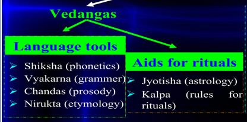

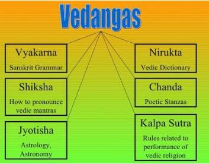

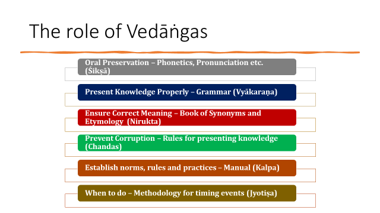

<!-- page 32 -->

VIJAY KUMAR, GEC 5. Chhanda: With chhanda, the person  gets an access to the mastery of rhyme and meter of the mantic tradition. Chhanda takes the initiated from the structure of language system to the waves of deep aesthetics that are actually embedded in the language system and a system that constitutes various harmonies in creation. It takes the elevated mind to Rasa 6. Jyotisha:  deals with vedic astrology / astronomy. It was mainly designed to help in arriving at the most favorable time for the performance of vedic rituals; this is to indicate the measure of success or lack of it when vedic rituals are performed under the influence of a particular graha, nakshatra, tithi etc. It involves precise mathematical calculations concerning the transit of planets etc., and so mathematics is an integral part of it. VEDANTA The word "Vedanta" is a combination of two Sanskrit words: "Veda", which means "knowledge" or "the whole corpus of vedic texts", and "anta", which means "end" or "the goal of". Vedanta can also be interpreted as "the ultimate knowledge of the Vedas" or "the end, conclusion, or finality of knowledge". Focus: It is concerned with the jñānakāṇḍa or "knowledge section" of the Vedas, which are the Upanishads. Goal: The core aim of Vedanta is Self-Realisation, or the understanding and manifestation of the divine potential within each person Vedanta is a spiritual philosophy and the philosophical foundation of Hinduism. It's based on the idea that our real nature is pure, immortal, and free, and that the purpose of life on Earth is to realize this divinity. Vedanta teaches methods to help people achieve this goal, and it's considered universal in its application, relevant to all cultures, countries, and religious backgrounds. Vedantic Principle Core Principles of Vedanta: 1. Brahman is the Only Reality: Brahman is the eternal, infinite, unchanging Consciousness behind the phenomenal world. 2. Atman is Divine: The individual self (Atman) is inherently divine and ultimately identical with Brahman. 3. Maya and Avidya: The world of multiplicity is not non-existent but appears to us through the power of Maya (cosmic illusion) and Avidya (ignorance). 4. Unity of Existence: Vedanta teaches that the same Divine consciousness exists in all beings, leading to the principle of "oneness". 5. Moksha (Liberation): The ultimate goal of life is liberation from the cycle of birth and death (samsara), which is achieved by realizing one's true divine nature. Vedanta teachings there are four paths we can follow to achieve the goal of understanding our divine nature. These paths are known as the Four Yogas. 1.  Bhakti Yoga is the path of love and devotion 2.  Jnana Yoga is the path of knowledge. 3.  Karma Yoga is the path of selfless work 4.  Raja Yoga is the path of meditation

**Table 1 (page 32):**

|  |  |  |
| --- | --- | --- |
|  | 32 |  |
|  |  |  |

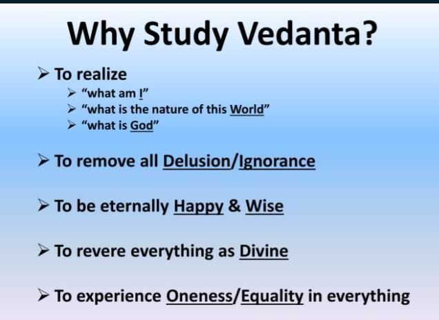

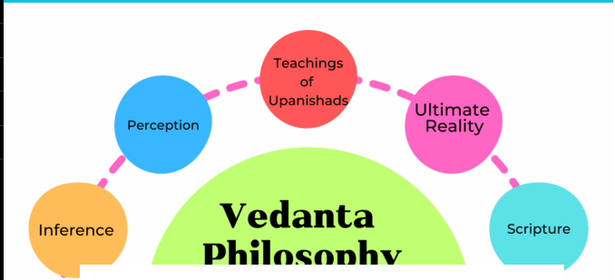

<!-- page 33 -->

VIJAY KUMAR, GEC JAINISM, The term "Jainism" comes from the Sanskrit word "ji," meaning "to conquer (to gain mastry over or win by overcoming obstacle or opposition). Vardhamāna, also known as Mahāvīra, is recognized as the founder of Jainism, a significant religion that emerged in the Indian subcontinent around the 6th century B.C.E Jainism is an ancient Indian religion emphasizing non-violence (ahimsa) and spiritual purity through a path of self-discipline and right conduct, aiming to liberate the soul from the cycle of rebirth " It signifies the inner struggle Jain monks and nuns undertake to conquer their desires and senses for spiritual enlightenment. Those who achieve enlightenment are called Jinas, or "Conquerors," and followers of the faith are known as Jains or Jainas. Orioins of Jainism The exact place where Jainism started is not confirmed, but India is most commonly referred to as the place of origin. Jainism, as a religion, was, at various times, found all over South Asia including Sri Lanka and what are now Pakistan, Bangladesh, Burma and Afghanistan. Founded by Mahavira Jainism, a religion with roots dating back to the 7th to 5th century BCE, emerged in the vibrant religious landscape of ancient India, particularly in the Ganges basin region. During this time, various spiritual movements arose, challenging the dominance of ritualistic Brahmanic traditions and advocating for asceticism and spiritual enlightenment as paths to liberation from the cycle of rebirth. The Jain tradition traces its origins to Parshvanatha, a revered figure who lived around the 7th century BCE. He is considered the 23rd Tirthankara, or spiritual leader, in Jainism. Later, Mahavira, often referred to as the 24th Tirthankara, further shaped Jain philosophy and practice Jainism is one of the three most ancient religions of India, with roots that go back to at least the mid-first century B.C.E. Today, it is still an integral part of Indian culture. Jainism is one of the three most ancient religions of India, with roots that go back to at least the mid-first century B.C.E. Today, it is still an integral part of Indian culture. HISTORY Early history (7th century BCE–c. 5th century CE) scholars of religion generally hold that Jainism originated in the 7th–5th century BCE in the Ganges basin of eastern India, The first Jain figure for whom there is reasonable historical evidence is Parshvanatha (or Parshva), a renunciant teacher who may have lived in the 7th century BCE  Jain tradition regards him as the 23rd Tirthankara (literally, “Ford Maker”; The 24th and last Tirthankara Vardhamana, who is known by the epithet Mahavira (“Great Hero”)  dated to 599–527 BCE, Early medieval developments (500–1100) There is archaeological evidence of the presence of Jain monks in southern India from before the Common Era, and the Digambara sect has had a significant presence in what is now the state of Karnataka for almost 2,000 years. Late medieval–early modern developments (1100–1800) In the period of their greatest influence (6th–late 12th century), Jain monks of both sects, perhaps influenced by intense lay patronage, turned from living as wandering ascetics to permanent residence in temples or monasteries. Jain history since the 19th century By the middle of the 19th century, image-venerating Shvetambara monks had virtually disappeared, and control of temples and ritual passed into the hands of quasi-monastic clerics known as yati. The Two Main Sects SVETAMBARA-Origin: The term "Svetambara" means "white-clad" in Sanskrit, referring to the white robes worn by their monks and nuns. Beliefs: They allow monks and nuns to wear white clothes, believing salvation is still achievable with them. Practices: They are dominant in North and West India and have adopted a more relaxed attitude toward extreme asceticism compared to the Digambaras. DIGAMBARA-Origin: "Digambara" means "sky-clad," referencing their belief that monks should not wear any clothes at all. Beliefs: They believe that complete detachment from all material possessions, including clothing, is necessary for achieving salvation. Practices: Their monks practice extreme asceticism and are associated with places like Shravanbelagola in Karnataka.

**Table 1 (page 33):**

|  |  |  |
| --- | --- | --- |
|  | 33 |  |
|  |  |  |

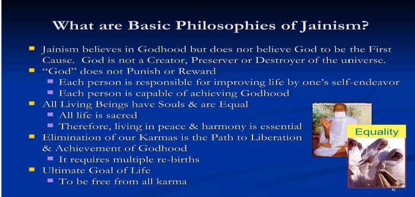

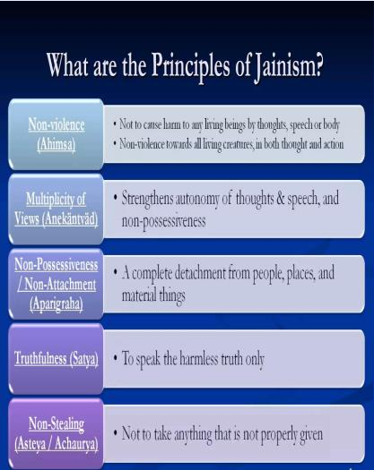

<!-- page 34 -->

VIJAY KUMAR, GEC THE FIVE CARDINAL PRINCIPLES (PANCH VRATAS) OF JAINISM ARE- TEACHINGS OF JAINISM ■ Reincarnation—until one finally breaks the cycle ■ Karma is the glue that sticks you to life ■ Reduce involvement and one reduces karma ■ Dualism: Jiva=soul=good, pure, eternal Ajiva=matter=bad, impure, temporal ■ Asceticism cleanses the soul of the karma ■ Salvation comes from ones work at release ■ God, prayers, rituals, etc. aren't necessary Nine Tattvas (Principles) of Jainism 1. Jiva – soul or living being (Consciousness). 2. Ajiva – non-living substances. 3. Punya – result of good deeds. 4. Pap – result of bad deeds. 5. Asrava – cause of the influx of karma. 6. Bandha – the bondage of karma. 7. Samvara – Stopping of the rise of karma. 8. Nirjara – Removal of the accumulated karma. 9. Moksha – Total freedom from karma BUDDHISM Buddhism is a major world religion and philosophical system founded by Siddhartha Gautama, known as the Buddha, in northeastern India between the late 6th and early 4th centuries BCE. It emerged during a time of social change and religious activity, offering an alternative to the ritualistic practices of Brahmanism. Buddhism, religion and philosophy that developed from the teachings of the Buddha (Sanskrit: “Awakened One”), a teacher who lived in northern India between the mid-6th and mid-4th centuries BCE (before the Common Era). Spreading from India to Central and Southeast Asia, China, Korea, and Japan, Buddhism has played a central role in the spiritual, cultural, and social life of Asia, and, beginning in the 20th century, it spread to the West Many modern scholars believe that the historical Buddha lived from about 563 to about 483 BCE. Many others believe that he lived about 100 years later (from about 448 to 368 BCE). Philosophy of Buddha Desire is the Cause for Suffering Ignorance is the Cause for Desire Four Noble Truth 1. There is suffering 2. There is the cause of suffering 3. The cessation of suffering 4. The path to end the sufferings Is Eight Fold Path 1. Right View / Right Understanding 2. Right Resolve / Right Thought 3. Right Speech 4. Right Conduct / Right Action 5. Right Livelihood

**Table 1 (page 34):**

|  |  |  |
| --- | --- | --- |
|  | 34 |  |
|  |  |  |

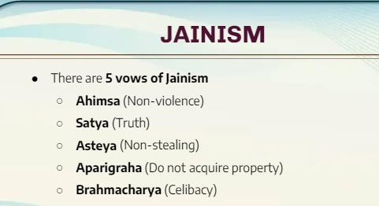

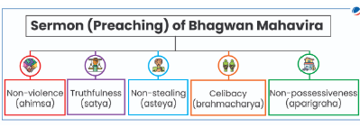

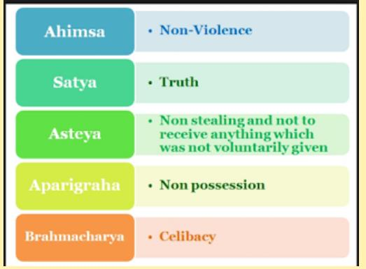

<!-- page 35 -->

VIJAY KUMAR, GEC 6. Right Effort 7. Right Mindfulness 8. Right Concentration Buddhism's philosophy centers on the understanding of suffering, its causes, and the path to liberation, emphasizing concepts like the Four Noble Truths, the Eightfold Path, and the pursuit of enlightenment (nirvana) through practices like mindfulness and compassion. Here's a more detailed look at key aspects of Buddhist philosophy: Core Concepts: Suffering (Dukkha): Buddhism recognizes that life is inherently marked by suffering, not just physical pain, but also dissatisfaction, frustration, and the impermanence of existence. Cause of Suffering (Dukkha-Samudaya): This suffering arises from attachment, craving, and ignorance (avidya), which lead to a cycle of rebirth (samsara). Cessation of Suffering (Dukkha-Nirodha): It is possible to end suffering by eliminating the causes, achieving a state of enlightenment (nirvana). Path to the Cessation of Suffering (Dukkha-Nirodha-Marga): The Eightfold Path provides a practical guide for cultivating wisdom, ethical conduct, and mental discipline to attain enlightenment. Impermanence (Anicca): Everything, including the self, is constantly changing and impermanent, which can lead to suffering when we cling to things as permanent. No-Self (Anatta):The idea that there is no permanent, unchanging self or soul, but rather a continuous stream of interconnected processes. Karma: Actions have consequences, shaping future experiences and influencing the cycle of rebirth. Nirvana: The ultimate goal of Buddhism, a state of liberation from suffering and the cycle of rebirth, achieved through enlightenment. UNIVERSAL HUMAN VALUES Human values are a tool to manage human relations and a tool for peace when the tension is high. Values can vary in importance between individuals and help to explain individual differences in specific attitudes, everyday decisions, and behavior in general. Human values are the virtues that guide us to take into account the human element when we interact with other human beings. Values that help the entire humanity to live in harmony with one another across class, culture, race and religion.Universal human values are values that are shared by all people, regardless of their culture, nationality, caste, creed, or personal history PURUSHARTHAS Purusha means either God or a human being Artha means, purpose, an object or objective. "Purusharthas" means objectives of a person or a human being. Purusha does not mean male in the physical sense, but any individual soul or Self in its purest, undifferentiated aspect. So the Purusharthas are applicable to both men and women equally. Dharma, Artha, Kama, and Moksha are the four goals of human life in Hinduism. They are also known as the four Purusharthas Purusharthas are the four primary purposes or objectives of human life 1. Dharma: Righteousness, Duty 2. Artha: Wealth 3. Kama: Desire 4. Moksha: Liberation

**Table 1 (page 35):**

|  |  |  |
| --- | --- | --- |
|  | 35 |  |
|  |  |  |

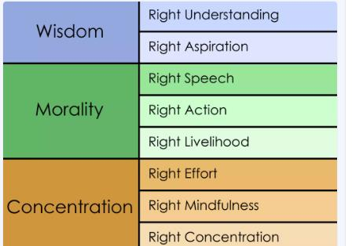

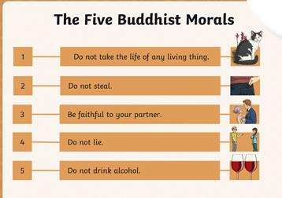

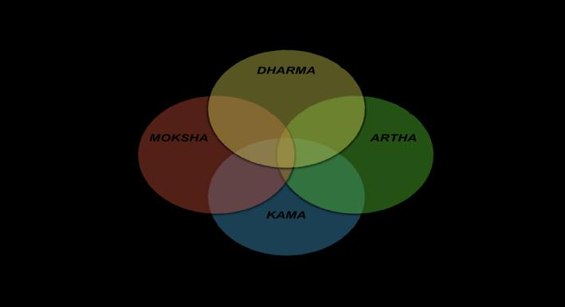

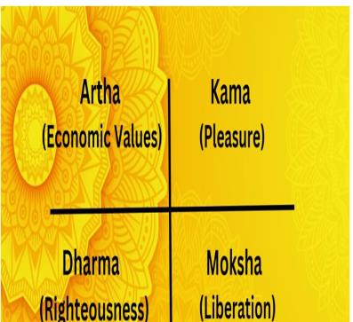

<!-- page 36 -->

VIJAY KUMAR, GEC DHARMA The first of the goals is dharma, Derived from the root dhri (to hold/support), it refers to actions that sustain individuals and society. It has been variously translated as duty, faith, religion, righteousness, sacred law, justice, ethics, morality and so on. Dharma is an obligatory duty as prescribed by the Vedas to be performed by an individual in accordance with the rules prescribed for the caste to which he or she belongs. Dharma (Righteousness, Duty, Ethics): Represents the ethical, moral, and social obligations that hold society and the universe together. It is the foundation that guides the pursuit of Artha and Kama. In the context of human life, dharma consists of all that an individual undertakes in harmony with divine injunctions and his own sense of morality and justice. Dharma is the power which maintains and balances the society in the universe. Each person has his own duties and Dharma to perform known as Sva Dharma. Role & Duty: It guides personal conduct, family obligations, and professional responsibilities, ensuring integrity. Context Sensitivity: Dharma is not rigid; it varies based on an individual's stage of life (ashrama), occupation (varna), and circumstances. Each person has his own duties and Dharma to perform known as Sva Dharma 1. Samanya Dharma (Eternal Duties) Dharma that everyone should follow. Like speaking truth, mercy, respecting others, respecting women, control over senses, compassion, honesty, absence of greed, etc. 2. Sva Dharma (Personal duties) This Dharma depends on the Ashrama Dharma and Varna Dharma. The four Varnas Brahman, Kshatriya, Vaishya, and Shudra are the four Varna. Dharma applicable to the respective varna is known as Varnadharma. ARTHA The name Artha, derived from Sanskrit, carries significant meanings such as purpose, wealth, and meaning in life. Artha means wealth. Artha means the material aspects of life Artha includes money, financial security, economic stability and career activity to lead a happy life In the context of Indian philosophy, it encapsulates the pursuit of material and spiritual objectives, signifying a balanced approach to existence Purpose: It holds that securing resources is essential for a stable and fulfilling life, provided it aligns with ethical principles (Dharma) Recognizes the importance of material wealth for the overall happiness and well being of an individual. Artha is the security of having the material comfort you need to live in the world with ease. rejecting the world, but being content with the things you own. Artha is one of the basic human dignities—to have enough assets to live on and care for your family, without hoarding or being greedy. It’s to live skillfully in a world of material objects that exist for your benefit. Artha guides you to ask the question, “What do I see as truly valuable?” Needs vary from person to person. Artha provides the foundation for Dharma and Kama. Without prosperity and security in society or at the individual level, both moral life and sensuality become difficult KAMA Kama (Sanskrit: काम, IAST: kāma) originates from the Sanskrit root kam (कम्), meaning "to desire," "to love," or "to wish". "Kama" primarily refers to the Hindu, Buddhist, and Jain concept of desire, pleasure, and aesthetic enjoyment.

**Table 1 (page 36):**

|  |  |  |
| --- | --- | --- |
|  | 36 |  |
|  |  |  |

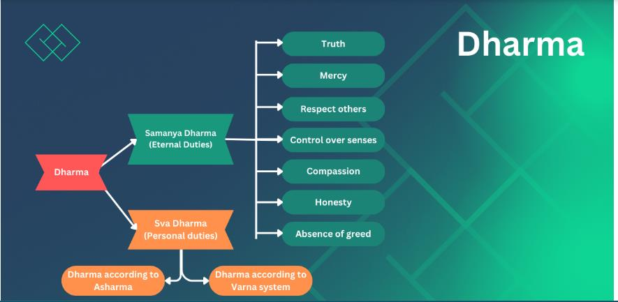

<!-- page 37 -->

VIJAY KUMAR, GEC Kama relates to this pleasure, which can be sensuality, but is also art, music, beauty, love, intimacy, affection, fellowship, and kindness it’s what brings a sense of delight to your life Kama  is the aim of enjoying the good things in life – love, desire and pleasure The desire for pleasure is what drives human behavior. A life without pleasure and enjoyment is hollow and empty. The right kinds of pleasure lead you toward your Dharma and help you fulfill it with passion. Kama is good and necessary when it exists to support Dharma and becomes part of the richness of life. However, excessive Kama can lead to overindulgence, addiction, sloth, greed, and lust Desire as the root cause of human suffering. . MOKSHA Moksha actually means absence of moha or delusion.  Moksha (liberation) is the ultimate purpose of human life. All Vedic and Upanishadic texts talk about the pursuit of moksha attaining which one is no longer bound by the continuous cycle of birth and death (called Samsara). Other terms that are frequently used for the concept of moksha are: 1.  self-realization, 2. removal of ignorance (avidya), 3. liberation, 4. freedom, 5. attaining the state of pure consciousness, 6.  becoming one with the supreme being etc. When moksha is attained, there is no feeling of insecurity or a sense of lack. One feels complete, fulfilled and blissful.  The main paths are the path of knowledge, of action, of devotion and of renunciation.  Each path has its own advantages and disadvantages. whatever may be the path, the help and guidance of a guru is indispensable to one's spiritual journey . Gyan Marga – Path of knowledge Jnana Yoga encourages people to explore reality, themselves, and the universe with wisdom. It teaches that understanding is crucial for freedom and self-discovery. 2. Bhakti Marga – path of devotion Bhakti Yoga is about love, devotion, and surrender, aiming for unity with the Divine. It believes that sincere devotion can lead to the highest connection with the Supreme. 3. Karma Marga – path of selfless service Engaging in actions without expecting anything in return. 4. Raja Marga – Path of meditation In Raja Yoga, meditation (called dhyana) is key. Practitioners focus on regular meditation sessions, concentrating on things like breath, a mantra, or a visual symbol. Through meditation, they learn to watch their thoughts without getting attached, calming their minds over time. What is Moksha? 1. Liberation 2. Free from the cycle of birth 3. Realize your true nature 4. Realize the supreme God 5. Complete detachment from worldly things and persons 6. This is also called human with its actual capacity 7. Seeing the world and ourselves as part of the same creator 8. There is nothing left to achieve after this DHARMA, ARTHA KAMA ,MOKSHA RELEVANCE IN TODAY CONTEXT 1. Meaningful Life:  By pursuing these four aims in a harmonious way, individuals can find deeper purpose, wisdom, and a more profound sense of contentment in their daily lives. 2. Ethical decision-making: Acting with integrity, honesty, and responsibility in personal and professional life. 3. Social and environmental responsibility: Upholding duties to family, community, and the planet, especially in an era of globalization and environmental crisis. 4. to secure one's livelihood and contribute to the well-being of others. 5. Personal Growth: They guide individuals in achieving personal growth and fulfillment by integrating ethical conduct, financial security, healthy relationships, and spiritual awareness into their lives.

**Table 1 (page 37):**

|  |  |  |
| --- | --- | --- |
|  | 37 |  |
|  |  |  |

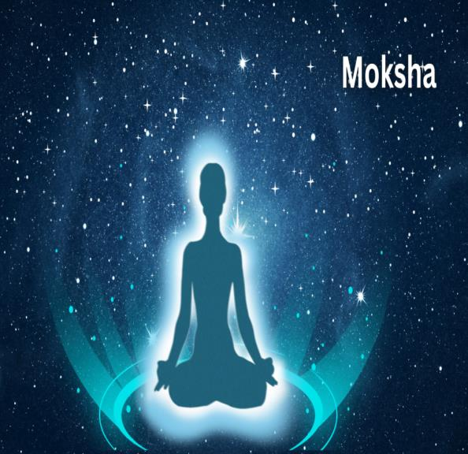

<!-- page 38 -->

VIJAY KUMAR, GEC 6. Addressing Modern Challenges:  The concepts help address the challenges of globalization, technology, and societal change by promoting ethical decision-making and emotional well-being alongside professional and academic success. 7. Ethical decision-making: Acting with integrity, honesty, and responsibility in personal and professional life. 8. Social and environmental responsibility: Upholding duties to family, community, and the planet, especially in an era of globalization and environmental crisis. 9. Living one's purpose: Finding and acting on one's "inner purpose" or innate calling, which aligns with the universal good 10. Professional ethics: Striving for success and material security through ethical and fair means, rather than resorting to corruption or dishonesty. 11. Sustainable wealth creation: Moving beyond simply accumulating wealth to focusing on building long-term prosperity that benefits not only oneself but also society and the environment. 12. Balancing work and life: Avoiding the trap of making material gain the sole focus of life and instead balancing it with other life goals 13. Mindful pleasure: Enjoying life's pleasures—such as art, music, food, and love—in moderation and with full awareness, rather than pursuing instant gratification that can lead to addiction or emptiness. 14. Emotional well-being: Acknowledging and nurturing one's desires and emotional needs in a healthy, balanced way. 15. Creative expression: Expressing creativity and finding fulfillment in hobbies and passions 16. Purpose-driven life: Finding a deeper sense of purpose that goes beyond material success and fleeting pleasures. 17. Self-awareness and introspection: Using practices like meditation and mindfulness to understand the true self and gain critical perspective on life's challenges. 18. Personal growth and freedom: Seeking inner peace and freedom from limiting beliefs and emotional burdens 1. Relevance of each goal: 2. Dharma (Righteousness/Duty): In today's context, Dharma encourages ethical conduct, responsible actions, and fulfilling one's duties to family, community, and society, thereby fostering social welfare and a deeper sense of morality. 3. Artha (Material Prosperity): Artha remains crucial for survival and progress, but in the modern era, its pursuit is increasingly linked to ethical considerations, sustainability, and long-term well-being, rather than just personal gain. 4. Kama (Desire/Pleasure): The pursuit of Kama, encompassing love, joy, and sensory experiences, is still a vital aspect of human life. Modern approaches emphasize deriving pleasure through legitimate means and maintaining a balance to avoid excess and negative consequences. 5. Moksha (Liberation/Spiritual Fulfillment): In an age often dominated by materialism and external achievements, Moksha offers a path towards spiritual self-realization and freedom from the cycle of worldly attachmen GUNA Guṇa (Sanskrit: गुण) which can be translated as "quality, peculiarity, attribute, property". Trigunas are 3 qualities of nature. Indian philosophy conceptualizes Trigunas (Sattva, Rajas and Tamas Gunas) the source of the personality.  These three Gunas in different proportions influence the mental and intellectual quality of every individual. It indicates the attitude with which human mind functions. Sattva, rajas, and tamas are three mental attributes or qualities that are used to describe human behavior and natural phenomena in Indian Vedic literature and Samkhya philosophy The creation comes into existence with the emergence of the 3 gunas or qualities Sattva is intelligence or knowledge.  it means pure, harmonious, clear, balanced, peaceful. Sattva is a valuable energy for inquiry and should be cultivated as it is the guna most conducive for self-knowledge to take place. Tamas is matter, the substance of creation. it means lazy, lethargic, dark, ignorant. Tamas A tendency toward lethargy, dullness, and inactivity. Tamas is an underactive state, and is characterized by confusion, possessiveness, and greed. Tamas is the very substance of matter, a heavy and steady energy. Without Tamas, you would not be capable of endurance Rajas is the putting together energy.  it means aggressive, restless, fiery, passionate Rajas A tendency toward activity, passion, and ambition. Rajas is an overactive state, and is characterized by restlessness, workaholism, and aggression. Rajas is the active, creative force. It is the mode of passion and desire. Not all desire or passion is unconstructive

**Table 1 (page 38):**

| Sattva A tendency toward balance, harmony, purity, and goodness. Sattva is a state of balance between activity and inertia, and |
| --- |
| is characterized by happiness, calm, and contentment |

**Table 2 (page 38):**

|  |  |  |
| --- | --- | --- |
|  | 38 |  |
|  |  |  |

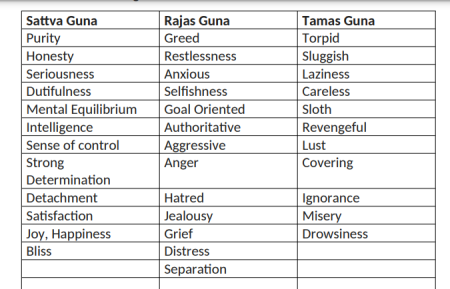

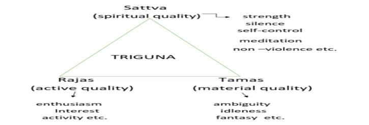

<!-- page 39 -->

VIJAY KUMAR, GEC Trigunas and Personality Indian philosophy conceptualizes Trigunas (Sattva, Rajas and Tamas Gunas) the source of the personality. These three Gunas in different proportions influence the mental and intellectual quality of every individual. It indicates the attitude with which human mind functions Trigunas have been utilized to explain the concept of personality in the modern age. Trigunas are the primary attributes of your existence as a human being that helps in shaping characteristics of everything of material or immaterial in you. These threegunas in different proportions influence the mental & intellectual caliber of every individual. Guna indicates the attitude with which human mind functions. Dominance of guna determines the individual’s personality. The proportion of each Guna may rise or fall anytime that certainly affects your personality and traits pertaining to a specific Guna or combination of Gunas. These 3 qualities, in different proportions, lead you to behave, react, conceptualize, and comprehend the nature of your surroundings differently. The characteristics of inherited Gunas by an individual can be changed due to physical, psychological and social influences. Also, it leads to determination of behaviour of an individual at that particular time. On the basis of the preponderance of particular Guna the human personality can be classified as: - 1. Sattivic personality : - sattva guna predominant. 2. Rajasic personality : - Rajas Guna Predominant. 3. Tamsic personality : - Tamas Guna predominant. Any changes whether it’s physical, mental, or psychological occurs in a human being, has the root 5 elements which composed the body. These 5 elements perceived in the body through 5 physical senses. Further, data collected through senses passed through mind, intellect and then modified according to the dominant Guna. Hence, Guna is the final step which influences the Personality of a person Every person has some ego according to which they perceive processed data according to their intellect (Buddhi). Trigunas are stemming out of ego, which is also called I-sensor or modifier, decides the personality of a person. Now, in the end, what comes out as a result of raw data (collected through 5 senses) is called the Personality of a person and it depends upon the trigunas which dominant at a particular time.

**Table 1 (page 39):**

|  |  |  |
| --- | --- | --- |
|  | 39 |  |
|  |  |  |

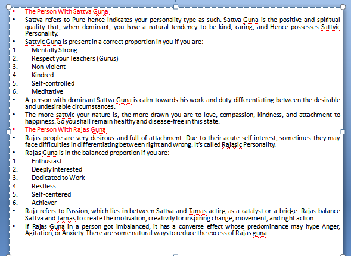

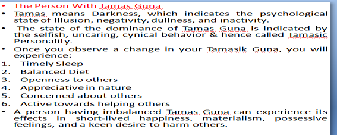

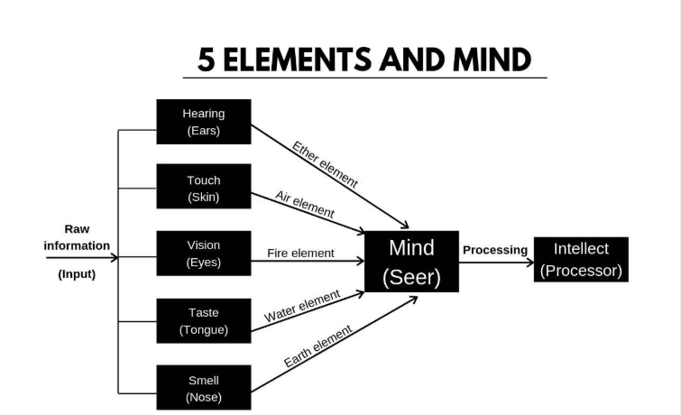

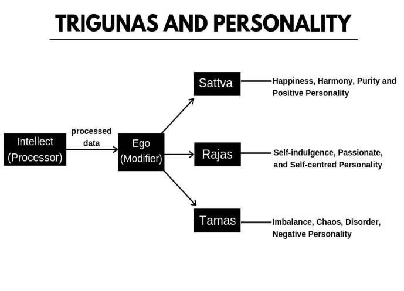

<!-- page 40 -->

VIJAY KUMAR, GEC THE RELEVANCE OF THE TRIGUNA FRAMEWORK IN TODAYS CONTEXT 1. Understanding mental health and psychology A holistic model: Ayurveda and Yogic philosophy use the trigunas as a psychological model for understanding an individual's constitution (manasa prakriti). It recognizes that imbalances in the gunas can lead to mental distress, with excessive rajas linked to anxiety and restlessness, and excessive tamas associated with depression, apathy, and lethargy. Integrative therapy: Mental health professionals are exploring the integration of triguna theory with modern psychotherapy, such as Cognitive Behavioral Therapy (CBT) and Mindfulness-Based Stress Reduction (MBSR). This allows for a more culturally sensitive and holistic approach to treatment that addresses emotional, psychological, and spiritual dimensions. Mapping personality traits: Research has found correlations between the triguna model and Western personality theories like the Big Five personality traits. For instance, a predominance of sattva can be linked to high levels of conscientiousness and agreeableness, while rajas can correlate with traits like extraversion and openness. 2. Managing stress and promoting well-being Counteracting restlessness: Modern life is often dominated by a fast-paced, high-stress lifestyle driven by ambition and desire (rajas). The triguna model provides concrete practices, such as meditation and mindfulness, to calm the mind and reduce the anxiety that comes with excessive striving. Overcoming inertia: With constant digital stimulation, many people suffer from information overload and burnout, leading to a state of mental heaviness and lethargy (tamas). The framework encourages purposeful activity and early rising to overcome procrastination and dullness. Achieving inner balance: Instead of suppressing any single quality, the goal is to create a dynamic balance. The model explains that all three gunas are necessary for a functional life, with sattva for clarity, rajas for motivation, and tamas for rest. 3. Informing lifestyle choices Dietary and lifestyle guidelines: The triguna theory classifies foods and activities based on their energetic effects. A sattvic diet of fresh, whole foods promotes mental clarity, while rajasic (spicy, stimulating) and tamasic (processed, stale) foods can disrupt balance. This ancient wisdom offers guidance for modern wellness trends like mindful eating and a healthy diet. Ethical decision-making: The Bhagavad Gita connects the trigunas to ethics, explaining how our dominant qualities influence our actions and moral compass. In professional settings like medicine, the framework can be used to understand the motivations behind decisions, emphasizing the importance of sattvic qualities like wisdom and integrity for ethical practice. 4. Insights for modern organizations Personnel selection: The triguna framework has been used in human resources to assess personality traits for personnel selection. A sattvic personality is associated with emotional intelligence and reliability, a rajasic person with ambition, and a tamasic person with a lack of motivation. Leadership and team dynamics: In a team, a balance of different gunas is needed for success. A sattvic leader fosters a harmonious environment, a rajasic individual drives action and change, and a tamasic person provides grounding and restraint. Recognizing these qualities can help build stronger, more effective teams.

**Table 1 (page 40):**

|  |  |  |
| --- | --- | --- |
|  | 40 |  |
|  |  |  |

---
*End of document. Pages processed: 40/40 (0 page(s) had errors).*
