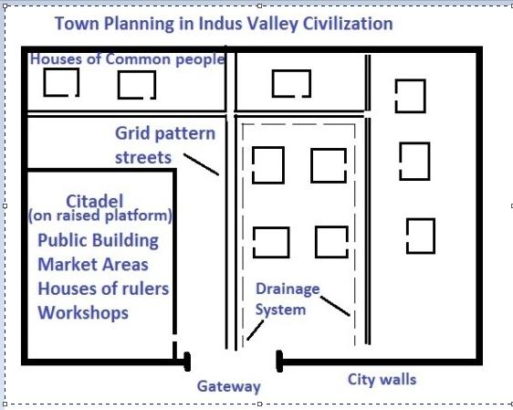
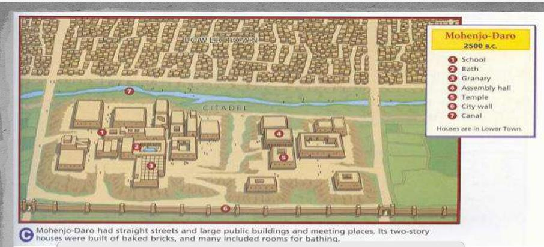
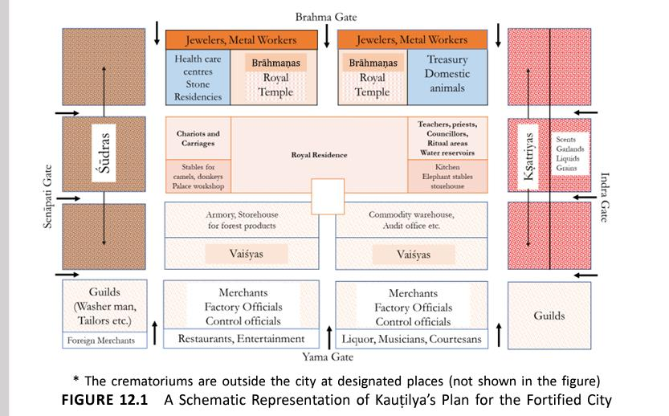
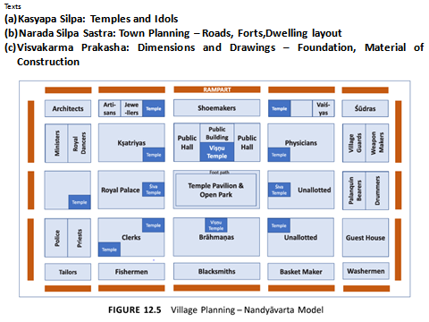
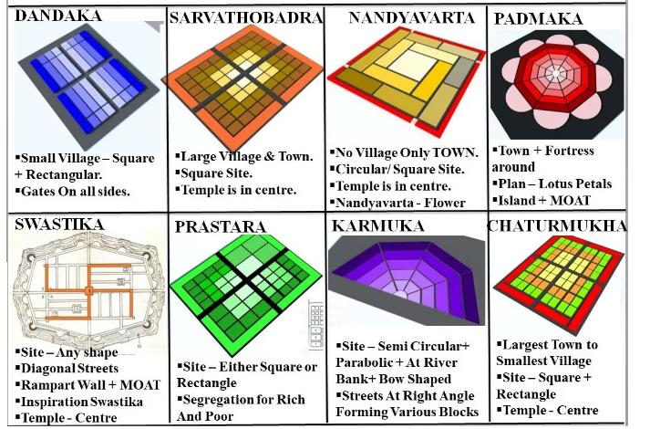
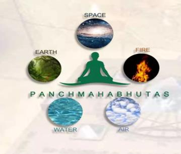
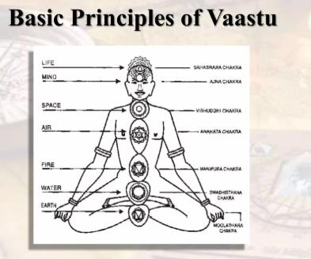

# IKS UNI-II. Town planning. vastushstra

*Converted from `IKS UNI-II. Town planning. vastushstra.pdf` on 2026-06-18 10:41*

<!-- page 1 -->

VIJAY KUMAR, GEC IKS UNIT- II TOWN PLANNING The art and science of ordering the use of land and siting of buildings and communication routes so as to secure the maximum practicable degree of economy convenience, safety   beauty, to protect self from the weather and other living beings TOWN PLANNING SYSTEM OF INDUS VALLEY CIVILIZATION The Indus Valley Civilisation, also known as the Harappan Civilisation Indus Valley Civilisation also referred to as Harappan civilization and Saraswati Sindhu Civilization.  It was situated between Indus River and the Ghaggar - Hakra River ( Pakistan and North Western India). Mohenjodaro was one of the major settlements in this area The origins of urban planning in India can be traced to the planned towns of Mohenjodaro and Harappa belonging to the Indus Valley Civilisation as early as 2500 BC(Ramachandran 1989). Cities and towns were also built around forts and centres of trade and commerce at various periods in the history of India. Archaeological Survey of India has documented town planning structure dating back to 2600 BCE. Sindhu-Saraswathi .  main cities were  Harappa (Punjab, Pakistan), Mohenjo-Daro (Sindh, Pakistan), Dholavira, Lothal, and Surkotada (Gujarat, India), Kalibangan and Banawali (Rajasthan, India), and Rakhigarhi (Haryana, India) are the major cities in the Harappan period. Main features of town planning in Indus valley civilisation:- 1. One of the most outstanding features of the Indus cities was that they were well planned. The excavations at Harappa and Mohenjodaro have shown a lot of evidence of this. 2. Division of City ;-The city had two parts, i.e., the citadel and the outer city. The citadel was built on an elevated area. The outer city was at a lower level. Raised Part (called Citadel): Consisted of housing for rulers and important public buildings such as granaries, workshops. It was mostly situated west of the city. Lower Part (eastern side of town): Consisted of houses of common citizens (see illustration map) Rectangular Grid pattern:The Harappan cities were designed on a grid pattern, with streets running in a north-south 5. Drainage system They also had a perfect drainage system. Each house had a well constructed sink from which water flowed into the underground drains. These drains along the road were covered by loose bricks. The drainage channels were made of bricks and ran along all the streets.These channels ensured that water and waste could flow smoothly through the city.Manh oles for Maintenance:Manholes were added at regular intervals to make it easy for workers to clean the drains. 8. Building materials;- Standardized burnt-bricks of ratio 1:2:4 found in all the sites (no stone was used) (*Egyptian civilization at that time used mud-bricks and stones). These excavations also found that every house consisted of two or more rooms. And there were more than one-storied houses. Likewise, archaeologists found evidence that the houses were designed with pillared halls, bathrooms, paved floors, kitchens, and wells.

**Table 1 (page 1):**

| o Rectangular Grid pattern:The Harappan cities were designed on a grid pattern, with streets running in a north-south |
| --- |
| and east-west direction, forming a well-organized layout. Streets and lanes were cutting across one another almost |
| at right angles, thus dividing the city into several rectangular blocks. The main street was connected by narrow lanes. |
| The doors of the houses opened in these lanes and not the main streets. |
| 3. Streets Grid System: Cities were planned on a grid pattern with streets running north-south and east-west, intersecting at |
| right angles, creating a well-organized layout. It followed a grid pattern (i.e. streets cut each other at right angles, thus |
| dividing the city into several rectangular blocks) .The roads were wide and straight cutting each other at right angles. |
| 4. Fortification/City wall:City in the Indus Valley was surrounded by massive walls and gateways. The cities were |
| surrounded by fortified walls made of mud bricks, providing protection against robbers, cattle raiders and floods. Each |
| part of the city was made up of walled sections. Each section included different buildings such as: Public buildings, |
| houses, markets, craft workshops, etc.In Mohenjodaro and Harappa the citadel was surrounded by a brick wall |

**Table 2 (page 1):**

| 6. Houses were of different types, small and large. They were often of two or more stories, but no window faced the |
| --- |
| streets. Burnt bricks were extensively' used. Houses were also provided with well and bathrooms. Housing Pattern: |
| People lived in houses of different sizes, mostly consisting of rooms arranged around a central courtyard. The average |
| citizen seems to have lived in the blocks of houses in the lower city. Here too there were variations in the sizes of houses. |
| 7. Commercial areas:Commercial areas were present within the cities, where artisans, craftsmen, and merchants conducted |
| their trade. These areas had specialised workshops and shops, indicating a well-organized economic system.Evidence of |
| breadmaker shops has been found at Chanhudaro and Lothal. |

**Table 3 (page 1):**

| 9. Great bath The other important structures found in the Indus cities include the Great Bath and pillared hall at |
| --- |
| Mohenjodaro, the dockyard at Lothal and the grznary at Harappa. These structures stand testimony to the architectural |
| skills of the Indus people. |
| 10. Granaries and storage facilities: The cities had well-planned granaries and storage facilities to store surplus |
| agricultural produce. These structures featured thick walls to protect the stored food from pests and were often located |
| near the citadel or the city centre. |
| 11. Public Bath Network: Public bathing played a significant role in Harappan society. The Great Bath at Mohenjo-daro |
| exemplifies this focus on public hygiene. This impressive structure, built with fired bricks, served as a communal bathing |
| area |

**Table 4 (page 1):**

|  |  |  |
| --- | --- | --- |
|  | 1 |  |
|  |  |  |

<!-- page 2 -->

VIJAY KUMAR, GEC TOWN PLANNING IN HARAPPA 1. WELL PLANNED TOWNS ;-Main and smaller streets – cut at right angleMain streets – parallelStraight and wide (about 30 feet) roadsCurved corners – easy passage for cartsPaved with baked bricks 2. BUILDINGS Skillful builders Dwelling houses – houses along street side.Public buildings – Great Granary, Great Bath, Assembly Hall 3. DWELLING HOUSES large blocks street side double - storeyed flat roofs. different sizes palaces to two room houses very good quality bricks (4,500 bricks)Courtyard surrounded by rooms, a bathroom, a kitchen, a well, narrow staircase = a house 4. PUBLIC BUILDINGS The Great Granarya large building to store surplus food grains ,2 rows of 6 granaries, close to the river bank – water transportation of grains.circular brick platforms – threshing grain, furnaces – metal workers – produced a variety of objects 5. PUBLIC BUILDINGS The Great Bath ;- Mohenjodaro  large swimming pool,six entrances,central bathing pool,galleries,dressing rooms, flights of steps to its bottom, burnt bricks ,watertight – bitumen lining, well – source of water  drainage,ceremonial bath 6. THE ASSEMBLY HALL  Mohenjodaro pillared hall thick walls 20 pillars – burnt/baked bricksfor an assembly/prayer or just a palace 7. GRID LAYOUT: Streets were laid out in a precise grid pattern, with roads intersecting at right angles, dividing the city into distinct blocks. 8. DRAINAGE SYSTEM: An intricate network of underground drains, connected to individual houses, ran along the streets, demonstrating a sophisticated waste management system. 9. BRICK CONSTRUCTION :Buildings were primarily constructed using standardized baked bricks, indicating a high level of planning and construction techniques. 10. CITADEL AND LOWER TOWN: Many Harappan cities, including Harappa, were divided into a fortified citadel, likely the administrative center, and a lower town for residential purposes. 11. WELL-PLANNED STREETS:Wide main streets were intersected by smaller lanes, facilitating movement within the city. TOWN PLANNING IN MOHENJODARO 1. Mohenjo-daro, is an ancient planned city laid out on a grid of streets. An orthogonal street layout was oriented toward the north-south & east-east directions: the widest streets run north-south, straight through town; secondary streets run east- west, sometimes in a staggered direction. Secondary streets are about half the width of the main streets; smaller alleys are a third to a quarter of the width of the main streets 2. Mohenjodaro - City Layout and Organization Mohenjodaro city was built on a high platform which also followed the well-planned layout. It covered almost 250 acres.

**Table 1 (page 2):**

|  |  |  |
| --- | --- | --- |
|  | 2 |  |
|  |  |  |

<!-- page 3 -->

VIJAY KUMAR, GEC The Mohenjodaro city was divided into two parts including the citadel and the lower city. The citadel was located on the west side of the main city. The citadel was an area that had all important buildings like a great bath, assembly hall, and great granary. Lower Town was a large area that was the main residential area. There were so many marketplaces and workshops. It was a major commercial place also. The lower city was surrounded by a big and high wall that protected the lower city from any invasion. There were multiple gateways found in the wall which were mainly used for entry and exit purposes. 3. Mohenjodaro - Street Planning The Street Planning of the city was in a grid pattern. It formed a well defined structure, those were straight and narrow. The main streets were more wide and lanes were present there. 4. Mohenjodaro - Drainage System Mohenjodaro's Drainage System was an incredible feature. The drains were made of baked bricks which had a flat base. These drains were built around 50 cm below the road. The waste water was managed by the pipelines that were connected to the chutes. These drains were covered which is the prove of the advanced sanitation system It is a fact that these drains are still in work. 5. Mohenjodaro - Residential Planning All houses in the city were built with baked bricks. All houses followed the same unique style of architecture. These houses were multi-storeyed those had flat roofs. They built up in a systematic way and each house was separated by the narrow lanes. Most of the houses had their private well and own bathrooms. 6. Mohenjodaro - Public Buildings and Amenities There were so many public buildings present in the city of Mohenjodaro. The Great Bath was a major public structure. It had a large tank that was made of bricks. It was sealed with the waterproof facilities. The Great Bat was used as the communal swimming pool and sometimes used for rituals. The Great Granary was constructed for food storage and food distribution. There was an Assembly Hall that was important for the different administrative and religious activities. TOWN PLANNING IN MAURYAN PERIOD Of various scriptures from ancient times in India, the Kautilya’s Arthashastra is one which elaborates on town planning In a capital, the city was of geometrical form. Normally square so as to allow its layout to confirm to the cosmological principles of urban planning It was surrounded by a series of moats fed by a perennial source of water containing crocodiles An earthen rampart surrounded by brick built parapets and towers On each side it is recommended that 3 gates shall be located Three royal roads to run east-west and three roads north-south dividing the interior of city into 16 wards The kings palace is situated in two north-central wards Around it the houses of four castes: 1.  North – Brahman, 2.  South – Vaishya, 3. East – Kshatriya, 4.  West - Sudra In the northern, area as well as the homes of Brahmans were to be located the residences of ministers to the crown, the royal tutelary deity of the city, tanks, monasteries, ironsmiths and jewellers. In the eastern area were to be located the elephant stables, store houses, the royal kitchen, expert artisans, troops and the: treasury. •To the south the substantial houses of merchants, warehouses and workshops, restaurants, timberyards, stables, and the arsenal were to be located; while in the west as well as the houses of the lower classes there were to be various groups of artisans working on textiles, skins, mats, weapons and other goods required by the court and other inhabitants of the city. Around the central crossroads of the city temples to various gods were to be built and commemorative pillars erected to successive kings.

**Table 1 (page 3):**

|  |  |  |
| --- | --- | --- |
|  | 3 |  |
|  |  |  |

<!-- page 4 -->

VIJAY KUMAR, GEC Between the houses and the defensive rampart a road encircles the city, to facilitate movements of troops, chariots etc., and temples of guardian deities were to- be located at each corner of the built-up area. The city as described thus functioned primarily as an administrative centre, with most of its activities centred on the needs of the royal palace, the court, the priests, the army and the considerable bureaucracy with which the king surrounded himself. Cities should be square in structure. They should have six main towns, divided by six main roads. Three roads should go from east to west, remaining three from north to south. Similarly, as we sec in my civilization, different parts arc made on the basis of different occupations of the people. Temples should be built in the middle of the TOWN PLANNING SYSTEM OF INDUS VALLEY CIVILIZATION(HARAPPAN CIVILIZATION) Indus Valley Civilisation also referred to as Harappan civilization and Saraswati Sindhu Civilization. It was situated between Indus River and the Ghaggar - Hakra River ( Pakistan and North Western India). Mohenjodaro was one of the major settlements in this area

**Table 1 (page 4):**

|  |  |  |
| --- | --- | --- |
|  | 4 |  |
|  |  |  |

<!-- page 5 -->

VIJAY KUMAR, GEC TOWN PLANNING IN MOHENJODARO 1. No fortification(walls, towers).;- military construction designed for the defense of territories in warfare, 2.  Major streets In North South direction. 3.  Intersection at right angles. 4.  Streets within built up areas were narrow. 5.  Distinct zoning for different groups. CONSTRUCTION TECHNIQUES IN MOHENJODARO :- Buildings – masonry construction by Sun dried bricks. Ranging from 2 rooms to mansions with many rooms. Underground sewerage & drainage from houses. Helical pumps for pumping water in Great bath. Principal buildings – monastry& bath - indicating religious culture. Ancient town classification 1. Dandaka 2. Sarvathobhadra 3. Nandyavarta 4. Padmaka 5. Swastika 6. Prastara 7. Karmuka 8. Chaturmukha i) Dandaka Dandaka is a Sanskrit term that refers to a type of town plan shaped like a staff or rod. In ancient Indian town planning, different shapes and designs were used to symbolize different things and to promote specific qualities in the built environment. The Dandaka town plan was characterized by its straight lines and regularity, which symbolized stability and order. This type of plan was often used in the design of military fortifications and other structures that required a strong and orderly layout. The Dandaka plan was also believed to promote positive energy and to enhance the functionality of the structures it was used in. Dandaka. Literally means a village that resemble. a staff. Its streets are straight and cross each other at nght angles at the center. running west to east, and south to north. This type of town plan provides for two main entrance gates and is generally adopted for the formation of small towns and villages Village is Rectangular / Square with street width of street varies from 1-5 Banda. • Village office located in the east Female deity (Gramadevata) will generally be located outside the village, whereas Male deities in the northern portion. ii) Sarvathobadra Sarvatobadra is a Sanslcnt term that refers to a type of town plan shaped like an umbrella. In ancient Indian town planning, the umbrella shape symbolized protection and shelter. The Sanratobadra town plan was characterized by Its circular shape and radiating streets. which provided a sense of harmony and balance to the built environment.

**Table 1 (page 5):**

|  |  |  |
| --- | --- | --- |
|  | 5 |  |
|  |  |  |

<!-- page 6 -->

VIJAY KUMAR, GEC This type of plan was often used in the design of religious and spiritual structures. such as temples and ashrams. where people sought refuge and peace. The circular shape of the Sarvalobadra plan was also believed to promote positive energy and to enhance the functionality of the structures It was used in. This type is applicable to larger villages and towns, which have to be constructed on oblong or square sites. • The whole town should fully be occupied with HOUSES of various descriptions that should be inhabited by all classes of people. • Temple dominates the village. iii) Nandyavarta Nandyavarta is a Sanskrit term that refers to a type of town plan that is circular with a central square and streets radiating outwards. This type of town plan was commonly used in ancient India. particularly in the design of cities and large settlements. The circular shape of the Nandyavarta town plan symbolized unity and completeness, while the central square served as a gathering place for the community. Mainly used for construction of TOWNS and not villages. Adopted for sites which are either circular or square in shape with 3000- 4000 houses. The streets run parallel to the central adjoining streets with the temple of the presiding deity in the center of the town. Temple of the presiding deity at the center of the town. This name is derived from a flower, the form of which is followed in this layout. iv) Padmaka (Lotus Petals) Padmaka is a Sanskrit term that refers to a type of town plan shaped like a lotus flower. In ancient Indian town planning, the lotus flower was a symbol of purity, enlightenment, and beauty. The Padmaka town plan was characterized by its circular shape, with streets radiating outwards in a petal-like pattern. This type of plan was often used in the design of religious and Spiritual This type of plan was practiced for building of the TOWNS with fortress all around. Patter of the PLAN resembies petals of lotus radiating outwards from the center. The city used to be an island surrounded by water. No scope for expansion. v) Swastika Swastika is an ancient Hindu symbol that is widely used in Hindu architecture and town planning. The word “swastika” comes from the Sanskrit word “svastika,” which means “good fortune” or “well-being.” The symbol consists of four arms that are bent at rignt angles. arranged in a cross-like pattern. The arms are typically of equal length and can be arranged clockwise or counterclockwise. « This type of plan contemplates some diagonal streets dividing the site into certain triangular plots. « The site may be of any shape. « The town is surrounded by a rampart wall. with a MOAT at its foot. « Two main streets cross each other at the center running north to south and west to east. « Temple is at the centre. vi) Prastara Prastara is a Sanskrit term that refers to the arrangement of tiles or stones used in the construction of floors or pavements. In ancient Indian architecture and town planning, the prastara was an important decorative element that was used to create intricate and beautiful patterns on the floors of buildings. « The characteristic feature of this plan is that the site may be either square or rectangular but not triangular or circular. « The sites are set apart or the very rich, rich, middle class and poor. « The size of the site increases according to the capacity of each to purchase or build upon. « The main roads are much wider when compared to those of other patterns. « The town may or may not be surrounded by a fort. vii) Karmuka This refers to a town plan that is shaped like a bow. This plan is suitable for the place where the site of the town is in the form of a bow or semi-circular or parabolic and mostly applied for towns located at sea shores or riverbanks. « The main streets of the town run from north to south or east to west and the cross streets run at right angles to them. This divides the whole area into BLOCKS. « Female deity (the presiding deity) is installed in the temple built in any convenient place. viii) Chaturmukha Chaturmukha is a Sanskrit term that refers to a building or structure that has four faces or entrances. In ancient Indian town planning and architecture. Chaturmukha structures were used for a variety of purposes, including as temples, gateways, and other religious or secular buildings.

**Table 1 (page 6):**

|  |  |  |
| --- | --- | --- |
|  | 6 |  |
|  |  |  |

<!-- page 7 -->

VIJAY KUMAR, GEC The four faces of a Chaturmukha structure symbolized the four cardinal directions. and were believed to provide protection and access to the building. This is applicable to all types of towns (from the largest town to the smallest village). The site may be either square or rectangular having four faces. The town is laid out east to west lengthwise with four main streets. The temple of the presiding deity is always at the center. VASTU SHASTRA Vastu: Means "shelter" or "house" Shastra: Means "science", "doctrine", or "teaching The term is derived from Sanskrit words Vastu (shelter or house) and Shastra (science, doctrine, or teaching). The foundational texts of Vastu Shastra are traditionally attributed to the divine architect Vishwakarma and the mythical sage Maya Muni. Vastu Shastra is an ancient Indian system of architecture that aims to create harmonious living spaces. Vastu Shastra is an ancient Indian science of harmony and prosperous living by eliminating negative and enhancing positive energies around us. It's based on the idea of combining the five elements of nature earth, water, fire, air, and space or aether to create a pleasant environment What are the goals of Vastu Shastra? 1. To create and attract positive cosmic energy 2. To enhance well-being and prosperity 3. To block negative energies 4. To invite prosperity and fortune 5. To boost health and wealth 6. To stabilize relationships 7. To increase job and business opportunities History /Origin of Vastu Shastra The origin of Vastu Shastra evolved during Vedic times in India. Vastu Shashtra developed between 6000 BCE to 3000 BCE. Origin -in 4000 B.C.-Indus Civilisation is proof of it The mention of Vastu Shastra can be found in ancient scriptures like RIGVEDA, ATHARVAVEDA, RAMAYANA,MAHABHARATA, The art of Vastu originates in Sthapatyaveda, a part of the Atharvaveda, which emerged as a system of knowledge involving the connection between man and his buildings – in other words – architecture. Here, Vastu Shastra arises to teach the art of living, designing building in harmony with nature and stimulating positive energy. Sthapatya Veda could be the theory while Vaastu Shastra is the application of this knowledge, the “science of architecture”. first used by Indian maharajas and later on it spread in whole world. Its concepts transfers to Tibet, China and Japan where it provided the base for development of what is now called FENG SHUI. Component / Elements of Vaastu Shastra: Vastu Shastra is based on the five essential elements – 1. Prithvi (earth), 2. Agni (fire), 3. Tej (light), 4. Vayu (wind) and 5. Akash (ether), which are known as panchabhutas. The whole universe including the earth and the human body is considered to be made out of these five elements that affect the cosmic forces and the forms of energies

**Table 1 (page 7):**

|  |  |  |
| --- | --- | --- |
|  | 7 |  |
|  |  |  |

<!-- page 8 -->

VIJAY KUMAR, GEC Light or Agni – Enough natural light to live comfortably (essential to create energy.) Vayu, or air– is continuously ventilated throughout the house (essential to sustain energy.) Water or Jal– For hydration and survival (essential for life.) Earth or Prithvi– Our inside organs are impacted by the magnetism of the Earth’s poles. Aakash. Energy is drawn from space, Basic Principles of Vaastu Since the whole universe is a composition of five basic elements: Fire, Air, Space, Earth and Water. Through these, our body receives Internal Energies in the form of Proteins, Carbohydrates, Fats etc. and External Energies in the form of Heat, Light, Sound, Wind and so on . The basic principles of Vaastu enables us to achieve balance among these ; giving more flexibility of body & mind for a better life . When the harmony between these elements gets disturbed our energies get dissipated in different directions leading to stress, tension and ill health and our peace of mind is destroyed. We then have to redirect our Energies subjectively as well objectively , so as to achieve an equilibrium between Internal / External Energies, to attain a healthy body and a happy mind leading to health, wealth, happiness, prosperity and success . The principles of Vastu Shastra include: 1. Orientation: The direction a building faces is important, with east being considered ideal for the entrance. 2. Shape: Rooms should be square or rectangular. 3. Lighting: Rooms should be well-lit and bright. 4. Colors: Light and neutral colors are believed to promote a feeling of calm. 5. Mirrors: Mirrors should reflect light into a room, but not cluttered spaces. 6. Furniture: Heavy furniture should be placed in the southwest direction. 7. Water: Water features like fountains and aquariums should be avoided in bedrooms. 8. Dining: The dining space should be near the kitchen, not the main door. 9. Vastu Purusha Mandala: A guiding blueprint that corresponds each square of a mandala to a part of the Vastu Purush's body. 10. Directional influence: Each direction is governed by a specific Vedic deity, which influences the energy associated with that direction. TYPES OF VASTU Residential Vastu

**Table 1 (page 8):**

|  |  |  |
| --- | --- | --- |
|  | 8 |  |
|  |  |  |

<!-- page 9 -->

VIJAY KUMAR, GEC Residential Vastu or Vastu for the house aims at creating positive energy in the residential structure of a house or a building so that its occupants can experience benefits from energies like magnetic, thermal, cosmic, light and wind of the surrounding nature of the property. Commercial Vastu Commercial Vastu principles are applied in commercial properties or business properties with the sole objectives, such as –To reap profitable business gains. To engage in commercial activities like selling products or services. To manifest transparency and flow of positive energy at workplaces. It creates an aura of energetic and hardworking ambience It boosts awareness and workforce productivity. Industrial Vastu Industrial Vastu principles are applied to ensure that your factory or commercial establishments reach their maximum profitable growth by yielding considerable production with the highest quality standards. Spiritual/Religious Vastu Spiritual or religious Vastu refers to the application of Vastu principles in places, like temples, asylums, and other spiritual/educational establishments to ensure their proper wellbeing and positive growth in the long run. Muhurta Vastu Muhurta Vastu, also known as Muhurta Shastra, is an essential aspect of Vastu Shastra that focuses on identifying auspicious moments for various activities. Yantra Vastu Yantra Vastu is an ancient practice that uses mystical designs to draw prosperity, good fortune, success, protection, and good health. Yantras are diagrams that are highly regarded and venerated as representations of heavenly forces. Planning of a building according to Vaastu pre-supposes certain principles. Aspect: The manner of arrangement or peculiarity of arrangement of the doors and windows in the external walls of the building is termed as aspect. Furniture requirement: Furniture requirement: While planning a building, furniture arrangements must be shown to justify the size of a room. Roominess: Room should have all proportional dimensions. A square room has no advantage and a rectangular room of the same floor area gives a better outlook. Similarly height also plays an important role Privacy: Privacy is the screening provided for the individuals from the others. It is different from seclusion. Grouping: Grouping is the planning of two or more related rooms in proximity of each other. It minimizes the circulation and at the same time improves the comfort, privacy and convenience of the inmates of the house Sanitation: It is the provision and upkeep of the various components of a house to keep the inmates cheerful and free from disease. Flexibility: Flexibility means that a room which is planned for one function can be used for other, if so required. Elegance: Elegance is the grand appearance of a building attained mainly owing to the elevation which in turn depends on the plan. Selection of site for the building greatly affects the elegance. Economy: The building should have minimum floor area with maximum utility. It will reduce cost and hence will be economical. Practical considerations TOWN PLANNING CIVIL ARCHITECTURE TEMPLE ARCHITECTURE •Site selection •Designs of towns, villages, capital city •Land use pattern (Zoning) •Palace •Houses •Forts •Public building • Theater •Library •Meeting Halls •Other public infrastructure •Temples •Components of a temple •Iconography (idol making) •Paintings •Furniture, doors •Sculptures •Qualification of a Sthapati •Choice of material (wood) •Site planning (Vastupurusa mandala)

**Table 1 (page 9):**

| 1 | Aspect: | Aspect: The manner of arrangement or peculiarity of arrangement of the doors and windows in the external walls of the building is termed as aspect. |
| --- | --- | --- |
| 2 | Prospect | Prospect: It is to enrich the outside view . |
| 3 | Furniture requirement: | Furniture requirement: While planning a building, furniture arrangements must be shown to justify the size of a room. |
| 4 | Roominess: | Roominess: Room should have all proportional dimensions. A square room has no advantage and a rectangular room of the same floor area gives a better outlook. Similarly height also plays an important role |
| 5 | Privacy: | Privacy: Privacy is the screening provided for the individuals from the others. It is different from seclusion. |
| 6 | Grouping: | Grouping: Grouping is the planning of two or more related rooms in proximity of each other. It minimizes the circulation and at the same time improves the comfort, privacy and convenience of the inmates of the house |
| 7 | Circulation: | Circulation: Circulation is the access into or out of a room. |
| 8 | Sanitation | Sanitation: It is the provision and upkeep of the various components of a house to keep the inmates cheerful and free from disease. |
| 9 | Flexibility: | Flexibility: Flexibility means that a room which is planned for one function can be used for other, if so required. |
| 10 |  | Elegance: Elegance is the grand appearance of a building attained mainly owing to the elevation which in turn depends on the plan. Selection of site for the building greatly affects the elegance. |
| 11 | Economy: | Economy: The building should have minimum floor area with maximum utility. It will reduce cost and hence will be economical. Practical considerations |

**Table 2 (page 9):**

| Organised under Five Heads |  |  |  |  |  |  |
| --- | --- | --- | --- | --- | --- | --- |
|  | TOWN PLANNING | CIVIL ARCHITECTURE | TEMPLE ARCHITECTURE | ARTISTIC | OTHERS |  |
|  | •Site selection •Designs of towns, villages, capital city •Land use pattern (Zoning) | •Palace •Houses •Forts •Public building •Theater •Library •Meeting Halls •Other public infrastructure | •Temples •Components of a temple •Iconography (idol making) | •Paintings •Furniture, doors •Sculptures | •Qualification of a Sthapati •Choice of material (wood) •Site planning (Vastupurusa mandala) |  |
|  |  |  |  |  |  |  |

**Table 3 (page 9):**

|  |  |  |
| --- | --- | --- |
|  | 9 |  |
|  |  |  |

<!-- page 10 -->

VIJAY KUMAR, GEC APPLICATION OF VASTUSASTRA 1. site planning 2. proportionate measurements 3. doctrine of orientation 4. planning of residential space according to directions 5. designing of building 6.  aesthetics of the building 7. to remove defect in structure 8. building such as houses, buildings, forts, bungalows, cities, and industries THE BENEFITS OF VASTU SHASTRA The potential disadvantages include: Vulnerability: The northeast is also associated with water, so a main gate in this location could potentially be more susceptible to flooding or other water-related issues, depending on the specific site conditions. Feng Shui conflicts: In some cases, the northeast gate placement may conflict with the optimal Feng Shui configuration for the overall layout and energy flow of the property. A skilled Vasthu practitioner would need to evaluate the full context. Access challenges: Depending on the property layout, placing the main entrance in the northeast may create inconvenient access or circulation issues for residents, especially if it is not the most direct route from common approach points. Difficult to apply always VASTU SHASTRA IS USED IN MODERN ARCHITECTURE Orientation: Placing the building in an optimal direction (like east or north facing) to maximize natural light and positive energy flow. Entrance Placement: Locating the main entrance in the north, east, or northeast direction, considered auspicious in Vastu. Room Placement: Placing specific rooms like the living room (northwest), master bedroom (southwest), kitchen (southeast) according to Vastu guidelines. Natural Ventilation: Designing spaces with proper air circulation to ensure fresh air throughout the building. Lighting Design :Utilizing natural light and strategically placing artificial lighting to enhance the positive energy within a space. Sustainable Materials: Incorporating eco-friendly building materials that align with Vastu's emphasis on natural elements. Landscaping and Water Features ;-The integration of nature into building designs is another aspect where Vastu Shastra in modern architecture plays a role. Water features like fountains or ponds are often incorporated into designs because water is considered a symbol of wealth and prosperity in Vastu Balancing the Five Elements;-The concept of balancing the five elements—earth, water, fire, air, and space—is central to Vastu Shastra. In modern architecture, this can be achieved through the thoughtful use of colors, materials, and designs. stress-Free Living and Working Spaces;-Vastu Shastra in Modern Architecture promotes the idea that spaces should be designed to reduce stress and enhance mental well-being. In today’s fast-paced world, stress-free living and working environments are more important than ever

**Table 1 (page 10):**

|  |  |  |
| --- | --- | --- |
|  | 10 |  |
|  |  |  |

---
*End of document. Pages processed: 10/10 (0 page(s) had errors).*
