# IKS UNI-IV - revised

*Converted from `IKS UNI-IV - revised.pdf` on 2026-06-18 10:41*

<!-- page 1 -->

VIJAY KUMAR GEC-GOA 1 IKS UNIT- IV LINGUISTICS Language has been the most effective tool for our communication since time immemorial. Though some basic communications can be handled with gestures, language becomes inevitable for communicating elaborate and complex ideas. Scientific discovery, the advancement of knowledge, and collaborative working require a common method of communication. Language plays this role in a civilized society. As technology and computing prowess improves, we are able to develop better applications using Artificial Intelligence (Al) techniques. This requires us to develop efficient Natural Language Processing (NLP) capabilities. A systematic study of languages and their capabilities for the evolving requirements has become important for the science and technology community. Language is a tool used by everyone in a community and it is very difficult to maintain it unchanged.Studying the structure of the language helps us not lose the underlying principles that govern a language and ensures that the received wisdom from the ancestors is not lost. It also maintains continuity in language processing. Communication is key to trade, science and technology, and societal progress. It hinges on our ability to effectively process language as it is central to all human transactions and pursuits. LINGUISTICS Linguistics (L.) (from Lat. lingua – “language”) is scientific study of language. Is a branch of language research that provides a scientific study of a language. It is a systematic study of language to understand speech sounds, grammatical structures, and meaning. It helps us analyse the language form and meaning and identify systematic methods integral to the language to derive the word forms and their meaning using structured rules and syntax. The earliest approach to a systematic treatment of linguistics is attributed to the Indian Linguistics is the scientific study of language. At the heart of linguistics is an understanding of: 1. What is language? 2.  How does language work? 3.  What do all languages have in common?’, 4.  What range of variation is found among languages? 5.  How does human language differ from animal communication?’ 6.  How does a child learn to speak? 7.  How does one write down and analyse an unwritten language?, 8.  Why do languages change? 9.  To what extent are social class differences reflected in language? AIM Linguistic theory is the study of the nature of human language and the underlying principles that govern it. The study of language structure is a key part of linguistic theory, and linguists analyze language in a variety of ways: 1. Syntax: The study of sentence structure and how it affects meaning and interpretation 2. Semantics: The study of meaning 3. Morphology: The study of word structure and how it relates to sound and sentence structure 4. Phonetics: The study of sound systems, sound patterns, and sound structures 5. Phonology: The study of the abstract sound system of a language 6. Pragmatics: The study of how context contributes to meaning Linguistic theory also encompasses a variety of frameworks and perspectives, including: 1. Evolutionary linguistics: The study of the origins and development of language from an evolutionary and cognitive perspective 2. Cognitive linguistics: The study of the relationship between language and cognition Aims of linguistic theory: The main aim of linguistic theory is twofold 1. first, to characterize what human languages are like (descriptive adequacy) and 2.  second, to explain why they are that way (explanatory adequacy) other 1. What is knowledge of language? (Competence) 2. How is knowledge of language acquired? (Acquisition) 3. How is knowledge of language put to use? (Performance/language processing) SCOPE

<!-- page 2 -->

VIJAY KUMAR GEC-GOA 2 The scope of linguistics is the scientific study of language, which includes many branches and subfields. The scope of linguistics is vast and includes both theoretical and practical applications: 1. Linguistic analysis; -The study of the structure and meaning of language, including syntax, semantics, morphology, phonetics, and phonology 2. Linguistic perspectives;-The study of language from a variety of perspectives, including synchronically, diachronically, and in monolinguals or multilinguals 3. Linguistic branches;-The study of language in relation to other areas, including sociolinguistics, psycholinguistics, neurolinguistics, historical linguistics, and applied linguistics 4. Linguistic applications;-The use of linguistic knowledge in real-world situations, such as language teaching Linguistics emerged from the field of philology, and some of its branches are more qualitative and holistic in approach. COMPONENT OF LANGUAGES Language processing has two dimensions: 1. Receptive and 2. Productive. The receptive ;-The ability to understand and comprehend language through listening and reading. Is a part of a language deals with the ability of an individual to receive language inputs from multiple sources and process them to decipher the intended message and comprehend them. Receptive language involves gaining meaning from sounds, words, written information, and visual information from the environment. Productive. ;-The ability to produce words, phrases, sentences, and paragraphs through speaking and writing. Productive skills are also known as active skills. On the other hand, the productive part of the language  is to transmit back to others for their consumption.  The focus in the former is on listening and reading, Language whereas it is on speaking and writing in the latter. Viewed from another perspective, sound (listening Reading Writing and speaking) and script (reading and writing) are the essential elements of a language. Therefore, language1 Components of a processing can be represented in a 2 x 2 framework Linguisticsaddress all of this aspect and phonetics will cater Receptive and Productive aspect of sound  and a syntactical structure will cater to the spiritual aspect of language BRANCHES The core branches of Linguistics are associated with language structure and the units of each level of this structure at which Linguistics. is looking at: 1. sounds, 2. words, 3. sentences, and

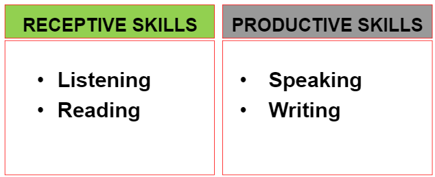

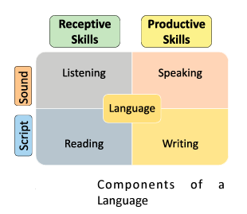

<!-- page 3 -->

VIJAY KUMAR GEC-GOA 3 4. Texts. 1. If Linguistics. looks at sound, then we can distinguish between the following linguistic branches: a) phonetics – deals with the production (articulatory phonetics), physical transmission (acoustic phonetics), and reception or perception (auditory phonetics) of speech sounds by people (e.g. what organs of speech participate in articulating the sound  and b) phonology – how sounds are organized in a particular language (e.g. how many consonants and vowels does this language have?) 2. If Linguistics. looks at structure of words and sentences, we can distinguish between: a) morphology – deals with the structure of words (e.g. the word “superuser” consists of the stem ‘superuser’, two roots: ‘super’ and ‘use’, the suffix ‘-r’, and a zero ending) and b) syntax – how phrases and sentences are constructed 3. If Linguistics. looks at meaning, we can distinguish between: a) semantics – has to do with meaning of words and other communicative units b) pragmatics – how meaning works to produce a particular communicative effect c) discourse – language in use – the focus here is the text and how it functions in a variety of contexts. Micro linguistics focuses on the study of language itself, including its sound (phonetics and phonology) grammatical structures (morphology), syntax, and meanings (semantics) in context (pragmatics). Macro Linguistics takes a broad view of linguistic phenomena, studying language in different context and its development over time. Macro-linguistics includes study of other disciplines that are connected with language study in any perspective e.g. the study of relation between society and linguistics is sociolinguistics. Macro-linguistics is further divided into Inter disciplinary branches of linguistics and Infra disciplinary branches of linguistics. Inter Disciplinary Branches of Macro Linguistics;- deals with study of linguistics with relation to other disciplines as sociology, psychology, neurology, geography, etc. Below are inter-disciplinary branches of macro linguistics. Intra disciplinary branches of linguistics deal with the study of linguistics within its own discipline. MUSIC Music;- an arrangement of sounds in patterns to be sung or played on instruments.aan art of sound in time that expresses ideas and emotions in significant forms through the elements of rhythm, melody, harmony, and color. HISTORY OF INDIAN MUSIC Indian music has a long history, with roots in the Vedic Age and beyond. The history of Indian music can be divided into three main periods: Ancient, Medieval, and Modern. Prehistoric Period 3000 - 1800 BC Indus Valley Culture :Mohenjo-daro, Harrappa. Musical instruments including flutes, drums and string instruments have been found in excavations of Indus Valley sites. Vedic Period1500 BC Beginning of Aryan immigration from Central Asia. Vedas (Sanskrit liturgical hymns, prayers, spells and incantations) : Rig Veda - 3 note chant. Sama Veda - 7 note chant. Atharva Veda

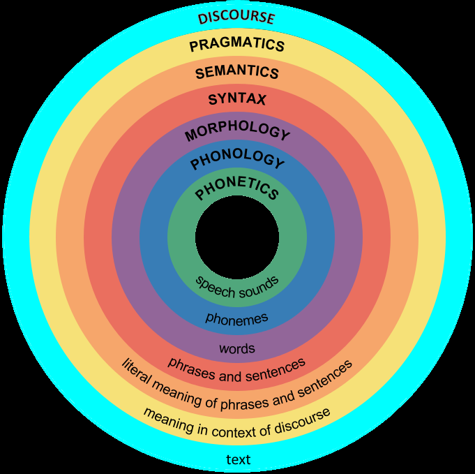

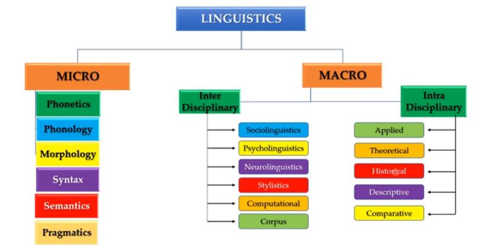

<!-- page 4 -->

VIJAY KUMAR GEC-GOA 4 Yajur Veda - poetic meters are antecedents of tala (rhythmic cycle). Upanishads,800BCBrahamanas, Puranas(other Sanskrit liturgical texts). GandarvaGaan;-(Music of the Celestial Singers) in practice. Buddhist music 273 - 232 BC is music (Sanskrit: vàdita, saṅgīta) created for or inspired by Buddhism and includes numerous ritual and non-ritual musical forms Reign of Emperor Ashoka 200 BC;-Panini codifies Sanskrit grammar. Natya Shastra - by Bharata Muni 200 - 300 AD;-(treatise on the art of vocal and instrumental music, dance and drama - known as the fifth Veda). Matanga'sBrihaddeshi (5th century AD–13th century AD): The term raga was first used in this work. Gita Govinda (5th century AD–13th century AD): Jayadeva is considered a trailblazer for composing a work with structured compositions. SangitaRatnakara (5th century AD–13th century AD): Shargnadeva's work covered concepts like raga, talas, musical instruments, and voice culture. 12th–13th century AD: Persian and Central Asian influences began to affect the music of North India. 14th century: Indian music split into the Hindustani and Carnatic systems. ANCIENT PERIOD The ancient literature of our country, like the Vedas, Agamas, Upanishad, VayuPurana, BrihaddharmaPurana, Ramayana, Mahabharata, Bhagavata, Shikshagranthas and others contain invaluable references to the basic principles ofclassical music such as - seven swaras, three gramas, twenty onemurchanas, threelayas (speeds), nine rasas, three sthayis (octaves), srutis, etc. Reference available dating back to the Vedic Age (2000-1000BC) mentions a number of musical instruments.Sama Veda gives three types of notes – Udatta, anudatta and swaritha,  In Rig Veda – Veena, Vanshi (Flute) and Damaru In epics the Ramayana specifies the time for the practice of the music and in Mahabharata refers to musical instruments played at the commencement of the  Bharata war like sankha, bheri, anakagomukha etc. AD 400-500 – Bharata’sNatyasastra is the first and most dependable evidence to be found regarding the basis of Indian Classical music AD 400-1100 considerable progress in music can be seen and that the jatis were subsequently consolidated into six basic melodies and then came into being two branches --- the Hindustani and Carnatic Music schools MEDIEVAL PERIOD India had one system of music through out the country till about 13th century. Thesame fundamentals like saptaswaras, octave, sruti etc. formed the basic principles.Haripala, for the first time mentioned the terms Hindustani and Karnatak(Carnatic) music. With the advent of muslim rule in North, the art of Indian musicinteracted with the Arabian and Persian systems of music. Patronised by theMuslim rulers in their royal court, the Indian music branched out to develop alongwith new dimension. Comparatively South India remained undisturbed withoutany foreign invasions or upheavals. Indian classical music continued to prosperand grow along the ancient traditional way encouraged by temples and traditionalHindu Kings. Thus Hindustani and Kamatak music developed into two independentsystems of music emerging from the same, single source- Vedas. Emperor Akbar (AD 1556-1605)…Music reached its zenith…a great connoisseur of art and culture particularly the Classical music…Thirty six experts in the art of music..Chief among them were TansenBaijuBawra and Ramdas 18TH CENTURY - THE GOLDEN AGE During this period there was multifaceted development and musical activity, bothin quality and quantity of the musical forms, Ragas, Talas, Musical instruments,musical notation system etc. The scholarly musical forms such as well decoratedKritis, Swarajatis, Varna, Pada, Tillana, Jawali, Ragamalikas etc. were composedin large numbers. It is important to mention here that all these different forms ofcompositions drew their fundamentals from the ancient prabandhas. Only thesections; the musical and lyrical aspects had assumed a refined and transformedshape in the newer compositions Classical music too started being exported out of the country in the 60`s, and an experiment of combining western music with the Indian Classical form also took place. This gave rise to what is popularly referred to as fusion music. In the 70`s and 80`s disco and pop music entered the Indian musical scene. The 90`s further popularised the pop trend among the Indian audiences. With the further spread of information technology and an increasingly global world, we see a host of musical forms existing in contemporary India—rock, Hip-hop, jazz etc

<!-- page 5 -->

VIJAY KUMAR GEC-GOA 5 Apart from these western forms of music, traditional forms of Indian music, such as Khayal, Ghazal, Geet, Thumri, Qawwali etc. also find place in the contemporary music. Bhajans and Kirtans, which form a separate stream of religious songs, are also quite widely sung across the country. CLASSICAL MUSIC Two distinct classical music emerged over time: 1. Hindustani music - It is practised in northern India. 2. Carnatic music - It is a type of Indian classical music that is popular in the southern parts of the country. North Indian Music (Hindustani Music) method is prevalent in the states of Maharashtra, Gujarat, Punjab, Rajasthan, Madhya Pradesh, Bihar and West Bengal. Majorly found in the northern part of the Indian sub-continent evolved in northern India around the 13th and 14th centuries Hindustani music was influenced by Mughal Persian performance customs and old Hindu musical traditions, Vedic philosophy, and natural Indian sounds..Musical instruments used in Hindustani are Tabla, Sarangi, Sitar, Santoor, Flute and violin It is based on the Raga system. The Raga is a melodic scale comprising of basic seven notes. Hindustani Music is vocal-centric Music from the north can be divided into two types: 1) classical and 2) light classical (also referred to as semi-classical). The classical form requires stricter adherence to the raga formula while light classical allows more opportunities for deviations and does not require the intense concentration that classical Indian music requires. Light classical music is defined as a style of music that follows the rules of raag and taal but adheres to them less strictly than with classical music. The alaap is usually very short or doesn't exist and the melodies are often derived from popular folk music and are rendered in medium (“madhyakaal”) or fast (“teevragati”) tempo There are ten main styles of singing in Hindustani music like the Dhrupad, Khayal, Tappa, Chaturanga, Tarana, Sargam, Thumri and Ragasagar, Hori and Dhamar. South Indian Music (Karnataka Music) Carnatic music is a part of the south- Indian culture ,Carnatic music or Karnataka Sangita (known as Karnāṭakasaṃgīta or Karnāṭakasaṅgītam in the Dravidian languages) is a system of music commonly associated with South India, including the modern Indian states of Andhra Pradesh, Karnataka, Kerala, Tamil Nadu and portions of east and south Telangana and southern Odisha. The main emphasis in Carnatic music is on vocal music; most compositions are written to be sung, and even when played on instruments, they are meant to be performed in gāyaki (singing) style. Although there are stylistic differences, the basic elements of śruti (the relative musical pitch), svara (the musical sound of a single note), rāga (the mode or melodic formulae), and tala (the rhythmic cycles) form the foundation of improvisation and composition in both Carnatic and Hindustani music. Although improvisation plays an important role, Carnatic music is mainly sung through compositions, especially the kriti (or kirtanam) – a form developed between the 14th and 20th centuries by composers such as PurandaraDasa, and the Trinity of Carnatic music Types of Carnatic Music and its meaning Ragam 1. Tanam-Pallavi – Elaborate rhythmic and melodic variation in unmeasured sense. 2. Kriti-Kirthanai – Most popular type which refers to devotional music laced with poetic beauty. 3. Varnam – Performed at the beginning of a concert; a completely composed piece.

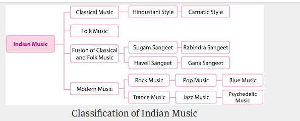

<!-- page 6 -->

VIJAY KUMAR GEC-GOA 6 4. Padam – Slower tempoed love songs referring to the human yearning for the adored god head. 5. Javalis – Faster tempoed love songs with direct description of human love. 6. Tillana – Meaningful phrases are interspersed with variety of meaningless syllables. Regional Music Cultural traditions from various regions of the country reflect the rich diversity of Regional Music of India. Each region has its own particular style. 1. Tribal music 2. Folk music Is not taught in the same way that Indian classical music is taught. There is no formal period of apprenticeship where the student is able to devote their entire life to learning the music, the economics of rural life does not permit this sort of thing. The musical practitioners must still attend to their normal duties of hunting, agriculture or whatever their chosen profession is. Music in the villages is learnt from childhood, the music is heard and imbibed along with numerous public activities that allow the villagers to practice and hone their skills. The music is an indispensable component of functions such as weddings, engagements, and births. There is a plethora of songs for such occasions. There are also many songs associated with planting and harvesting. In these activities the villagers routinely sing of their hopes, fears and aspirations. Musical instruments are often different from those found in classical music. Although instruments like the tabla may sometimes be found it is more likely that cruder drums such as daf, dholak, or nal are used. The sitar and sarod which are so common in the classical genre are absent in the folk music. One often finds instruments such as the ektar, dotar, rabab, and santur. Quite often they are not called by these names, but may be named according to their local dialect. There are also instruments which are used only in particular folk styles in particular regions. These instruments are innumerable. The instruments of classical music are crafted by artisans whose only job is the fabrication of musical instruments. In contrast the folk instruments are commonly crafted by the musicians themselves. It is very common to find folk instruments that have been fabricated of commonly available materials. Skin, bamboo, coconut shells, and pots are but a few commonly available materials used to make musical instruments. Main are 1. Rasiya Coot, Uttar Pradesh the rich tradition of singing RasiyaGeet flourished in Braj which is the sacred land of Lord Krishna's charming leelas from time immemorial. 2. Pankhida, Rajasthan Sung by the peasants of Rajasthan while doing work in the fields, the peasants sing and speak while playing algozaandrnanjira. 3. Lotia, Rajasthan 'Lotia' is sung in the chaitra month during the festival - 'Lotia'. Women bring lotas (a vessel to fill water) and kalash vessel considered to be auspicious to fill water during worship) filled with water from ponds and wells. 4. Pandavani, Chhattisgarh In Pandavani, tales from Mahabharata are sung as a ballad and one or two episodes are chosen for the night's performance. 5. Shakunakhar - Mangalgeet, Kumaon Numberless songs are sung on auspicious occasions in the foothills of Himalaya. Shakunakhar are sung during religious ceremonies of baby-shower. child-birth, Ghhati (a ritual done on the sixth day from the birth of a child) Ganesh poojaetc.. 6. Mando, GoaGoan regional music is a treasury of the traditional music of the Indian subcontinent. Mando, the finest creation of Goan song is a slow verse and refrain composition dealing with love, tragedy and both social injustice and political resistance during Portuguese presence in Goa. 7. Alha, Uttar PradeshAlha, typical ballad of Bundelkhand narrates the heroic deeds of Alha and Udal, the two warrior brothers who served Raja Parmal of Majoba 8. Hori, Uttar Pradesh The history of Hon, its evolution and tradition is quite ancient. It is based on the love pranks of 'Radha-Kris hna'. Hon singing is basically associated with the festival of Holi only. 9. Sohar, Uttar Pradesh Social ceremonies have. at times, served as a potent factor for intermingling of different cultures. North India has a strong tradition of singing 'Sohar' songs when a son is born in a family. 10. Chhakri, KashmirChhakri is agroupsong which is the most popular form of Kashmir's folk music. It is sung to the accompaniment of the noot (earthen pot) rababs, sarangi and tumbaknari (an earthen pot with high neck). 11. Laman, Himachal Pradesh In Laman a group of girls sing a stanza and a group of boys give reply in the song. ELEMENTS OF INDIAN MUSIC The basic concepts of this music includes 1. Shruti (microtones), 2. Swaras (notes), 3. Alankar (ornamentations), 4. Raga (melodies improvised from basic grammars), and 5. Tala (rhythmic patterns used in percussion).

<!-- page 7 -->

VIJAY KUMAR GEC-GOA 7 Its tonal system divides the octave into 22 segments called Shrutis, not all equal but each roughly equal to a quarter of a whole tone of the Western music. Both the classical music are standing on the fundamentals of The seven notes of Indian Classical music. These seven notes are also called as Saptasvara or Sapta Sur. These seven svaras are Sa, Re, Ga, Ma, Pa, Dha and Ni respectively. These SaptaSvaras are spelt as Sa, Re, Ga, Ma, Pa, Dha and Ni, but these are shortforms of Shadja ,Rishabha , Gandhara , Madhyama , Panchama , Dhaivata  and Nishada respectively. Elements of Indian music 1. Tala, 2. Raga, 3. Shruti, 4. Alankara, 5.  Drone Tala: is the rhythmic structure that defines the timing and cycle of a piece of music. Refers to a metrical cycle of beats. It is composed of long and short beats that are accented and unaccented. It is a complex system with various patterns and durations, and the tala dictates the rhythmic framework for improvisation. Is known to be the rhythmic time cycle of Indian music. It is composed of long and short beats that are accented and unaccented. Tala means clapping of one's hand in a rhythmic  beat that measures musical time. It can be clapping hands, touching fingers on the lap or striking small cymbals. Tala rarely changes with the tala. Raga and tala are the two fundamental elements in Indian Music. There are seven talas : Ata, Dhruva, Eka, Jhampa, Matya, Rupaka and Triputatala. Raga;- Raga: Ragat form the melodic foundation of Indian music, serving as a framework for improvisation and composition. They are based on specific scales and patterns of notes (swaras), including microtones, and are unique to each raga. Indian music is  based on a different tonal organization called Raga. A raga is an aesthetic melodic form with peculiar ascending and descending movement. It is based on a scale of five to seven notes. Indian Tonal System SA RE GA MA PA Dha Ni It is a powerful element of any song whereby the singer sings according to a certain motif in the song to attract the attention of the audience. Each raga has its own mood and personality which works wonders on the audience when it is performed. Swara: It is a Sanskrit word which connotes musical notes in successive steps of the Octave. It defines the relative position of the note rather than a particular frequency. A swara is different from Shruti in the context of Indian music. Swara is also referred to as solfege of Carnatic music which has seven basic notes sa, re, ga, ma, pa,dha,ni. Shruti:-Is the twenty-two microtones, which are used as ornamentations for the raga. This adds texture to the melody of the music. It is a Sanskrit word which is an important concept in Indian music. It is a pitch produced either by a singer or musical instrument which is audible to the human ear Drone: Drone: The drone, a sustained pitch or set of pitches, provides a continuous background sound against which the melody is played. It is often played on instruments like the tanpura and creates a harmonic foundation, particularly relevant since Indian music doesn't rely heavily on traditional harmony as in Western music. Is a low dull monotonous sound that is continuously played throughout the composition. In the Indian musical tradition the stringed instrument called Tambura is used to play the drone. Alankara(Sanskrit:  romanized: Alaṃkāra), also referred to as palta or alankaram, is a concept in Indian classical music and literally means "ornament, decoration"

<!-- page 8 -->

VIJAY KUMAR GEC-GOA 8 SIGNIFICANCE AND IMPORTANCE OF MUSIC 1. Preserving Our Rich Heritage 2. Expressing the Soul of India 3. Fostering Bonds of Unity 4. Celebrating Our Cultural Tapestry 5. The Power Of Music In Society ;-Music is one of the most powerful forms of communication on the planet. It has the ability to unite people across cultural, language, and geographical boundaries 6.  Music is known to improve cognitive function in a variety of ways. It has been shown to help with memory recall, problem solving skills, multitasking abilities, focus and concentration, spatial awareness, and more. 7.  In addition to these cognitive benefits, music also has a positive impact on creativity! Learning 8.   Enhance Motor Skills Coordination ;-One of the most important benefits of music is that it enhances motor skills coordination.   When you learn how to play an instrument or sing properly, your muscles will become stronger and more flexible in different areas of your body 9.  Increase Self Esteem and Confidence ;-Learning music can be a fun process that provides you with opportunities to express yourself creatively in ways that other activities may not allow. By singing or playing an instrument in front of others — even if they don't understand what you're saying — you'll begin to build your self esteem and confidence one step at a time. 10.  Provide An Escape From Everyday Life And Stress. 11.  In addition, music can be a powerful tool for personal development and emotional healing 12. Increase Self Esteem and Confidence MUSICAL INSTRUMENTS A musical instrument is a device constructed or modified for the purpose of making music. In principle, anything that produces sound can serve as a musical instrument. A musical instrument is a device created or adapted to make musical sounds Classification

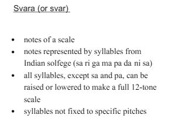

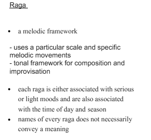

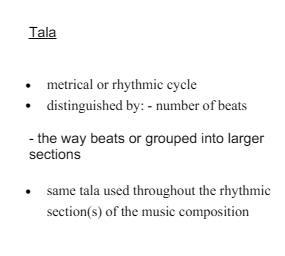

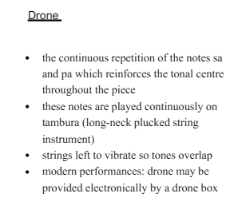

<!-- page 9 -->

VIJAY KUMAR GEC-GOA 9 four main categories on the basis of how sound is produced. Four main categories on the basis of how sound is produced. 1. The Tata Vadya or Chordophones- Stringed instruments 2. The Sushira Vadya or Aerophones- Wind instruments 3. The Avanaddha Vadya or Membranophones-  sound is produced by striking a stretch membrane 4. The Ghana Vadya or ldiophones- sound is produced by striking metal or clay . Played using a hammer or striker. Solid instruments which do not require tuning. Tata Vadya - Stringed Instruments The tatavadya is a category of instruments in which sound is produced by the vibration of a string or chord. These vibrations are caused by plucking or by bowing on the string which has been pulled taut. The stringed instruments that were played with bow, plectrum or plucked with fingers. The pitch of the note is determined by the length of the string and how tightly it's stretched. Strings can be made of metal, synthetic or natural materials. The strings can have different gauge or thickness, weight, length and tension. The tata vadya is a category of instruments in which sound is produced by the vibration of a string or chord. These vibrations are caused by plucking or by bowing on the string which has been pulled taut. The tata vadya are divided into two broad categories 1. the plucked and 2. the bowed, • and further subdivided into the fretted and non-fretted variety. I. Plucked String Instruments (Tat) - These instruments are played by plucking or striking the strings. Sitar, Tanpura, Veena, Vichitra Veena, Saraswati Veena, Ektara, Sarod, Surbahaar, Surmandal, Rebab, Santoor etc. are examples of Plucked String Instruments. ii. Bowed String Instruments (Vitat) - These string instruments are bowed. Chikara, Dilruba, Sarangi, Ravanhasta, Taar Shehnai, Israj etc. are examples of Bowed String Instruments Veena, Kand Veena, Karkari Veena are mentioned. fretted instruments have metal bars (frets) along neck marking specific note location like guitar, basses, mandolins Unfretted instruments have uninterrupted finger board like violin , cellos Tata Vadyas or String Instruments 1. Plucked-with frets: like veena, sitar etc. 2. Plucked- without frets: like vichitraveena, sarod, rabab etc. 3. Bowed- with frets: like dilruba, esraj etc. 4. Bowed- without frets: like sarangi, violin etc. SushiraVadya Are wind instruments In the Sushira Vadya group, sound is produced by blowing air into a hollow column In the SushiraVadya group, sound is produced by blowing air into a hollow columnproduce sound by vibrating a body of air. The tonal quality depends on the shape and size of the tube.. The pitch of the note is determined by controlling the air passage and the melody is played by using the fingers to open and close the in the instrument. Key characteristics 1. Hollow;- the instruments has hollow body creating a resonating chamber for the air 2. Pitch control;- the pitch is altered by changing the length of vibrating air column, which is achieved by opening and closing the hole on the instruments surface 3. Fingering;- fingers are used to cover and uncover the holes, modifying the pitch and producing deferent notes The simplest of these instruments is the flute. These categories are based on the distance between the blow hole and the first finger hole Blown- with mouth by breath: like flute, shahnai, mouth organ etc. Blown- with some mechanical devices: like, harmonium. WIND INSTRUMENTS: (a) Buffalo horn (Kombu) was the first wind instrument (b) Bamboo, bamboo with holes finally flute (c) Nadaswara and Shahani AvanaddhaVadya In the AvanaddhaVadya category of instruments, sound is produced by striking the animal skin which has been stretched across an earthern or metal pot or a wooden barrel or frame.

<!-- page 10 -->

VIJAY KUMAR GEC-GOA 10 Avanaddh part refers to that which is covered • Sound is generated when stretched  membrane is strict, plucked or stroked, causing vibration that produce sound wave • A covered  hollow vessel generates bits when struct • It can play with hands, sticks or even combination of both • Drums have been divided into different categories on the basis of their shapes and structure as also the position and placement for playing. • The main categories are-Oordhwaka, Ankya, Alingya and the waisted or the Damaru family of drums. PERCUSSION INSTRUMENTS: (a) Ghata, terracotta vessel was the first percussion instrument (b) Kanjira was first instrument with skin cover (c) Single side: Drums, Double Side: Dhol&Mridanga (d) Tabla and many other variants In these instruments, body of the musical instrument is made up of specialclay, wood or metal; 1. Barrel shaped with both the sides open in the opposite ends e.g., Mridanga, Pakhawaja, Dholak, Madal etc. 2. Kettle shaped musical drums with only one open end e.g., Tabla, Bayan, Urdhwaka etc. is covered with best skin with the help of thin and long leather straps to keep the musical drum in perfect tone. Ghana Vadya The earliest instruments invented by man are said to be the Ghana Vadya. Once constructed, this variety of instrument do not need special tuning prior to playing. • Ghana Vadya / idiophones • The earliest instruments invented by man are said to be the Ghana Vadya. • Are solid musical instruments that produce sound through vibration when struct, shaken or scraped • Once constructed, this variety of instrument do not need special tuning prior to playing.  And often used for rhythmic accompaniment • Example majira, khartl, kanch trang, jhani, jaltrang, Key characteristics; 1. Solid instruments;- they are made from solid material likes wood  , metal or other hard substance 2. No tuning required;- the produce sound through their inherent vibration when played, rather than needing to be tuned in specific way 3. Rhythmic emphasis;- the are often used to create rhythmic patteren and accompany other instruments in music • In early times these instruments were the extension of the human body such as sticks, clappers, rods, etc. and were also closely related to objects of utility in daily life such as pots and pans, jhanj, falams, etc. • They are principally rhythmic in function and are best suited as accompaniment to folk and tribal music and dance. In these instruments, sound is produced by striking instruments made upof metal or wooden pieces. Thus, these instruments are also called metallicinstruments. It includes Jhanjh, Kartal, Manjira, Chimta and Talam, etc.They are principally rhythmic in function and are best suited as accompaniment to folk and tribal music and dance. PERCUSSION INSTRUMENTS: (a) Ghata, terracotta vessel was the first percussion instrument (b) Kanjira was first instrument with skin cover (c) Single side: Drums, Double Side: Dhol&Mridanga (d) Tabla and many other variants INDIAN MUSIC INSTRUMENTA

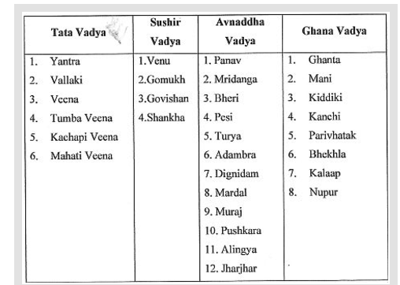

<!-- page 11 -->

VIJAY KUMAR GEC-GOA 11 DHVANI SIDDHANTA Dhvani Theory A composition where suggested sense predominates is called Dhvani. The word Dhvani is used for both - the suggestive word and the suggestive meaning. The poetic language can never be possible without Dhvani. In Dhvanyāloka, Dhvani becomes an all-embracing principle that explains the structure and function of the major elements of literature - the aesthetic effect (Rasā), the figural mode and devices (Alamkāra), the stylistic values (Riti) and excellence and defects (Guna-dosa). DANCE Dance is a type of art that generally involves movement of the body, usually rhythmic and to music, performed in many different cultures and used as a form of expression, social interaction and exercise or presented in a spiritual or performance setting. In the Natyashastra the dance is divided into two basic categories; 1. Natta or the abstract, ;-Pure dance, which does not convey any story or specific mood, 2. Nritya or dance;-dance with rasa moods, often serving as a medium to convey a story.Nritya is also often called abhinaya

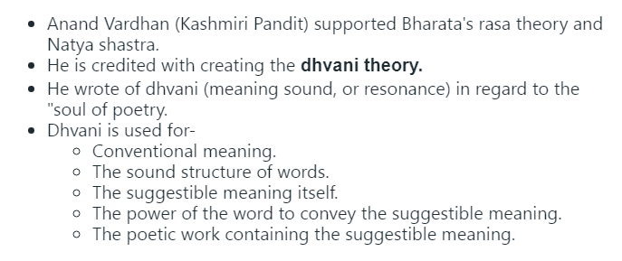

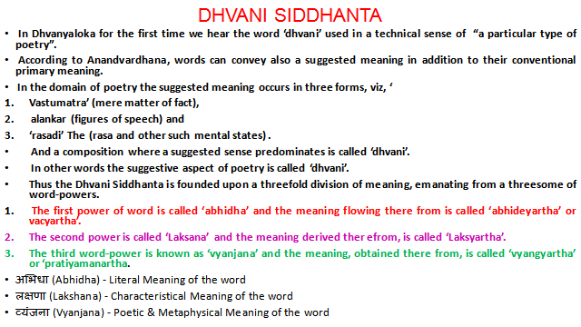

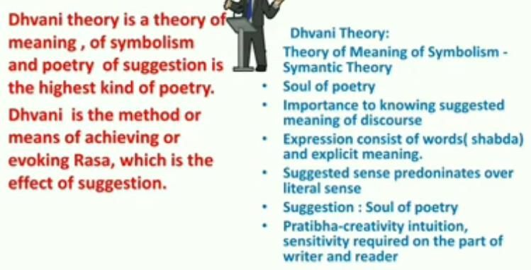

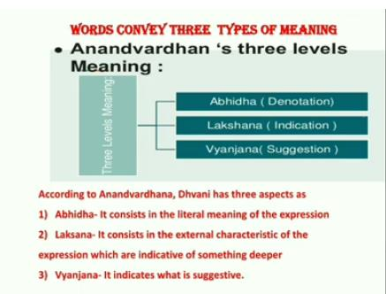

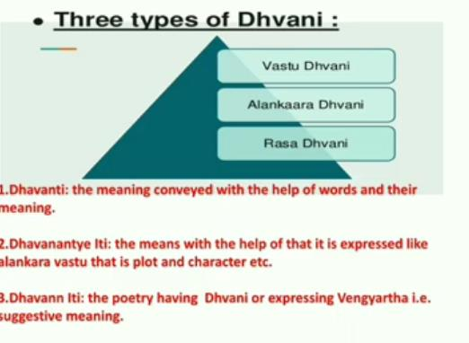

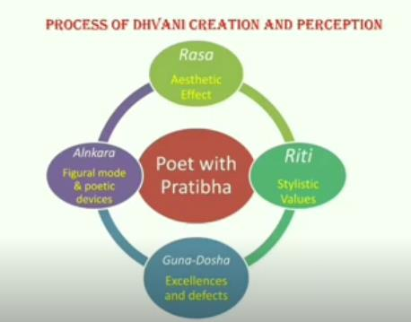

<!-- page 12 -->

VIJAY KUMAR GEC-GOA 12 The nrtta is constructed of the technique of rendering the rhythm (tala) through movements that do not have any specific meaning, and the skill of projecting frozen, sculptural poses within a given rhythmic cycle. Component of dance/ elements of dance The Natyashastra, an ancient Indian treatise on dance, identifies three aspects of dance: 1. Nritta: The abstract, technical aspect, where the focus is on the beauty of movement, form, and speed 2. Nritya: The expressive aspect, often used to convey a story or theme 3. Natya: The dramatic element, often performed as a play by a group or solo artist Nritta = Advas(BASIC DANCE MOVEMENTS) + Hastas (HAND GESTURES) Nritya - Advas(BASIC DANCE MOVEMENTS) + Hastas (HANDGESTURES) +Abhinaya (art of expression) Natya: = Abhinaya (art of expression)+ character potrayl ( the way a character is represented ) Nritta (Nṛtta) is pure dance without any emotional expression.It is characterized by its rhythmic patterns and complex footwork.Nritta is often used to showcase the technical skill of the dancer. Nritya;-Also known as abhinaya, this aspect of dance is slower and more expressive.Nritya (Nṛtya) is an expressive dance that combines nritta with emotional expression  .It uses gestures, facial expressions, and eye movements to convey a story or mood. Nritya is often used to tell stories or express ideas. Natya;-is the highest form of dance, which combines nritta, nritya, and abhinaya.  It often involves a group performance, but can also be performed solo. The dancer uses standardized body movements to indicate different characters in the story. Natya is often used to create a theatrical experience that engages the audience on an emotional level.This can be done in two modes of presentation: • natyadharmi (stylistic depiction) and • lokadharmi (realistic depiction). The four elements of Natyashastra consist of, 1. Aṅgika (body movements) 2. Vācika (verbal expressions) 3. Āhārya (costumes, makeup, and props) 4. Sāttvika (emotional expressions). Aṅgika includes facial expressions, hand gestures, and body postures, Vācika encompasses dialogue, songs, and narration. Āhārya involves costumes, jewelry, makeup, and props used by actors to enhance their characters. SatvikaAbhinaya (Emotional Expression);-This is where the dancer transcends physicality and enters the realm of pure emotion, using trembling, sweating, or other physical manifestations to portray inner feelings. NAVARASAS Rasa, “taste” or “essence”, refers to the sentiment that the bhava, manifested by the actor, should evoke in the audience Rasas, also known as the Navarasas, are integral to classical dance and Indian aesthetics. Each Rasa represents a specific emotion or sentiment that can be expressed through facial expressions, body movements, and gestures. Here are some of the key concepts of the NāṭyaŚāstra: The Natyashastra only mentions eight rasas, and the ninth, Shanta, was added by Abhinavgupta, a philosopher from 1000 AD. In the Natyashastra, the Navarasa are the nine emotions that are expressed in Indian classical dance: 1. Sringaram: Love and beauty 2. Hasya: Laughter and mirth 3. Karunam: Compassion and mercy 4. Bibhatsam: Disgust and aversion 5. Bhayanakam: Horror and terror 6. Veeram: Heroic mood 7. Adbhutham: Wonder and amazement 8. Raudra: Anger 9. Shanta: Peace or tranquility By skillfully evoking these Rasas, classical dancers bring depth, emotional resonance, and a powerful connection to their performances, captivating audiences and allowing them to experience the full spectrum of human emotions. The colors associated with the nine rasas or emotions in the Natyashastra are: Sringara: Dark bluish, associated with romance, love, and attractiveness Hasya: White, associated with laughter, mirth, and comedy Raudram: Red, associated with fury Karunam: Grey, associated with compassion and mercy

<!-- page 13 -->

VIJAY KUMAR GEC-GOA 13 Bībhatsam: Blue, associated with disgust and aversion Bhayānakam: Black, associated with horror and terror Veeram: Bright white, associated with heroism Adbhutam: Yellow, associated with wonder and amazement Shantam: No color assigned, associated with peace, tranquility, and serenity MUDRA One of the most striking features of Indian classical dance is the use of hand gestures.The Natyashastra book goes on to further explain the position of the hands, palmand fingers in more detail. These positions are called MUDRAS and conveys various meaningsin the dance Speaking in dance via gestures, rather than orally, in order to visually convey outer events or things, as well as inner feelings, two classifications of specific traditional 'MUDRA' (hand/finger gesture) are used in Indian Classical Dance,A dancer has to strictly comply with all the postures, expressions and mudras in his / her dance performance. To convey inner feelings, two classifications of mudras 1. hand or 2. finger gesture are used in Indian classical dance, The AbhinayaDarpa (a descriptive primer for dancers) mentions that the dancer should sing the song by the throat, express the meaning of the song through hand gestures, show the state of feelings in the song by eyes, and express the rhythm with his or her feet. From the Natya Shastra, a text on the arts, this quotation and translation is often quoted by Indian classical dance instructors: "Yatohastastatodrishtihi"..."Where the hand is, the eyes follow" "Yatodrishtistatomanaha"..."Where the eyes go, the mind follows" "Yatomanastatobhavaha"..."Where the mind is, there is the feeling" "Yatobhavastatorasaha"..."Where there is feeling, there is mood/flavour, sweetness (i.e., appreciation of art; aesthetic bliss)" In Bharatanatyam, the classical dance of India performed by Lord Nataraja, approximately 51 root mudras (hand or finger gestures) are used to clearly communicate specific ideas, events, actions, or creatures `Asamyuta Hasta in which require only one hand, 28 mudras, There are 24 Asamyuta Hasta according to Natyasahastra of Bharatmuni. They are: Pataka, Tripataka, Kartarimukha, Ardhachandra, Arala, Shukatunda, Mushti, Shikhara, Kapittha, Khatakamukha, Soochyasya, Padmakosha, Sarpasheersha, Mrigasheersha, Kangula, Alapadma, Chatura, Bhramara, Hamsaya, Hamsapaksha, Samdamsha, Mukula, Urnanabha, Tamrachuda. 'Samyuta Hasta';;- mudras which require both hands, Gestures of combined hands are thirteen in number : Anjali, Kapota, Karkta, Svastika, Kataka.- vardhamanaka, Utsanga, NishdaDola, Puspaputa, Makara, Gajadanta, Avahittha and Vardhaman Before learning the hand gestures, here is the nomenclature of each finger as per Natyasastra. 1. Angushta – Thumb 2. Tarjani – Forefinger 3. Madhyama – Middle finger 4. Anamika – Ring finger 5. Kanishta – Little finger General rules regarding the use of hand gestures 1. In acting, hand [gestures] should be selected for their form, movement, significance, and class according to the personal judgment [of the actor]. 2.  There is no gesture (lit. band)-that cannot be used in indicating [some] idea.. 3. There are besides other popular gestures (lit. hand) connected with other ideas, and they also are to be freely used along with the movements inspired by the Sentiments and the States. 4.  These gestures should be used by males as well as females with proper regard to place, occasion, the play undertaken and a suitability of their meaning. Indian Dance Forms Bharat Muni’s book Natya Shastra is the first famous source to mention dance. India has various forms of dances including classical dances and folk dances. Dance holds a prominent place in Indian culture and is classified into two major forms: 1. CLASSICAL 2. FOLK DANCE Classical Dance in India Classical dance traces its roots back to the ancient treatise Natya Shastra, where specific characteristics of each classical dance form are elaborated.

<!-- page 14 -->

VIJAY KUMAR GEC-GOA 14 Folk Dance in India In contrast, folk dance evolves from the local traditions and customs of specific states, ethnic groups, or geographical regions. Each region boasts a rich diversity of folk dances, reflecting the cultural diversity of the country. Classical dance of India FOLK DANCE Folk dances are created by individuals to depict the lifestyles of people in a specific country or region. These dances are not all ethnic dances, they are not ceremonial dances or dances based on rituals. Folk dances facilitate the exploration of India’s diverse cultural terrain. Folk dances, unlike classical dances, are spontaneous and performed by locals with no formal instruction and they are restricted to a small group of people or a single venue. The knowledge is passed down from generation to generation. Indian folk and tribal dances are a result of various socioeconomic conditions and long-standing traditions. The folk dances of India reflect the diversified culture and customs of the country. There are numerous types of folk dances that are practised in various parts of the country. The folk dances of India are vibrant and full of life. Folk dances of India are of great significance, particularly in rural areas because they mostly express the daily work and rituals of the village community. Most of the folk dances in the country have unique costumes and they vary according to the local tradition of that particular state. The tribal folk dances of India are inspired by the tribal folklore which is either sung by the dancers or the onlookers.

**Table 1 (page 14):**

| S.No | Name of Classical Dance | Place of Classical Dance |
| --- | --- | --- |
| 1 | Bharatanatyam | Tamil Nadu |
| 2 | Kathak | Northern India |
| 3 | Kathakali | Kerala |
| 4 | Kuchipudi | Andhra Pradesh |
| 5 | Manipuri | Manipur |
| 6 | Mohiniyattam | Kerala |
| 7 | Odissi | Odisha |
| 8 | Sattriya | Assam |

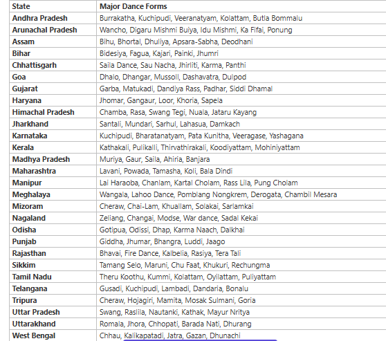

<!-- page 15 -->

VIJAY KUMAR GEC-GOA 15 These dances are usually performed during ceremonies such as Weddings, births, coronations, entering a new house or town, welcoming a guest, religious processions, harvest time, and so on. Some dances are performed by men and women individually while men and women dance together in other performances. List of Folk Dances Of India (State-wise) Kinnauri, Thoda, Jhora, Jhali, Chharhi, Dhaman, Chhapeli, Mahasu, Dangi, Chamba, Thali, Jhainta, Daf, Stick dance Ghoomar, Suisini, kalbeliya, Chakri, Ganagor, JhulanLeela, Jhuma, Suisini, Ghapal, Panihari, Ginadetc Lavani, Nakata, Koli, Lezim, Gafa, DahikalaDasavtar or Bohada, Tamasha, Mauni, Powara, Gouricha Tertali, Maanch, Matki, Aada, KhadaNach, Phulpati, Grida Dance, Selalarki, Selabhadoni, Jawaraetc Gaur Maria, Panthi, RautNacha, Pandwani, Vedamati, Kapalik, Chandaini, BharthariCharit, Goudi, Karma, Jhumar, Dagla, Pali, Tapali, Navrani, Diwari, Mundari, Jhumar Karma Munda, Karma, Agni, Jhumar, Janani Jhumar, MardanaJhumar, Paika, Phagua, Chhanu, Sarahul, Jat-Jatin, Karma, Danga, Bidesia, Sohrai, Hunta Dance, Mundari Dance, Sarhul, Barao, Jhitka, Danga, Domkach, GhoraNaach PuruliaChhau, Alkap, Kathi, Gambhira, Dhali, Jatra, Baul, Marasia, Mahal, Keertan,Santhali Dance, Mundari dance, Gambhira, Gajan, ChaibariNritya Chu Faat, Yak ChaamSikmari, SinghiChaam or the Snow Lion, Yak Chaam, DenzongGnenha, TashiYangku, KhukuriNaach, ChutkeyNaach, Maruni Dance Bihu, Bichhua, Natpuja, Maharas, Kaligopal, Bagurumba, Naga dance, Khel Gopal, TabalChongli, Canoe, JhumuraHobjanaietc Chham, Mask dance (MukhautaNritya), War dance, Buiya, Chalo, Wancho, PasiKongki, Ponung, Popir, Bardo Chong, Khaiva, Lim, Nuralim, Bamboo Dance, Temangnetin, Hetaleulee. Rangma, Zeliang, Nsuirolians, Gethinglim Thang Ta, Lai Haraoba, PungCholom, Rakhal, Nat Rash, Maha Rash, Raukhat, DolCholam, KhambaThaibi, Nupa Dance, Raslila, KhubakIshei, LhouSha Cheraw Dance, Khuallam, Chailam, Sawlakin, Chawnglaizawn, Zangtalam, Par Lam, Sarlamkai/ Solakia, Tlanglam, Khanatm, Pakhupila, Cherokan Ghantamardala, OttamThedal, Mohiniattam, Kummi, Siddhi, Madhuri, Chhadi. VilasiniNatyam, Bhamakalpam, Veeranatyam, Dappu, TappetaGullu, Lambadi, Dhimsa, Kolattam, ButtaBommalu Fugdi, Dhalo, Kunbi, Dhangar, Mandi, Jhagor, Khol, Dakni, Tarangamel, Shigmo, Ghode, Modni, Samayinrutya, Jagar, Ranmale, amayinrutya, Tonnyamell IMPORTANCE OF DANCE MAIN BENEFITS OF DANCE

**Table 1 (page 15):**

| State | Folk Dance |
| --- | --- |
| Himachal Pradesh | Kinnauri, Thoda, Jhora, Jhali, Chharhi, Dhaman, Chhapeli, Mahasu, Dangi, Chamba, Thali, Jhainta, Daf, Stick dance |
| Punjab | Bhangra, Giddha, Daff, Dhaman, Bhand, Naqual |
| Haryana | Jhumar, Phag Dance, Daph, Dhamal, Loor, Gugga, Khor, Gagor |
| Uttar Pradesh | Nautanki, Raslila, Kajri, Jhora, Chappeli, Jaita |
| Rajasthan | Ghoomar, Suisini, kalbeliya, Chakri, Ganagor, JhulanLeela, Jhuma, Suisini, Ghapal, Panihari, Ginadetc |
| Gujarat | Garba, DandiyaRas, Bhavai, TippaniJuriun, Bhavai |
| Maharashtra | Lavani, Nakata, Koli, Lezim, Gafa, DahikalaDasavtar or Bohada, Tamasha, Mauni, Powara, Gouricha |
| Madhya Pradesh | Tertali, Maanch, Matki, Aada, KhadaNach, Phulpati, Grida Dance, Selalarki, Selabhadoni, Jawaraetc |
| Chhattisgarh | Gaur Maria, Panthi, RautNacha, Pandwani, Vedamati, Kapalik, Chandaini, BharthariCharit, Goudi, Karma, Jhumar, Dagla, Pali, Tapali, Navrani, Diwari, Mundari, Jhumar |
| Jharkhand | Karma Munda, Karma, Agni, Jhumar, Janani Jhumar, MardanaJhumar, Paika, Phagua, Chhanu, Sarahul, Jat-Jatin, Karma, Danga, Bidesia, Sohrai, Hunta Dance, Mundari Dance, Sarhul, Barao, Jhitka, Danga, Domkach, GhoraNaach |
| Bihar | Jata-Jatin, Bakho-Bakhain, Panwariya, Sama-Chakwa, Bidesia, Jatra |
| West Bengal | PuruliaChhau, Alkap, Kathi, Gambhira, Dhali, Jatra, Baul, Marasia, Mahal, Keertan,Santhali Dance, Mundari dance, Gambhira, Gajan, ChaibariNritya |
| ikkim | Chu Faat, Yak ChaamSikmari, SinghiChaam or the Snow Lion, Yak Chaam, DenzongGnenha, TashiYangku, KhukuriNaach, ChutkeyNaach, Maruni Dance |
| Meghalaya | Laho, Baala, Ka Shad Suk Mynsiem, Nongkrem |
| Assam | Bihu, Bichhua, Natpuja, Maharas, Kaligopal, Bagurumba, Naga dance, Khel Gopal, TabalChongli, Canoe, JhumuraHobjanaietc |
| Arunachal Pradesh | Chham, Mask dance (MukhautaNritya), War dance, Buiya, Chalo, Wancho, PasiKongki, Ponung, Popir, Bardo |
| Nagaland | Chong, Khaiva, Lim, Nuralim, Bamboo Dance, Temangnetin, Hetaleulee. Rangma, Zeliang, Nsuirolians, Gethinglim |
| Manipur | Thang Ta, Lai Haraoba, PungCholom, Rakhal, Nat Rash, Maha Rash, Raukhat, DolCholam, KhambaThaibi, Nupa Dance, Raslila, KhubakIshei, LhouSha |
| Mizoram | Cheraw Dance, Khuallam, Chailam, Sawlakin, Chawnglaizawn, Zangtalam, Par Lam, Sarlamkai/ Solakia, Tlanglam, Khanatm, Pakhupila, Cherokan |
| Tripura | Hozagiri |
| Odisha | Ghumara, Ranappa,Savari, Ghumara, Painka, Munari, Chhau, ChadyaDandanata |
| Andhra Pradesh | Ghantamardala, OttamThedal, Mohiniattam, Kummi, Siddhi, Madhuri, Chhadi. VilasiniNatyam, Bhamakalpam, Veeranatyam, Dappu, TappetaGullu, Lambadi, Dhimsa, Kolattam, ButtaBommalu |
| Karnataka | Yakshagana, Huttari, Suggi, Kunitha, Karga, Lambi |
| Goa | Fugdi, Dhalo, Kunbi, Dhangar, Mandi, Jhagor, Khol, Dakni, Tarangamel, Shigmo, Ghode, Modni, Samayinrutya, Jagar, Ranmale, amayinrutya, Tonnyamell |
| Telangana | Perini Shivatandavam, Keisabadi |
| Kerala | OttamThulal, Kaikottikali, Tappatikali, Kali Auttam |
| Tamil Nadu | Karagam, Kumi, Kolattam, Kavadi |

<!-- page 16 -->

VIJAY KUMAR GEC-GOA 16 I. PHYSICAL II. MENTAL/EMOTIONAL III.SOCIAL IV. CULTURAL PHYSICAL BENEFITS OF DANCE 1. develops muscular and cardiovascular endurance 2. improves flexibility, coordination, balance, and body composition 3. enables joint mobility 4. helps prevent osteoporosis 5. lowers risk of cardiovascular diseases MENTAL/EMOTIONAL BENEFITS OF DANCE 1. helps keep the brain sharp 2. decreases risk of dementia  and Alzheimer’s disease 3. decreases depressive symptoms 4. increases self-esteem and improves body image 5. aids in releasing emotional tension SOCIAL BENEFITS OF DANCE 1. gives sense of togetherness within a group 2. encourages positive social interaction and interpersonal relationship in a group 3. contributes to the individual’s potential for self-actualization in society CULTURAL BENEFITS OF DANCE 1. promotes cultural values Physical fitness;-Dancing can improve your coordination, flexibility, muscular strength, and cardiovascular health. It can also help you maintain a healthy weight and build muscle strength. Mental health;-Dancing can help improve your mood and reduce stress by releasing endorphins. It can also help you process difficult emotions and connect with your inner self. Cognitive function;-Dancing can improve your verbal fluency, delayed recall, and recognition memory function. Bone strength;-Dancing can help reduce the risk of osteoporosis and strengthen your bones. Heart health;-Dancing can help improve your endurance and balance your heart rate, which can reduce the risk of heart attack and stroke. Self-expression;-Dancing is a creative outlet that allows you to communicate your feelings and emotions through movement. Social skills;-Dancing can help you improve your social skills. TEXTILE A general term for any material made from interlaced fibers, such as yarn, thread, silk, rayon, or metal wire History of Textile The usage of textiles can be traced back to the Neolithic Age. The people around 4000 BC invented hand-operated spindles and looms in Europe and the materials used were wool and flax. The history of textiles dates back to prehistoric times, when early humans used natural fibers such as animal hair, plant fibers, and leaves to create clothing and other textiles. These fibers were collected, cleaned, and processed by hand, and were used to create simple fabrics such as woven baskets and mats. The processing of textiles (dyeing and printing) also has its roots in the prehistoric era. The first solid evidence about dyeing of silk and brocades from religious and social records suggests that Indians were aware of the dyeing process in 2500 BC; however, it is also believed that the Chinese in 3500 BC practiced dyeing but no solid evidence is available to substantiate it Safflower was in use for dyeing textiles for red and yellow colours in 2500 BC. Egyptians were able to produce a whole range of colors for textiles by 1450 BC. As civilizations developed, so did the techniques for producing fibers and textiles. In ancient Egypt, for example, flax fibers were used to create linen,. In ancient China, silk fibers were harvested from silkworms and used to create luxurious fabrics. During the Middle Ages, wool became an important fiber for textiles, particularly in Europe where sheep were widely raised. Wool fibers were spun into yarn and used to create warm clothing and blankets. Cotton fibers also became an important fiber during this time, particularly in India where cotton had been cultivated for thousands of years.

<!-- page 17 -->

VIJAY KUMAR GEC-GOA 17 In the 18th and 19th centuries, the Industrial Revolution brought about major advancements in textile production. New machinery was developed that could spin, weave, and process fibers more quickly and efficiently. This led to the mass production of textiles, making them more affordable and widely available. In the 20th century, synthetic fibers such as nylon, polyester, and acrylic were developed, which offered new properties and benefits over natural fibers. These fibers were used to create a wide range of products, from clothing and accessories to industrial and technical textiles. A review of clothing microbiology: the history of clothing and the role of microbes in textiles, Volume: 17, Issue: 1, DOI: (10.1098/rsbl.2020.0700) HISTORY OF INDIAN TEXTILES 1.Patterned cloth on stone bust, Mohenjodaro, c.2500 B.C. India has been famous for its textiles from very early times asrevealed by literary and archaeological evidence. Our knowledge of the fabricsthemselves, however, is limited almost entirely to those produced after the 16th century. 2.3000 BC The discovery of a few fragments with traces of a purple dye at Mohenjodaro proves thatcotton was spun and woven in India at least as early as 3000 B.C. We also know from asculpture of that time that patterned cloths were in use even then 3. 5th Century BC & 4th Century BC The Achaemenid Empire linked the Greek world to India and Darius I (521-486 B.C.) ofPersia had commissioned a Greek to explore the Indus River, the Persian Gulf and theRed Sea with an eye to commerce. 4. 3rd Century BC Chanakya, also known as Kautiliya, who was Chancellor in the Court of ChandraguptaMaurya (c. 300 B.C.), mentions in his Arthashastra, that textiles were especially importantamong the articles of internal and external trade and has listed the important centres forcotton, silk and woolen cloth manufacturing. The materials employed in spinning werewool (urna), cotton (karpasa), hemp (tula) and flax (ksaum). Silk wasimported from. China. Weaving was done by women 5.1st Century BC There are references to the popularity of brightly coloured Indiantextiles among the Persians, but it is not known when they were firsttraded in Europe. By the first century A.D., Indian muslins hadbecome famous in Rome under such names as nebula, gangetika, andventi textiles ('woven winds'), the latter exactly translating the technical name of aspecial type of Dacca muslin. Silk was also an important export to Rome, both as yarn andas finished cloth, but the raw material was imported into India from China. 6. 1st-3rd Century AD The 1st to 3rd century A.D. was an era of flourishing empires, four of which jointlyspanned the breadth of Eurasia — the Han in China, the Kusana in India, the Parthian inMesopotamia and the Roman in Europe.The Kusana Empire acted as the commercial intermediary for much of the trade between Rome and China. The trade in silk thatpassed over the Trans-Asian Silk Route must have been the main commodity, in additionto carpets, wool and furs 7. 4th-7th Century AD

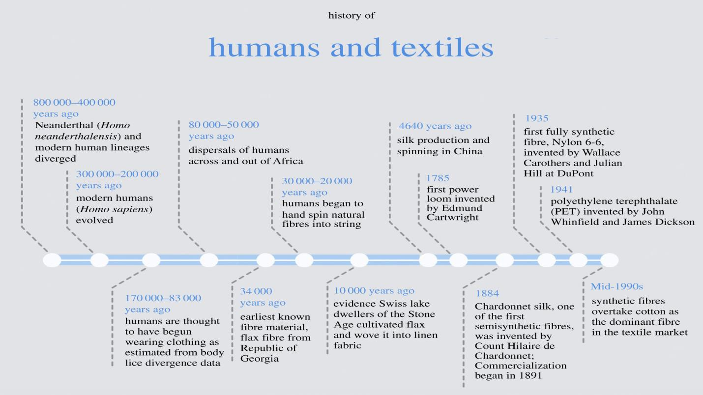

<!-- page 18 -->

VIJAY KUMAR GEC-GOA 18 From an examination of the Ajantapaintings particularly those attributed tothe 6th century A.D., it becomespossible to identify the techniques ofembroidery, bandhana, (tie-and-dye);patolu (ikat, in which warp and woof are resist-dyed separately before weaving,according to the pattern required); brocading; and fine muslin weaving. 8. 13th-16th Century AD For a study of the later mediaevaldevelopment, evidence is limited tocotton fragments. discovered at Fostatand other Egyptian sites, probably of fourteenth or fifteenth century origin.Marco Polo (1254-1324) brought back to Europe valuable knowledge of India and the east. He has recordedthat "Guzzerat" embroidery was regarded as the finest in the world and "all the clothes ofgold and silver that are called mosolins are made in this country" 9. 16th-18th Century AD The advent of the Mughals in India, resulting in economic prosperity and the development of a veryhigh standard of craft workmanship. Apart from carpets, the earliest Mughal textilesknown to us are of the Jahangir period (1605-1627). TEXTILES USED IN ANCIENT INDIA 1. Cotton;-A popular choice for everyday use in India's hot and humid climate. India was the first country to grow, weave, and pattern cotton. 2. Silk;-A staple of ancient trade, with evidence of use in the Indus Valley Civilization. 3. Muslin;-An early cotton cloth that was handwoven in India and became popular in trade with Europe. 4. Organza;-A silk fabric used in saris, salwar kameezes, and churidars. 5. Kalamkari;-A textile art from South India that uses vegetable dyes and block printing or hand drawing. 6. Bandhani;-An ancient textile art form that uses a tie-dye technique to create intricate patterns and designs. 7. Georgette;-A lightweight fabric with a subtle sheen that's used to make traditional Indian sarees called "georgette pattu". 8. Linen;-A lightweight, thin fabric that's been woven from the flax plant since around 5000 B.C. TRADITIONAL TEXTILE USED IN INDIA

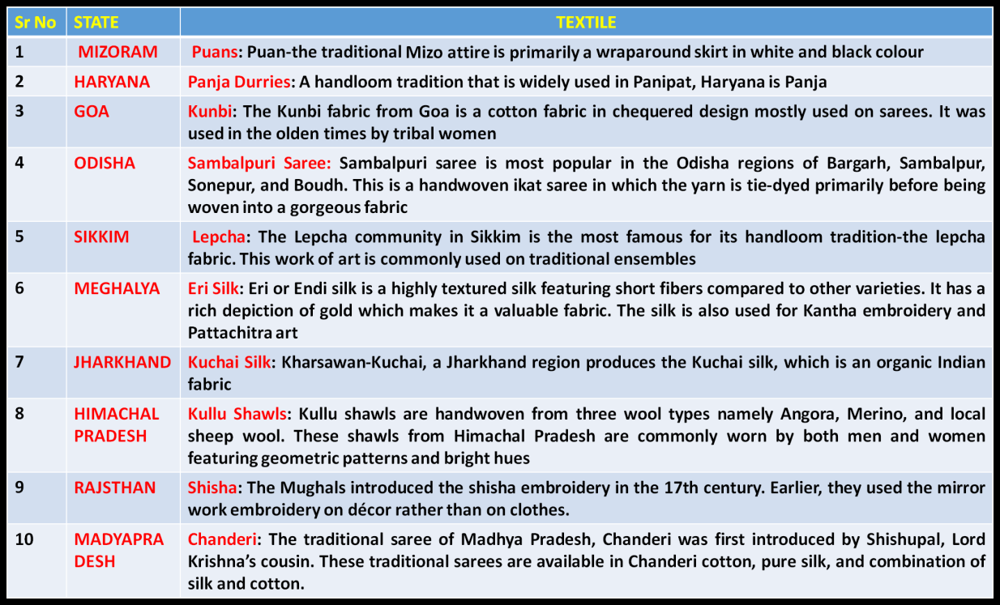

<!-- page 19 -->

VIJAY KUMAR GEC-GOA 19 Sr No STATE TEXTILE 11 GUJRAT Bandhani: The term Bandhani was derived from the Sanskrit word ‘banda.’ This stunning tie-dye fabric was made by Khatri, a Gujarati community, and is commonly available in shades of black, yellow, green, blue, red, and white dots that bring out interesting designs on the fabr 12 TELENGANA Pochampally Ikat: The Ikat textile is produced from Bhoodan Pochampally, Telengana and is famous for its geometric designs and intentional bleed 13 NAGALAND Naga Shawls: Weaving is a major traditional occupation of the Naga people. The Naga shawls are highly symbolic and are made using black and red woo 14 BIHAR Bhagalpuri Silk: Bihar is better known as the silk city. the silk weaving industry at Bhagalpur, The tussar silk is the most commonly used fabric made out of colourful threads and produced from tussar cocoons 15 WEST BENGAL Jamdani: Jamdani is one of the main fabrics used in West Bengal. This was earlier used as a dress material for men and women but at present date, Jamdani is used in sarees with unique patterns. 16 ANDHRA PRADESH Kalamkari: Kalamkari is derived from the Persian words, Qalam (pen) and Kari (craftsmanship). This fabric is now popularly used as a block print on most Indian attires. 17 KERALA Kasavu: The white and gold kasavu saree is famously used by the people of Kerala especially during the celebration of Onam. Kasavu is referred to the gold zari border depicted on the mundu-saree that is made out of 100% unbleached cotton. 18 TAMILNADU Kanjeevaram Silk: This popular silk fabric is from Tamil Nadu and is famous from their exquisite fabric and zari work. At present, the Kanjeevaram saree remains one of the popular Indian sarees with its rich depictions of gold used. Sr No STATE TEXTILE 19 TRIPURA Pachra: Pachra is the handloom fabric found in Tripura. It is a long cloth piece worn as lower attire by the women. It extends below the knee, featuring unique stripe designs and embroidery in several shades 20 UTTARAKHAND Panchachuli Weave: The rural women of Panchachuli range in the Himalayan region commonly knit exquisite clothes made up of sheep wool and Tibetan cashmere 21 PUNJAB Phulkari: The Phulkari work is a common embroidery work of floral depictions used on fabrics by the Punjabi women. This unique design is made on the reverse of the cloth while the design is created on the front. 22 KARNATAKA Mysore Silk: When Tipu Sultan ruled over Mysore, the silk industry witnessed a huge growth. Till date, the state is the largest producer of silk. The rich, silk material from Mysore is famous for their quality and artistry 23 UTTARPRADESH Chikankari: Chikankari is famously produced in Lucknow. It is a delicate embroidery design that was primarily introduced by Nur Jehan, wife of Mughal emperor, Jehangir. This cloth piece is initially block- printed and after that the chikan stitches are used on the outline 24 MAHARASTRA Paithani: The Paithan town of Aurangabad, Maharashtra is famous for its hand-woven silk saree- Paithani. 25 CHHATTISGARH Kosa Silk: The kosa silk is the famous fabric used in Champa district of Chattisgarh. This rich fabric is considered to be the finest in the world mostly because of its durability. 26 JAMMU & KASHMIR J&K The shawls which are known for its in imitable tapestry design make use of a fibre commonly known among the natives as Pashm or Pashmina. The fibre normally comes from the fleece of a wild Cashmere Asian mountain goat IMPORTANCE OF TEXTILE: Textiles play a vital role in our everyday lives and are important for both practical and aesthetic reasons. They are versatile materials that are used in a wide range of applications and industries, and their importance is likely to continue to grow in the future. Some of the main reasons why textiles are important include: 1. Clothing: Textiles are used to create clothing and other garments that keep us warm, protected from the elements, and looking stylish. 2. Household items: Textiles are used to create a wide range of household items such as curtains, bedding, and furniture upholstery. 3. Industrial and technical uses: Textiles are used in a variety of industrial and technical applications such as filter fabrics, geotextiles, and protective clothing. 4. Health and medicine: Textile materials are used in the production of surgical gowns, face masks, and other medical equipment. 5. Transportation: Textiles are used in the production of car seats, safety belts, and airbags 6. Agriculture: Textiles are used in agriculture for crop protection and to provide shade for animals

<!-- page 20 -->

VIJAY KUMAR GEC-GOA 20 7. Leisure and sports: Textiles are used to make outdoor clothing, tents, and other outdoor gear 8.Economy: The textile industry is a significant contributor to the global economy, providing jobs and generating income through the production and export of textile products. 9. Creativity and Art: Textiles are used to create art, design, and fashion. 10. Sustainability: Textile production and use is becoming more sustainable through the use of recycled materials, organic fibers, and sustainable production methods. DRESS MATERIAL Dress material is a woven or knitted cloth made from animal, plant, or synthetic fibers that is suitable for making dresses.A specific type of textile used for clothing. Dress materials can be made from a variety of fabrics, such as silk, velvet, chiffon, georgette, crepe, lace, cotton, or linen. Linen; A traditional and comfortable fabric used for sarees, dupattas, and lehengas. Silk;-A popular choice for traditional Indian dresses like sarees, Anarkalis, and lehengas. Georgette;-A lightweight and flowy fabric used for salwar kameez and jacket style suits. Cotton;-A comfortable, breathable, and affordable fabric used for daily wear like salwar suits, sarees, and kurtas. Chiffon;-A lightweight, sheer, and comfortable fabric used for kurtas. Crêpe ;-A fabric used for salwar kameez, sarees, and kurtas in both formal and casual wear. Velvet; -A luxurious and elegant fabric used for ethnic clothing for women. Wool;-A warm and durable fabric used for carpets, shawls, blankets, and sweaters. HISTORY The story of textiles in India is one of the oldest in the world and goes back to prehistoric times. Examples have been found depicting waist garments in the cave paintings of the Mesolithic era but concrete evidence of textile production and use starts appearing from the proto-historic times i.e. 3rd Millennium BCE. ANCIENT INDIAN Clothing AND FASHION The evidence of wild indigenous silk moth species from Harappa and Chanhudaro suggests the use of silk in the mid 3rd millennium BCE. abundance of archaeological finds and literary references. The excavations at the site of Mohenjo-Daro (C.2500 to 1500 BCE) revealed the presence of dye vats together with woven and madder-dyed (a herb dye) cotton fragments wrapped round a silver pot. Indus valley civilization (2600 BCE to 1900 BCE) Indus valley civilization was the pioneer of spinning and weaving cotton textiles. VEDIC PERIOD (1500 BCE TO 500 BCE) From the Vedic period we get references to materials and manners of dressing which point to the developments in the textile history of ancient India. A weaver in the Rigveda is described as vasovaya. The male weaver was called vaya whereas a female weaver was called vayitri. The Rigveda refers mainly to two garments, vasa or the lower garment and the adhivasa or the upper garment. In the later samhiras, the nivi or undergarment had also come into use. THE POST VEDIC PERIOD witnessed two divergent lines in respect of the nature or source of materials used for textile purpose. Those pursuing Vedic line of animal sacrifice sought the major source of clothing in skins, while others, the Buddhists and Jains in particular, in cotton. THE SANSKRIT EPIC MAHABHARATA (C. 400 BCE-C. 400 CE) mentions silk fabrics among the presents brought to Yudhisthira by feudatory princes from the Himalayan regions. References of weaving are very common from Rigveda onwards. There were female weavers from earliest times. ACCORDING TO THE VALMIKI'S RAMAYANA( 5TH/ 6TH- 3RD CENTURY CE), the trousseau of Sita consisted of woolen clothing, furs, precious stones, fine silk vestments of diverse colours, princely ornamental and grand carriage of different kinds. The veil, bodice, and body clothes are repeatedly mentioned in the epics Ramayana and Mahabharata. MOURYAN & SUNGA (321 BCE TO 73 BCE) ;-men and women in mauryan and sunga dynasty wore unstitched garments, with the main garment being the antariya made of white cotton, linen or muslin KUSHAN (1ST TO 3RD CENTURY CE) ;-adaptation of stitched garments. central asian styles on indian clothing GUPTA (320 CE TO 550 CE) ;-significant improvement in textile printing, embroidery, and dyeing techniques, which resulted in high-quality fabrics and intricate designs MUGHAL CLOTHING refers to clothing worn by the Mughals in the 16th, 17th and 18th centuries throughout the extent of their empire. Much of them were already being used in the past centuries before their arrival in Indian subcontinent. It was characterized by luxurious styles and was made with muslin, silk, velvet and brocade. Elaborate patterns including dots, checks,

<!-- page 21 -->

VIJAY KUMAR GEC-GOA 21 and waves were used with colors from various dyes including cochineal, sulfate of iron, sulfate of copper, and sulfate of antimony were used. During the British period in India, the primary dress materials were cotton, silk, mill-made cloth, and other imported satins and artificial silks: Cotton; India exported cotton to Britain, and the British imported mass-produced garments made from it. Silk;-Soft-washing silks, silk flannel, pongee silks, and black silk dresses were popular. Mill-made cloth;-This was cheaper to produce than the cloth used in India and was more versatile. Chintz;This was a light, color-fast cotton fabric made in India for the English market. The original chintz designs were hand- painted, but block-printed designs were later incorporate Ancient Indians used a variety of materials to make their clothing, including: 1. Cotton: India was one of the first places to cultivate cotton, and it was a primary material for clothing. 2. Silk: A significant material for the wealthy, silk was used in the uttariya, a scarf that draped the top half of the body. 3. Cotton –silk 4. Linen 5. Cotton –linen 6. Silk linen 7. Hemp: An affordable material for weavers and laborers. 8. Wool: Used in the form of blankets during the winter in the warmer regions of India. 9. Flax: A plant grown for its fibers. In ancient India, people used a variety of materials to make their clothing, including: 1. Cotton; -First found in India around 600 BC, cotton was widely used to make clothing. Women wore cotton sarees, while men wore lungis. 2. Silk;-A popular choice for traditional Indian clothing, silk is derived from the fibers of silkworms. It's used to make sarees, lehengas, and anarkalis. 3. Linen;-A soft and light fabric made from the flax plant, linen was used to make clothing for ancient Indian kings. 4. Muslin;-Made from locally grown cotton called Kapas, muslin was a legendary cloth of East India. Muslin from the eastern parts of ancient India was highly valued in the international market. 5. Animal skin and fur;-In ancient times, people also used animal skin and fur to make their clothing. 6. Tree leaves;-People also used tree leaves to make their clothing. 7. People in ancient India also wore jewelry made of gold, silver, copper, and stones like lapis lazuli, turquoise, amazonite, and quartz. COTTON TEXTILE MANUFACTURING PROCESS

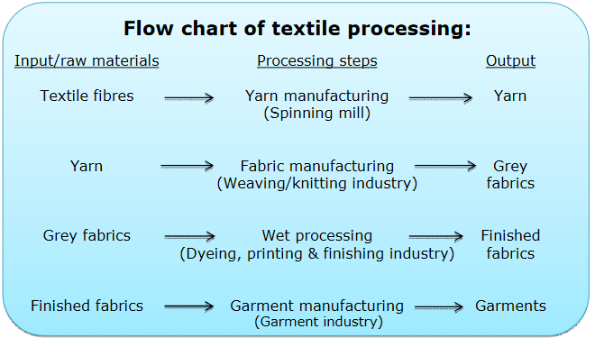

<!-- page 22 -->

VIJAY KUMAR GEC-GOA 22 STEPS INVOLVED IN MAKING COTTON FABRIC FROM COTTON BALLS The process of manufacturing cotton fabric from cotton balls started with cotton cultivation. And this process ends with weaving cotton fabric. Now here in this section of this article, we’ll go through all the processes involved with manufacturing cotton fabric from cotton balls. Step-01: Cultivation of cotton The cotton is planted in the early spring. In around 60 days, the plants begin to blossom, producing whitish-yellow flowers. These flowers mature into circular walnut-like structures throughout time. Cotton balls are what they’re called. Cotton fibers sprout on these grains. Green cotton balls eventually become brown. Cotton bolls break open at maturation, revealing the white cotton fiber. Step-02: Ginning Cotton that has been harvested from the plants will have seeds embedded inside it. Ginning is the term given to the process of extracting cotton seeds from the pods. Hand labor was historically used in the process of ginning. Ginning is done with the assistance of machinery these days. Step-03: Spinning Spinning is the very next process to make cotton fabrics from cotton balls. Producing cotton yarn from the cotton fiber is called spinning. The spinning process is involved 3 easy steps. Step-3.1: The raw cotton is unfastened and washed to eliminate straw as well as dried leaves. Step-3.2: After that, the cotton is washed and put into a machine. Then cotton fibers are combed, straight, as well as turned into a sliver, a rope-like form. Step-3.3: The lint-like fragment of cotton fiber is transformed into yarn via the spinning process performed by machines. Step-04: Dyeing At this step, the basic material utilized in cotton garments is finalized. This cotton yarn may subsequently be exposed to a number of chemical treatments as well as this yarn may be dyed. Step-05: Weaving Weaving refers to the act of making cloth by interlacing two different sets of yarn in a particular pattern. Bobbins are the common name for the large reels of yarn. The weaving of the fabric requires the employment of these bobbins WEAVING OF COTTON Cotton weaving is the process of interlacing two sets of yarn, the warp and weft, to create fabric. The process takes place in the latter stages of cotton manufacturing.Weaving is a process in which two sets of yarns are weaved together to make a fabric. 1. Hand weaving 2. Machine weaving Weaving process

**Table 1 (page 22):**

|  | Weaving is a process in which two sets of yarns are weaved together to make a fabric. |
| --- | --- |
| The lengthway threads, known as the warp and cross way threads known as the weft, are interlaced on a loom to form the |  |
| desired fabric. |  |
| Classification |  |

**Table 2 (page 22):**

| Hand weaving |
| --- |
| Machine weaving |

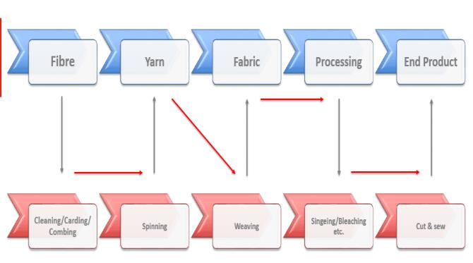

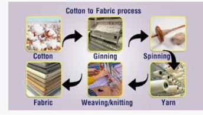

<!-- page 23 -->

VIJAY KUMAR GEC-GOA 23 Primary Motion of Weaving: In order to interlace warp and weft threads to produce fabric on any type of weaving machine, three operations are necessary: A. Shedding: Separating the warp threads, which run down the fabric into two layers to form a tunnel known as the shed. B. Picking: Passing the weft threads, which traverses across the fabric, through the shed. C. Beating-up: Pushing the newly inserted length of weft, known as the pick, into the already woven fabric at a point known as the fell. DYEING OF COTTON Dyeing is an ancient art which predates written records and it was practiced since Bronze Age1 .In textile processing dyeing is an integral part where textile coloration is done to make the fabric lively. Dyeing is the process of adding color to textile products like fibers, yarns, and fabrics. There are mainly two classes of dye: 1. Natural 2. Man-made(chemical) Natural Dyeing Methods - Natural Many companies are becoming more environmentally friendly and are using more natural dyes. These natural dyes are what used to be used years ago before the advent of the chemical processes. These work better with natural or regenerated fabrics and they require a mordant to fix them. It is difficult to reproduce the same colour each time. This technique is particularly good for: • Natural fabrics • Small quantities Dyeing & Printing

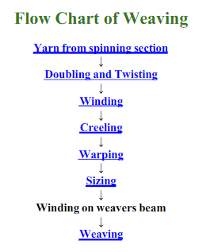

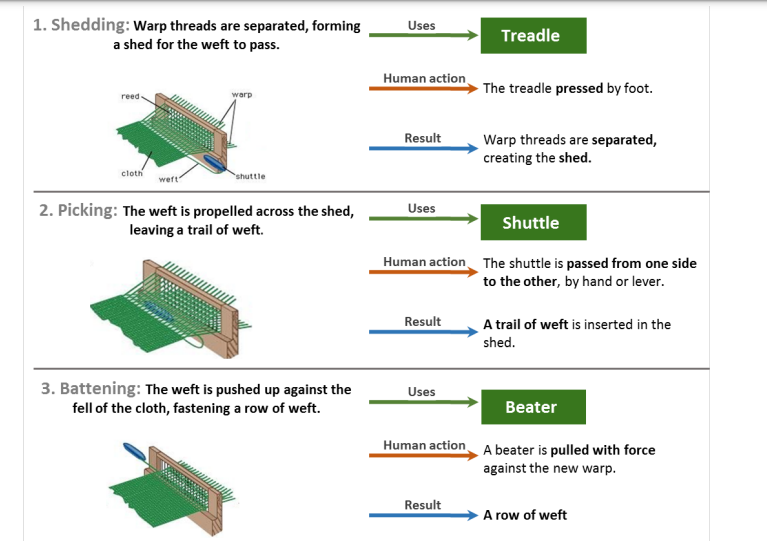

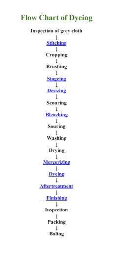

<!-- page 24 -->

VIJAY KUMAR GEC-GOA 24 Man-madeDyeing Methods - Chemical Chemical dyeing uses pigment dyes with salts to fix them. Fabric is immersed in the dye bath until the right depth of colour is achieved. This is the sort of dyeing that can be done at home. The best sort of fabrics to take up the dyes are things like cottons and silks – natural fabrics. There are cold water dyes available, and also dyes that can be put into the washing machine with the fabric to be done. The machine is then set to a wash cycle and the fabric dyed. This technique is particularly good for: • Natural fabrics • Small quantities Dyeing & Printing SILK FABRIC SILK WEAVING PROCESS Silk weaving is the process of interlacing two sets of threads to create a fabric. The threads are woven at right angles to each other, with one set running up and down the fabric (the warp) and the other set running across it (the weft). The type of weave used determines the finish of the silk. Some common types of silk weaves include plain weave, satin weave, and open weave. Here are some steps involved in the silk weaving process: Loading the yarn: The yarn is loaded into the loom as the warp. Weaving: The weaver uses their hands and legs to interlace the warp and weft threads. The weaver operates a pedal to pass a shuttle through the openings formed by the interlocked threads. Once the shuttle passes, the suspended sley is pulled to form the weave Weaving is done on the fly shuttle pit looms. The weaver interlaces the silk threads of weft and warp. The shuttle passes through the opens formed when the pedal is operated to interlock the threads of warp and the weft. Once the shuttle is passed, the suspended sley is pulled to form the weave. The proton of woven cloth is wounded to the wooden beam which is located in front of the weaver. After weaving of 6 yards of weft, the portion of unwoven warp is intentionally left before and after the sari weaving which is later knotted for fringe. Thus the weaving is completed- the sari is smoothened using brass metal blade and sari is folded in traditional manner for the market. It takes nearly 4 to 5 days to complete one sari. The length of 10 saris warp is loaded into the loom at a time. The weaver may need 1 or 2 persons to help him while working.

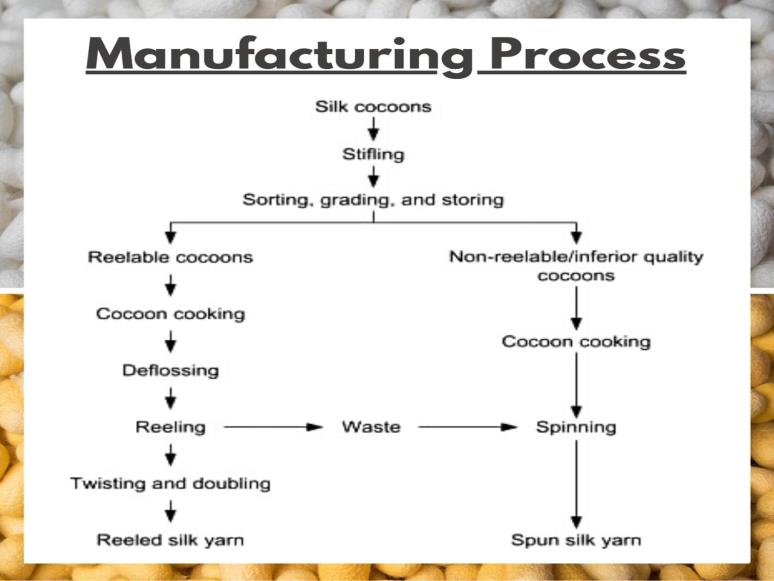

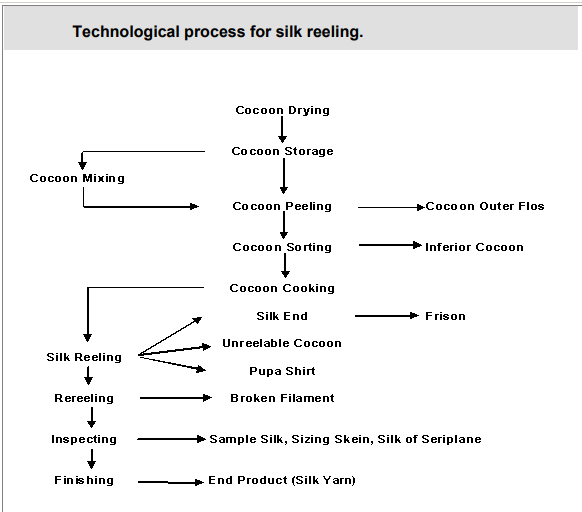

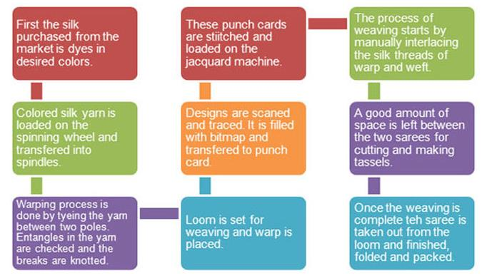

<!-- page 25 -->

VIJAY KUMAR GEC-GOA 25 Silk Dyeing: Silk being a natural polyamide or polypeptide fiber, its dyeing properties are very similar to those of other natural polypeptide fiber, wool as well as synthetic polyamide fiber, nylon. They can be dyed by similar methods. Very fine fibrillar structure and high orientation of fiber molecules are the two characteristic properties of silk which determine its dyeing behavior. silk is dyed using various dyes such as Acid dyes, metal-complex, reactive dyes etc. Acid dyes are more suitable for silk and wool. Pretreatment Before Dyeing Degumming Of Silk;-The process of eliminating sericin (gum) isknown as degumming. Scouring;-a pretreatment step in textile production that removes impurities from fabrics to prepare them for dyeing Bleaching; Bleaching of silk is carried out to remove naturalcolouring matter of silk Fluorescent Whitening;-uses fluorescent whitening agents (FWAs), also known as optical brightening agents (OBAs), to make materials appear whiter Step 1: BoM(Bill of Materials-Acid Dyes ,Hot water, Measuring cylinder,Scale, Synthrapol(or similar textile detergent),Large jars , Soaking container, Masking tape & markers (for labeling), Coffee stirrers/stirring sticks,Rubber gloves, protective wear, goggles etc Step 2: SynthrapolSoak;-All fiber has to be soaked before it can be dyed. Soaking allows the fibers to open up, making it easier to absorb dye. Silk can be hard to wet so the longer you let it soak, the more successful your dyeing will be. Step 3: Dye Preparation &Soak ;-How much dye powder you will need depends on how much fiber you are dyeing.Add the mixture to your dye jar  and then add fiber. Add more water to your jar to allow the silk to move around more freely. Let the silk soak in the dye bath for at 12-24 hours. Step 4: Add Heat ;- After the 12-24 hour dye soak, slowly turn up the heat. Don't let the water go over 180 or get to a boil. Too much heat will cause the silk to lose luster. Step 5: Cool Down &Rinse;-Once the dyes have all allow to cool down overnight.To rinse the silk, remove it from the dyebath (which will likely be very clear) and rinse under cool water until the water runs clear. Step 6: Dry;-Allow the silk to air dry before use. The silk dyeing process involves several steps, including: 1. Checking the fabric: Before dyeing, it's important to confirm that the fabric is 100% silk. Other fibers may not absorb the dye evenly or react differently. You can check the fabric content label or perform a burn test. 2. Preparing the dye: The dye is pasted with water and heated to 40°C. 3. Adding the dye: The dye is added to water with the silk in it. 4. Dyeing: The dyeing process takes place in the presence of acid at a temperature of up to 60°C for 2–4 hours. 5. Squeezing and drying: The silk is squeezed and dried

---
*End of document. Pages processed: 25/25 (0 page(s) had errors).*
