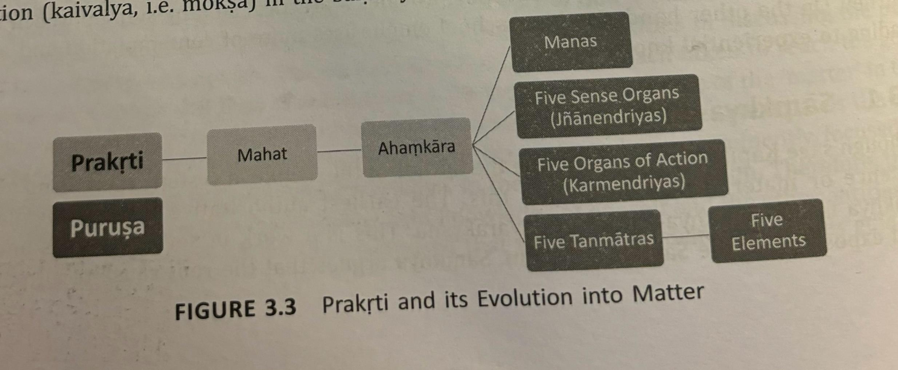
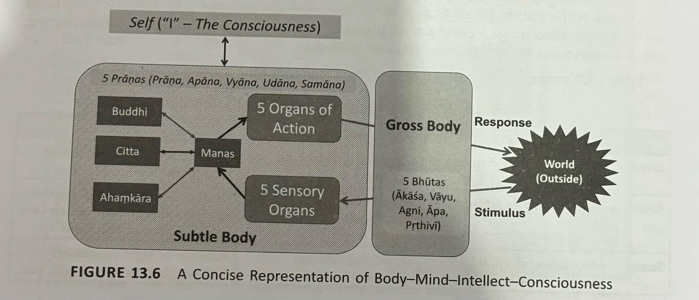
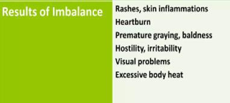
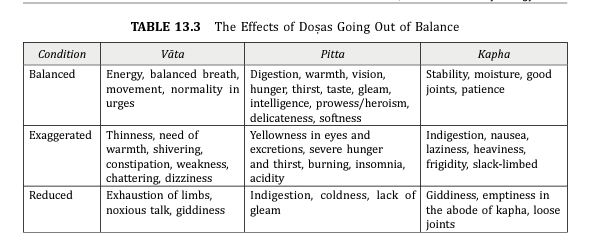
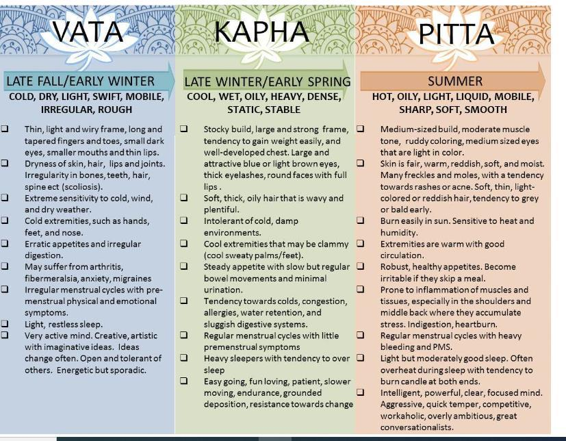
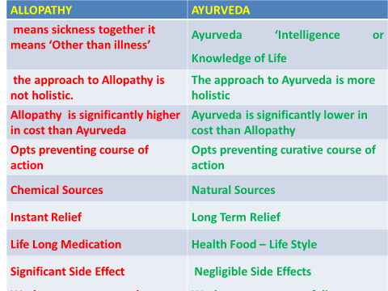
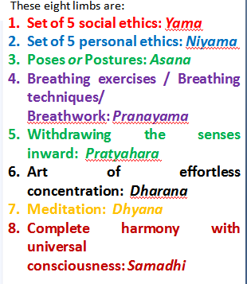

# IT_3_Portion_KP_IKS_UNIT_3_July_Dec_2025

*Converted from `IT_3_Portion_KP_IKS_UNIT_3_July_Dec_2025.pdf` on 2026-06-18 10:41*

<!-- page 1 -->

• Ayurveda, originating over 5,000 years ago in India, is one of the world's oldest holistic healing systems. • The word "Ayurveda" is derived from the Sanskrit words "Ayu" (life) and "Veda" (science or knowledge), meaning "the science of life." • Ayurveda emphasizes maintaining health through a balance of body, mind, and spirit, and it is closely linked to the natural rhythms of life. OBJECTIVE OF AYURVEDA The three principle objectives of Ayurveda are: 1. To prolong life and promote perfect health 2. To completely eradicate (to destroy) the disease and dysfunction (not working normally) of the body 3. To achieve “NIRVANA” OR Liberation from all kinds of wants

**Table 1 (page 1):**

| UNIT | - | 3: Ayurveda |  |
| --- | --- | --- | --- |

<!-- page 2 -->

### Origin of Ayurveda

Several sages (rishis) and scholars are credited with systematizing and writing down the knowledge of Ayurveda. Some of the most prominent historical figures in Ayurveda include: • Charaka: Known as the "father of medicine" in Ayurveda, Charaka authored the Charaka Samhita, one of the foundational texts of Ayurveda. This comprehensive treatise covers various aspects of medicine, diagnosis, and treatment. • Sushruta: Often referred to as the "father of surgery," Sushruta wrote the Sushruta Samhita, which is another key text in Ayurveda. It contains detailed descriptions of surgical techniques, instruments, and procedures. 2

<!-- page 3 -->

### Origin of Ayurveda

• Vagbhata: The author of the Ashtanga Hridaya and Ashtanga Sangraha, Vagbhata synthesized the teachings of Charaka and Sushruta, and his works are widely studied and practiced in Ayurveda. These texts and their authors played a crucial role in shaping and preserving the knowledge of Ayurveda, ensuring its transmission through generations. 3

<!-- page 4 -->

### Mind-Body Connection

• Ayurveda deeply recognizes the connection between the mind and body. • Mental and emotional health are considered integral to physical well- being. • According to Ayurveda, the mind has three states or "gunas“ (Sanskrit term meaning "quality" or "attribute.“) : Sattva (balance and clarity), Rajas (activity and agitation), and Tamas (inertia and darkness). Represent the three fundamental forces that influence the mind, body, and universe. 4

<!-- page 5 -->

### The Three Gunas

Gunas are present in varying proportions in all beings and matter • Overview of the Three Gunas: Sattva: • Quality of balance, purity, harmony, and knowledge. • Associated with light, clarity, and goodness. • Rajas: • Quality of activity, passion, and dynamism. • Leads to desire, restlessness, and ambition. • Tamas: • Quality of inertia, darkness, and ignorance. • Causes laziness, confusion, and stagnation. • Achieving a state of Sattva is crucial for mental health, which in turn influences physical health. 5

<!-- page 6 -->

### Sattva

• Characteristics of Sattva • Clarity, wisdom, and peace. • Promotes truth, compassion, and contentment. • Leads to spiritual growth and self-realization. • Symbolized by lightness and upward movement. 6

<!-- page 7 -->

### Rajas

• Characteristics of Rajas • Energy, movement, and excitement. • Motivates action and drives ambition. • Often leads to attachment, greed, and anxiety. • Symbolized by constant activity and agitation. 7

<!-- page 8 -->

### Tamas

8

#### •Heaviness, dullness, and lethargy.

#### •Leads to confusion, ignorance, and delusion.

#### •Causes resistance to change and lack of motivation.

#### •Symbolized by downward movement and stagnation.

<!-- page 9 -->

### Interplay of Gunas

9 •The three Gunas coexist and interact dynamically in all beings. •The dominant Guna influences thoughts, actions, and personality at any moment. Balance of Gunas can vary due to: •Environment •Diet •Actions •Associations

<!-- page 10 -->

### Path to Harmony through balance of Gunas

10 •Goal: Cultivate Sattva for inner peace and self-realization. •Ways to enhance Sattva: •Meditation and mindfulness. •Sattvic diet: fresh, vegetarian, and wholesome foods. •Positive company and uplifting activities. •Selfless service (Karma Yoga).

<!-- page 11 -->

### The Body-Mind-Intellect-Consciousness

### Complex

• Components of an Individual: 1. Gross Body : Physical manifestation of an individual in the form of visible organs which are made of the five bhutas or elements. 2. Subtle Body : Psychological part of an individual constitutes the subtle body. This consists of the five pranas, the organs of knowledge (Tanmatras) and action, and the internal instruments such as intellect, memory, mind and ego. 12

<!-- page 12 -->

#### The five types of Prana

Five types of prana are integral concepts in Indian yogic and Ayurvedic traditions. These five vayus (winds or life forces) represent the different functions and movements of prana (vital life energy) within the body. 1. Prana (the life force): The main life force which is derived from the environment and distributed to the entire body - governs respiration, heart function, and the intake of air and energy. 2. Samana (‘equal' or 'same'): Located in the navel region, it is responsible for digestion and assimilation. It balances prana and apana, creating harmony in the internal processes. Moves in a circular pattern and goes inwards (navel). 3. Apana (The outgoing) : Governs elimination and the downward-moving energy responsible for processes like excretion, urination…etc. 13

<!-- page 13 -->

#### The five types of Prana…

4. Vyana (outward-moving air) : Circulates throughout the body and governs the flow of blood, nutrients, and energy. It's responsible for overall circulation and cohesion within the body. 5. Udana ("to soar" or "to fly" ): Moves upwards from neck to the head and is responsible for higher thinking capacity, speech, and self-expression. It governs exhalation, strength, and consciousness, helping to lift energy towards the head and mind. NOTE : These five types of prana work together to maintain the balance of physical and subtle energy in the body and mind, ensuring proper functioning of both physiological and psychological systems. 14

<!-- page 14 -->

### The Body-Mind-Intellect-Consciousness

### Complex

Sämkhya school of Philosophy : Every human is made of 24 elements 15

## Matter

Matter

## Spirit

Spirit

## Buddhi

Buddhi

## Ego (I or mine)

Ego (I or mine)

## Mind

Mind

## Ears, Skin, Eyes, Nose, Ton

Ears, Skin, Eyes, Nose, Tongue

## Sp

Speech, Hands, Feet ..

### etc

etc

## Sound, touch, form or

Sound, touch, form or

## colour

colour

## , smell, taste

, smell, taste

## BHUTAS: Ether, Air, Fire, Water, Earth

BHUTAS: Ether, Air, Fire, Water, Earth

<!-- page 15 -->

### Antahkarana

Antahkarana refers to the "inner instrument" or the internal organ of perception and cognition in Indian philosophy. It is a collective term for the four mental faculties that are responsible for thought, emotions, decision-making, and identity. These four aspects are: 1. Manas (Mind): The aspect responsible for processing sensory inputs, thoughts, and emotions. It’s the part that gathers information and engages in day-to-day thinking, doubts, and considerations. 2. Buddhi (Intellect): The discriminating aspect that analyzes and makes decisions. It helps differentiate between right and wrong, true and false, and guides rational thinking. 16

<!-- page 16 -->

### Antahkarana

3. Ahamkara (Ego): The sense of "I" or personal identity. It is responsible for the feeling of individuality and separateness. It gives us the sense of "I am," associating the self with the body, mind, and experiences. 4. Chitta (Memory/Subconscious): The aspect that stores past experiences, impressions, and memories. It contains the deep- seated samskaras (impressions or imprints) that shape our tendencies and habitual reactions. • Together, these four form the antahkarana, which mediates between the external sensory experience and the true self (Atman or Purusha). • In the context of spiritual practice, understanding and mastering the antahkarana is seen as essential to achieving self-realization and liberation (moksha). 17

<!-- page 17 -->

### The True Self or Consciousness or “ I “

• Distinct from the physical and subtle body is the TRUE SELF or ‘I’ which is the consciousness.

## An

An

## individual is nothing but

individual is nothing but

## embodied

embodied

## consciousness !

consciousness ! 18

<!-- page 18 -->

### Body-Mind-Intellect Interaction

Step 1. External stimulus is gathered through sensory organs (eyes, ears, etc.). Step 2. These signals are fed to the Mind : Manas receives stimuli (from the outside world via the sensory organs) and coordinates responses (through the organs of action). It serves as the link between stimulus and response. In the context of the Antahkarana, it’s responsible for creating thoughts and emotions based on what is perceived. This part of the mind is prone to confusion, doubt, and is often influenced by desires or fears. It gathers information but does not make decisions. 19

<!-- page 19 -->

#### Step 3. Processing of the received signal by the

#### other antahkaranas:

• Buddhi (Intellect): • Elaboration: Buddhi is the discriminative aspect of the mind. It helps differentiate right from wrong, truth from falsehood, and makes decisions after processing the information provided by Manas. It is the seat of wisdom and rational thought, responsible for judgments and decisions. • Role in Decision Making: Buddhi helps in making choices by analyzing and evaluating inputs that Manas processes. It can control and guide Manas toward higher understanding, allowing for appropriate action. In spiritual practices, a sharpened Buddhi is essential for self- awareness and realization. 20

<!-- page 20 -->

### Step 3…

• Chitta (Memory/Subconscious): • Elaboration: Chitta is the storehouse of all memories, impressions (samskaras), and subconscious tendencies. It is shaped by past experiences, thoughts, and actions, which influence the way an individual reacts to new stimuli. These impressions can be positive or negative and are a key factor in shaping one's habits and predispositions. • Influence on the Mind: Chitta influences both Manas and Buddhi by bringing past experiences and subconscious conditioning into the decision-making process. Spiritual practices like meditation aim to purify Chitta, freeing it from harmful impressions and tendencies. 21

<!-- page 21 -->

### Step 3…

• Ahamkara (Ego): • Elaboration: Ahamkara is the aspect of the mind that gives rise to the sense of individuality or ego, the "I am" feeling. It identifies the self with the body, emotions, and thoughts. This identification creates the sense of separateness from the rest of the world and can lead to desires, attachments, and suffering when unchecked. • Sense of Identity: In the interaction of body-mind-intellect, Ahamkara is what shapes personal identity. While necessary for functioning in the world, it can be a barrier to spiritual growth if one becomes overly attached to the ego and loses sight of the true self (Atman). 22

<!-- page 22 -->

### Complex Psychological Issues

• Even though the process is simple and straightforward, a person can experience complex psychological issues due to the role played by the mind and other antahkaranas. • Issues are due to the interface between the antahkaranas, especially the mind, and the consciousness (True Self). • Consciousness is the ‘sakshi’ and the reference frame for the entire world of transactions an individual goes through in his/her life. It is the true self and the supplier of energy and vitality and therefore is the knower-doer-enjoyer in the process of life. 24

<!-- page 23 -->

### Conclusion

The reason for psychological imbalance in a person stem from the following • The Role of the Untrained Mind : Reflected consciousness in antahkaranas replaces the original. • Ahamkāra usurps the role of the true self. Understanding this is crucial to addressing psychological issues in individuals. 25

<!-- page 24 -->

### Consciousness – The True Nature of an

### Individual

From time immemorial, we all have this question : Who am I, and what is my true nature ? 1. The Indian scriptures state that we are nothing, but a bundle of consciousness caged in a physical frame called the body. 2. Consciousness is the ultimate essence of a person. 3. In the physical world, it embodies and expresses itself through the gross and the subtle body. 4. One can infer the presence of Consciousness only on the basis of the effects of its existence. 26

<!-- page 25 -->

### Consciousness – The True Nature of an

### Individual…

5. Reflected consciousness rather than the consciousness itself is in our domain of understanding and analysis using our antahkaranas. 6. Consider electrical gadgets such as a fan or a television. When there is electricity passing through the gadget, the gadget works and puts out useful work, in the absence of electricity the gadgets are inert and lifeless. The gadgets represent our gross bodies and electricity represents our consciousness. Consciousness is inferred through its manifold manifestations. 27

<!-- page 26 -->

### Understanding the Manifestations of

### Consciousness

• By self experimentation and deep contemplation of ones’ experiences. • Indian seers were seekers of this knowledge and developed alternative frameworks to understand consciousness. 28

<!-- page 27 -->

#### Framework for understanding Consciousness -

#### The Five Koshas

• In Ayurvedic philosophy (Taittiriya Upanishad), the human being is viewed as having five layers or sheaths or bodies, known as koshas. • Kosha – envelope. • Consciousness is covered by five layers and it radiates through these five layers. • These koshas represent different levels of existence, from the physical body to the innermost soul. Understanding and nurturing these layers is key to achieving holistic health. • The reflected consciousness is often mistaken to be the consciousness. • These koshas represent different levels of existence, from the physical body to the innermost soul. Understanding and nurturing these layers is key to achieving holistic health. 29

<!-- page 28 -->

### Annamaya Kosha (Physical Body)

• ‘Annamaya’ [Anna means food and Maya means ‘made of’] is a segment of the human system that is nourished by food (anna). • This is the outermost layer, made up of the physical body (earth, space, air, water, fire). It is nourished by food and maintained through proper diet and physical practices like yoga. It is also the grossest kosha. We often mistake ourselves to be this. • It’s perishable in nature and hence, has a beginning and an end (birth and death). • It’s the reason, the first layer of the body is linked with the Root chakra & earth element present in our body. 30

<!-- page 29 -->

### Pranamaya Kosha (Energy Body)

• Second Layer – just outside of the Annamaya Kosha • This layer comprises the vital life force (prana) that energizes the body and mind. • Consists of Pranic Energy – hence the name ! • It is influenced by breath and controlled through practices like pranayama (breathing exercises). • This sheath is also perishable and has a beginning and an end. • This sheath contains the 5 pranas that manifest in the physical body and connecting it to the next kosha i.e. Manomaya kosha. 31

<!-- page 30 -->

### Manomaya Kosha (Mental Body)

• Third Level – Mental Level, refers to the mind, emotions, and thoughts. • Mental health practices, meditation, and maintaining emotional balance are crucial for this layer. • ‘Manomaya’ is the kosha nourished by knowledge. • Mind has capacity to move outwards and understand the outside world. Also capacity to move inwards – experience & understand Inner Self. • This sheath contains gyanendriyas & karmendriyas for interaction with the outer world • Perishable by nature. 32

<!-- page 31 -->

The primary functions of manomaya kosha are: 1. Sankalpas i.e. being the aspects to interpret the intention and act accordingly. 2. Vikalpas refers to rejecting undesirable actions mostly with negative outcome. 33

<!-- page 32 -->

### VIJNANAMAYA KOSHA (Wisdom Body)

• Fourth Layer – just outside of Manomaya Kosha • Vijnana literally means intellect, hence Vijnanamaya kosha is the intellect/wisdom/knowledge sheath. • This Kosha is nourished by ‘ego’. • This kosha is related to the throat chakra. • Ability to understand, discriminate, analyse judge – correctly • It’s composed of a combination of intellect and the five sensory organs and is also considered to be the part of one’s being that is responsible for will, discernment, and determination. • Perishable by nature. 34

<!-- page 33 -->

### Anandamaya Kosha (Bliss)

• 5th & Final Level of Existence - most subtle of all. Ananda means blissful experience. • In Advaita Vedanta, anandamaya kosha is referred to as the innermost Kosha having close proximity with the soul, hence experiences the blissful experience coming out of the soul. • The innermost layer represents the state of pure bliss and connection to the universal consciousness. It is accessed through deep meditation and spiritual practices. • Is nourished by emotions and consciousness. • This is the intuitive expansive sheath aligned with the causal body and is often thought of as the soul (atman) 35

<!-- page 34 -->

The ananadamaya kosha highlights the three positive blissful qualities of the Soul viz Sat, Chit and Anand. 1. Sat: being truthful and eternal. 2. Chit: it refers to the one which is alive and has the consciousness, the main bridging line separating the living and the non-living. 3. Anand: it refers to an ever-joyful state. Since Kosha is a cover, it cannot be the original substance itself ! It has a temporary status and can change with respect to time, place and situation ! 36

<!-- page 35 -->

### HISTORY OF AYURVEDA

• Ayurveda, one of the oldest traditional systems of medicine, originated in the Indian subcontinent. • The evolution of the Indian art of healing and living a healthy life comes from the four Vedas namely : Rig veda , Sama veda ,Yajur veda and Atharva veda. Ayurveda attained a state of reverence and is classified as one of the Upa-Vedas - a subsection - attached to the Atharva Veda. • Originally transmitted orally, Ayurveda’s earliest concepts were first recorded during Vedic period. With a rich history that dates back to more than 5000 years, Ayurveda was mainly practised by the sages during the Vedic civilisation. 37

<!-- page 36 -->

### HISTORY OF AYURVEDA

• Documented history available today from the Indian subcontinent dates 3,500 years and those references suggests that the oral tradition of Ayurveda is much older. • Mention of use of herbs for medicinal purpose is found in the oldest available written literature of world, Rigveda. • It was around 1500 to 1000 BC when Ayurveda in India developed. It followed a same developmental phase as the Chinese and the Western medicine (evolving from religious and mythological discipline and then moving into the medical system). 38

<!-- page 37 -->

#### BRANCHES OF AYURVEDA (ASHTANGA AYURVEDA)

1. Kaya Chikitsa (Internal Medicine) • Focus: diagnosis and treatment of various diseases affecting the body. It emphasizes the balance of the three doshas (Vata, Pitta, and Kapha), as well as Agni (digestive fire) and the proper functioning of the dhatus (tissues). • Practices: Includes dietary regulations, herbal remedies, detoxification methods (Panchakarma), and lifestyle modifications to maintain health and treat diseases. 2. Shalya Tantra (Surgery) • Focus: surgical techniques and procedures. It includes the treatment of physical injuries, wounds, fractures, and the removal of foreign bodies. • Practices: Ancient texts describe various surgical instruments and procedures, including techniques for treating ulcers, tumors, and even cosmetic surgery. Sushruta, a renowned ancient surgeon, further developed and documented this branch. 39

<!-- page 38 -->

3. Shalakya Tantra (Ophthalmology & ENT) • Focus: diseases and treatments related to the organs above the neck, primarily focusing on the eyes, ears, nose, throat, and head. • Practices: It covers treatments for eye diseases, ear infections, nasal issues, and oral health problems. The use of herbs, oils, surgical tools, and therapies like Nasya (nasal therapy) is common. 4. Kaumarabhritya (Pediatrics and Obstetrics) • Focus: prenatal care, childbirth, and pediatric care, including the growth and development of children. • Practices: It includes guidelines for the health of the mother during pregnancy, the care of newborns, and the treatment of childhood diseases. This branch also covers immunization (Swarna Prashana), diet, and lifestyle for children. 40

<!-- page 39 -->

5. Agada Tantra (Toxicology) • Focus: diagnosis and treatment of poisoning from various sources, including toxins from plants, animals, minerals, and environmental pollutants. • Practices: It involves the use of antidotes, detoxification methods, and preventive measures to counteract the effects of poisons and venomous bites or stings. This branch also addresses poisoning due to food and water contamination. 6. Bhuta Vidya (Psychiatry) • Focus: addresses mental health and psychological disorders. It involves the study and treatment of mental imbalances, believed to be caused by external entities, negative energies, or imbalances in the mind-body system. • Practices: Treatments include herbal formulations, mantra chanting, meditation, and therapies to calm the mind and balance the doshas. Bhuta Vidya also explores the use of rituals and spiritual practices to address mental health issues. 41

<!-- page 40 -->

7. Rasayana (Rejuvenation and Anti-aging) • Focus: Rasayana therapy aims at promoting longevity, vitality, and overall well- being by rejuvenating the body and mind. It is also concerned with boosting immunity, improving strength, and enhancing cognitive functions. • Practices: The use of specific herbs, dietary regimens, and lifestyle practices are central to Rasayana. Chyawanprash and Ashwagandha are examples of Rasayana formulations. This branch also emphasizes the importance of a balanced lifestyle and mental clarity. 8. Vajikarana (Reproductive Health) • Focus: fertility and reproduction. It aims to enhance reproductive function, increase virility, and address infertility issues. • Practices: This branch utilizes herbs, dietary practices, and lifestyle adjustments to treat conditions like impotence and infertility. 42

<!-- page 41 -->

### BASIC PRINCIPLES OF AYURVEDA

1. Pancha Maha Bhutas – The five gross elements (earth, water, fire, air, and ether) that form the foundation of all matter. 2. Doshas – The three biological energies (Vata, Pitta, and Kapha) that govern physiological functions. 3. Three Gunas – The three psychological energies (Sattva, Rajas, and Tamas) that influence mental and emotional states. 4. Sapta Dhatus – The seven body tissues that support bodily functions and structure. 5. Ojas – The essence of digestion and metabolism that contributes to immunity and vitality. 43

<!-- page 42 -->

#### 1. Pancha Maha Bhutas (Five gross elements)

According to ancient Indian philosophy, the universe is composed of five basic elements or pancha bhutas: 1. PRITHVI (EARTH), 2. JAL (WATER), 3. TEJA (FIRE), 4. VAYU (AIR) AND 5. AKASH (SPACE). Everything in the universe, including food and the bodies were derived from these bhutas. 44

<!-- page 43 -->

The human body is composed of derivatives of the five basic bhutas in the form of 1. TRI-DOSHA 2. TISSUES(DHATUS) 3. WASTE PRODUCTS(MALAS) The PANCHAMAHABHUTAS, therefore serve as the foundation of all diagnosis and treatment modalities in Ayurveda. 45

<!-- page 44 -->

### 2. Biological Energies (Doshas)

Dosha is the biological energies found throughout the human body. Though, the term ‘Doṣa’ means ‘the disturbing factor’, it has got definite physiological importance in normal state. Doshas are two types – 1. Bodily : Vata, Pitta, Kapha 2. Psychological : Rajas & Tamas • Each individual has a unique combination of these doshas, which defines their constitution or "prakriti." • Imbalances in the doshas can lead to physical, mental, and emotional issues. • The goal of Ayurvedic practices is to balance these doshas to maintain health. 46

<!-- page 45 -->

### VATA - Air & Space

Qualities of VATA 1. Dry, rough 2. Cold 3. Light 4. Subtle, minute 5. Changeable, moving 6. Clear, non-sticky 7. Coarse, brittle • Vata season is autumn(season between summer and winter ) • Time of day is afternoon and early morning 47

<!-- page 46 -->

### TYPES OF VATA

• Types of VATA is same as Types of PRANA (recall the five types done earlier) 48

<!-- page 47 -->

### LOCATIONS OF VATA

• Colon (Main) • Bladder / kidneys • Excretory organs • Waist • Pelvis • reproductive organs • Legs • feet, Bones • Ears • Skin 49

<!-- page 48 -->

Vata governs the principle of movement and therefore can be seen as the force which directs nerve impulses, circulation, respiration and elemination, etc 1. Movement, 2. Transportation 3. Communication , 4. Neurological activities 50

<!-- page 49 -->

### FUNCTIONS OF VATA

1. Breathing 2. Cellular motion 3. Flow of nutrients & waste products 4. Heartbeat, blood flow 5. Movement 6. Natural urges 7. Nerve impulses, blinking 8. Sensory & motor functions 51

<!-- page 50 -->

### BALANCED FUNCTIONS OF VATA

**Table 1 (page 50):**

| PHYSICAL |
| --- |
| 1. All movements of the body |
| 2. Circulation of the blood |
| 3. Control of the organs of action and perception |
| 4. Development of tissues |
| 5. Flow of nutrients |
| 6. Greater vitality |
| 7. Nerve impulse, pulsation, heartbeat |
| 8. Normal respiratory function |
|  |

**Table 2 (page 50):**

| PHYSICAL |
| --- |
| 9. Release of waste products |
| 10. Sensory & motor functions |
| 11. Sound sleep |
| 12. Stimulation of digestive juices |
| 13. Strong Immunity |

<!-- page 51 -->

### BALANCED FUNCTIONS OF VATA

### (PSYCHOLOGICAL)

1. Clear comprehension 2. Controlled and precise mental activity 3. Creativity 4. Desire to lead an active life 5. Enthusiasm 6. Inspiration 7. Mental alertness 8. Sense of exhilaration 53

<!-- page 52 -->

### Imbalance of Vata

• Dry or rough skin • Constipation • Fatigue • Tension headaches • Underweight • Insomnia • Intolerence of Cold • Anxiety and worry 54

<!-- page 53 -->

### PITTA - Fire & Water

Qualities of Pitta 1. Slightly oily 2. Heat, warmth 3. Sharp 4. Liquid 5. Sour 6. Moving, flowing 7. Pungent, sour 8. spreading qualities • Responsible for the process of transformation or metabolism. • The transformation of foods into nutrients that our bodies can assimilate is an example of a Pitta function. 55

<!-- page 54 -->

### LOCATIONS OF PITTA

• Small intestine and stomach (Main) • Sweat • Plasma, blood • Liver, spleen • Endocrine glands • Skin • Brain • Eyes 56

<!-- page 55 -->

### TYPES OF PITTA

1. Alochaka ("critic“) Pitta : Controls functioning of the eyes 2. Bhrajaka (“that which makes things bright”)Pitta : Responsible for healthy glow of the skin 3. Sadhaka (“any religious practitioner”) Pitta : Controls desire, drive, decisiveness, spirituality 4. Pachaka (“Digestive”) Pitta : Responsible for digestion, assimilation, metabolism for healthy nutrients and tissues 5. Ranjaka (“to give colour” )Pitta : Responsible for healthy, toxin-free blood 57

<!-- page 56 -->

### FUNCTIONS OF PITTA

Digestion Metabolism Hormonal Enzymatic actions Absorption Assimilation Body temperature 58 Perception Skin coloration & luster Understanding Vitality

<!-- page 57 -->

### BALANCED FUNCTIONS OF PITTA

**Table 1 (page 57):**

| PHYSICAL |
| --- |
| 1. Good appetite |
| 2. Balanced digestion |
| 3. Balanced heat regulation |
| 4. Balanced thirst |
| 5. Good eye sight |
| 6. Luster Softness in the body |

**Table 2 (page 57):**

| PSYCHOLOGICAL |
| --- |
| 1. Cheerfulness |
| 2. Exhilaration |
| 3. Valor (great courage) |
| 4. Sharp Intellect |

<!-- page 58 -->

60 IMBALANCE OF PITTA

<!-- page 59 -->

### KAPHA - Water & Earth

Qualities of Kapha • Heavy • Cold • Soft • Oily Kapha is responsible for growth, adding structure. It also offers protection, for example, in form of the cerebral-spinal fluid, which protects the brain and spinal column. The mucousal lining of the stomach is another example of the function of Kapha Dosha protecting the tissues. 61 • Sweaty • Stable • Cloudy.

<!-- page 60 -->

### LOCATIONS OF KAPHA

• Thorax (Main) • Head, neck · • Mouth • Joints • Kidneys • Adipose tissue • Lymphatic system • Stomach • Small intestine • Pancreas 62

<!-- page 61 -->

### TYPES OF KAPHA

1. Tarpaka (one that satisfy or nourishes) Kapha : Responsible for moisture for nose, mouth, eyes and brain. 2. Bhodaka (knowledge) Kapha : Governs Sense of taste, which is essential for good digestion. 3. Kledaka ("wetting" or "moistening") Kapha : Controls moisture of the stomach and intestinal mucosal lining. 4. Avalambaka( support and dependence) Kapha : Protects the heart, strong muscles, healthy lungs. 5. Sleshaka ("binding or hugging" )Kapha : Lubricates the joints, Keeps skin soft and supple. 63

<!-- page 62 -->

### FUNCTIONS OF KAPHA

• Structure • Cohesion • Binding • Lubrication • Immune activities 64

<!-- page 63 -->

### BALANCED FUNCTIONS OF KAPHA

**Table 1 (page 63):**

| PHYSICAL |
| --- |
| 1. Binding, unctuousness |
| 2. Heaviness |
| 3. Lubrication of joints |
| 4. Potency |
| 5. Healing of wounds |
| 6. Greater vitality |
| 7. Strong immunity |

**Table 2 (page 63):**

| PSYCHOLOGICAL |
| --- |
| 1. Affection |
| 2. Balanced desires (absence of greed) |
| 3. Enthusiasm |
| 4. Firmness of mind, fortitude |
| 5. Generosity, forgiveness. |
| 6. Restraint, patience and understanding |

<!-- page 64 -->

66 IMBALANCE OF KAPHA

<!-- page 65 -->

67

<!-- page 66 -->

68

<!-- page 67 -->

### COMPARISON

69

<!-- page 68 -->

### Dravya-Guna-Karma : Introduction

• Dravya, guna, and karma are concepts in Ayurveda that are used to describe the nature, qualities, and pharmacological activities of herbs and Ayurvedic medications: • In Ayurveda, every substance (dravya) in the universe is believed to have qualities (guna) and actions (karma) that influence the human body and mind. • These three concepts come under the fundamental principles of Dravya-Vijnana (Pharmacology in Ayurveda), which explains how natural substances affect health and disease. 70

<!-- page 69 -->

### Dravya-Guna-Karma

Understanding Dravya-Guna-Karma is essential for: • Identifying the properties of herbs, minerals, and animal products. • Determining their effect on Doshas (Vata, Pitta, Kapha) and body functions. • Selecting the right substances for healing and treatment. 71

<!-- page 70 -->

### Dravya (Substance)

72 •Dravya is the physical entity that carries qualities and performs actions. •It consists of five basic elements (Panchamahabhuta) – Earth, Water, Fire, Air, and Ether. •Examples: •Herbs (e.g., Tulsi, Ashwagandha) •Minerals (e.g., Shilajit) •Animal products (e.g., Honey, Ghee)

<!-- page 71 -->

#### TYPES OF DRAVYA (based on panchamahabhutas)

73 1. Pārthiva Dravya (पार्थिवद्रव्य) ➡Earth-dominating substances •Properties (Guna): heavy (guru), stable, dense, solidifying •Action (Karma): nourishing, tissue-building (dhātu-vṛddhi) •Examples: clay, stones, grains, roots, ghee, muscles, bones Anything with stability, structure, and solidity is Parthiva. 2. Āpyadravya (आप्यद्रव्य) ➡Water-dominating substances • Properties: cold (śīta), fluid, cohesive, smooth • Action: moistening, lubricating, cooling. • Examples: water, milk, juices, oils, gels, blood plasma. Substances that moisten, hydrate and cause cohesion are Apya.

<!-- page 72 -->

74 3. Agneya Dravya (आग्नेयद्रव्य) ➡️Fire-dominating substances •Properties: hot (uṣṇa), sharp, penetrating, transformative •Action: digestion, metabolism, stimulation, detoxification •Examples: spices (ginger, pepper), alcohol, acids Anything that converts, digests, or heats is Agneya. 4. Vāyavya Dravya (वायव्यद्रव्य) • Properties: light (laghu), dry, mobile, subtle • Action: movement, nerve impulses, circulation • Examples: dry herbs, gases, stimulants (coffee/tea) Substances that cause movement or dryness are Vayavya. 5. Ākāśīya Dravya (आकाशीयद्रव्य) • Properties: subtle, lightest, providing space • Action: expansion, separation, enabling movement • Examples: porous materials, hollow organs (GI tract space), sound medium Wherever there is space and subtlety, it belongs to Akashiya.

<!-- page 73 -->

### Guna (Quality)

75 • Guna represents the inherent attributes of a substance. • Ayurveda describes 20 gunas in 10 pairs of opposites: • Heavy (Guru) – Light (Laghu) • Oily (Snigdha) – Dry (Ruksha) • Hot (Ushna) – Cold (Shita) • Sharp (Tikshna) – Dull (Manda) • Hard (Kathina) – Soft (Mridu) • Smooth (Slakshna) – Rough (Khara) • Dense (Sandra) – Liquid (Drava) • Mobile (Chala) – Stable (Sthira) • Subtle (Sukshma) – Gross (Sthula) • Clear (Vishada) – Cloudy (Pichchila)

<!-- page 74 -->

### Karma (Action/Effect)

• Karma describes how a substance interacts with the body and its therapeutic actions (biological or pharmacological action of a substance) • Types of Karma: • Dosha-specific actions (Balancing Vata, Pitta, Kapha) • Digestive actions (Deepana – improves digestion, Pachana – helps metabolism) • Healing actions (Vranaropana – wound healing, Rasayana – rejuvenation) • This concept helps practitioners choose the right herbs, food, or treatments based on a person’s constitution and disease condition. 76

<!-- page 75 -->

## Ashtanga Yoga

The Eight Limbs

<!-- page 76 -->

### Introduction to Ashtanga Yoga

• Ashtanga Yoga is an ancient practice attributed to the sage Patanjali. • Optimum mental and physical health can only be achieved by being ethically and morally right through karmas, meditation, disciplines, inner and outer cleansing, and physical exercises. • It is outlined in the Yoga Sutras and provides a structured path towards spiritual development, emphasizing a holistic approach to personal growth. • The practice of Ashtanga Yoga aims to harmonize the mind, body, and spirit through a series of progressive steps. • This ancient system continues to be relevant today, offering practical tools for leading a balanced and meaningful life.

<!-- page 77 -->

### The Eight Limbs of Ashtanga Yoga

• The term "Ashtanga" translates to "eight limbs" in Sanskrit, highlighting the interconnected practices that guide an individual towards enlightenment. • Each limb serves as a building block that prepares the practitioner for the next, ultimately leading to the attainment of Samadhi, or enlightenment.

<!-- page 78 -->

85 8

<!-- page 79 -->

### Detailed Explanation of Each Limb

1) Yama - Ethical Guidelines: • Yama represents the ethical foundation of Ashtanga Yoga, consisting of moral guidelines that govern interactions with others and oneself. • These guidelines are crucial for creating a harmonious social environment and fostering personal integrity. 86

<!-- page 80 -->

### Yama - Ethical Guidelines

a. Ahimsa (non-violence): Embracing kindness and avoiding harm in thoughts, words, and actions. Practicing Ahimsa involves cultivating compassion and empathy towards all living beings. b. Satya (truthfulness): Being honest and authentic in communication and actions. Satya encourages practitioners to align their words and deeds with their true beliefs and values. c. Asteya (non-stealing): Respecting others' belongings, time, and ideas. Asteya involves practicing contentment and gratitude for what one has, thereby reducing the desire to take what belongs to others. d. Brahmacharya (continence or moderation): Practicing self-control and balanced energy use. Brahmacharya promotes the wise use of one’s energy, whether physical, mental, or emotional, to support one’s spiritual growth. 87

<!-- page 81 -->

### Yama - Ethical Guidelines

e. Aparigraha (non-possessiveness): Letting go of greed and attachments. Aparigraha encourages simplicity and detachment from material possessions, fostering a sense of freedom and contentment. f. Kshama (patience): Cultivating tolerance and forbearance. Practicing Kshama helps in maintaining calm and composure, especially in challenging situations. g. Dhruti (steadfastness): Maintaining inner resolve and resilience. Dhruti involves developing perseverance and a strong will to overcome obstacles. h. Mitra (friendliness): Being amicable and maintaining harmonious relationships. Mitra promotes kindness and social harmony through positive interactions with others. 88

<!-- page 82 -->

### 2. Niyama - Personal Observances

Niyama focuses on personal disciplines and practices that support spiritual growth and self-purification. These observances help in cultivating a disciplined and balanced lifestyle. • Shaucha (cleanliness): Maintaining purity of body, mind, and environment. Saucha emphasizes the importance of cleanliness and orderliness in all aspects of life. • Santosha (contentment): Embracing gratitude and inner peace. Practicing Santosha involves accepting life as it is and finding joy in the present moment. • Tapas (austerity): Engaging in disciplined effort and self-control. Tapas involves undertaking practices that build inner strength and resilience, such as fasting or maintaining a regular practice routine. 89

<!-- page 83 -->

#### 2. Niyama - Personal Observances…

• Svadhyaya (self-study): Reflecting on personal growth and learning from sacred texts. Svadhyaya encourages introspection and the study of spiritual literature to gain deeper self-understanding. • Ishvara Pranidhana (surrender to a higher power): Acknowledging and connecting with a higher purpose or divine presence. Ishvara Pranidhana fosters humility and trust in the larger scheme of life. 91

<!-- page 84 -->

#### 3. Asana - Physical Postures

Asana refers to the physical postures practiced in yoga, aimed at maintaining physical health and preparing the body for meditation. The practice of asanas helps in developing strength, flexibility, and balance. • In ancient times, asana practice was meant more for cultivating the physical and mental stability and easiness that is required for the practice of meditation (the seventh limb). The literal meaning of asana is “a seat”. • Asanas give us an opportunity to study and explore the physical realm of our existence. More than flexibility of muscles and alignments, they are about connecting physical steadiness to stillness and happiness of mind. • Asanas involve increased awareness of various physical and physiological processes influenced by controlled stretching, contraction, relaxation, and coordination of various muscles, and in balancing and maintenance of posture. 92

<!-- page 85 -->

### Yoga poses: asana

• Today, most people practicing yoga focus on the practice of the third limb, Asana, or yoga postures. • Yoga poses are a discipline of physical postures designed to purify the body and provide physical stability, stamina, and strength. • Asanas include the dual qualities of alertness (steadiness) and relaxation (easeness). • Specific examples of asanas include Tadasana (Mountain Pose), Adho Mukha Svanasana (Downward Dog), Utkatasana (Chair Pose), and Savasana (Corpse Pose). 93

<!-- page 86 -->

#### 4. Pranayama - Breath Control

Pranayama involves the regulation of breath to control the life force (prana) within the body. Through various breathing techniques, practitioners can calm the mind and energize the body. • Pranayama consists of two Sanskrit words—Prana (life force) and Ayama (control). So, pranayama means the regulation of the flow of life force. • We breathe every single minute. We take approximately 21, 600 breaths every day! • Breath is a bridge between our body, mind and spirit. Changes in our mind affect our breathing and vice-versa. Every emotion has a corresponding rhythm of the breath, and the way we breathe can influence the way we feel. • Breathing is also a bridge between our sympathetic (fight-or-flight response) and parasympathetic (rest-and-digest) systems. • Practice of pranayama helps us to harness the power of breath for physical, mental, emotional and spiritual health. 94

<!-- page 87 -->

Pranayama consists in developing awareness of one’s breathing followed by willful regulation of respiration as the functional or vital basis of one’s existence. • Step 1: PURAKA – Breath In = INHALE • Step 2: ANTARA KUMBAKA – Hold the breath • Step 3: RECHAKA – Breath Out = EXHALE • Step 4: BAHYA KUMBAKA – Empty the lungs 95

<!-- page 88 -->

• It helps in developing awareness of one’s mind and helps to establish control over the mind. • In the initial stages, this is done by developing awareness of the ‘flow of in-breath and out-breath’ (svasa-prasvasa). • Bandhas and Mudras are practices associated with pranayama. • They are viewed as the higher Yogic practices mainly consisting on adopting certain body position along with control over breathing. • This further facilitates control over mind and paves way for higher yogic attainment. 96

<!-- page 89 -->

#### 5. Pratyahara - Withdrawal of Senses

Pratyahara refers to the withdrawal of the senses from external objects, directing attention inward. This practice helps in reducing distractions and enhancing inner awareness. • Most of the time we are engaged with the outer world through our senses. Our senses distract us from coming inwards. The various techniques of Pratyahara teach us to withdraw our senses from the outer world. These techniques allow the mind to settle inwards. • MIND survives on Sensory Inputs, if these inputs are detached, it will cease to exist. • MIND prompts you to engage in action, move from place to place, meet people or watch mobile so that it can survive. 98

<!-- page 90 -->

• After control on breathing, control the remaining 4 SENSE ORGANS – Eyes, Ears, Skin, Tongue • Tongue = Everyone has preference for food, controlling it is difficult; • Skin = Hot / Cold – Summer, Winter, Air-conditioner, Fan; Lean to Endure • Ears = Most of Us Cannot sit in DEAD SILENCE, we become agitated, if we do not hear some sound / noise around us. Some are addicted to head phones • Eyes = Watching mobile phones, closing the eyes and sitting for long hours is a challenge ESSENTIALLY – all inputs to the MIND is systematically reduced and finally made ZERO. 99

<!-- page 91 -->

How to quieten the mind? • Digital Detox: Taking breaks from digital devices to reduce sensory overload and enhance inner awareness. • Engaging in activities such as nature walks or meditation can help in practicing pratyahara. 100

<!-- page 92 -->

#### 6. Dharana – Concentration

Dharana involves the practice of concentration, focusing the mind on a single point or object. This practice helps in developing mental clarity and reducing inner turmoil. • Trataka (gazing): Focusing on a single point, such as a candle flame, to improve concentration and mental clarity. Trataka is a powerful technique for enhancing focus and calming the mind. 101

<!-- page 93 -->

### 7. Dhyan - Meditation

Dhyana represents the practice of uninterrupted concentration, deepening awareness and achieving a state of profound calm and stillness. • Meditation or Dhyana is the effortless art of doing nothing in order to experience inner peace. • It is the skill of relaxing the mind totally and living in the present moment. • Through regular practice of meditation, we can remain in witness consciousness and achieve a blissful state with complete evenness of mind and harmony with the universal consciousness. • When all sensory inputs are made NIL, eyes are close, ears are close, skin no longer is sensing • Limited food intake only for survival of the body; breathing is under control 102

<!-- page 94 -->

### What does prolonged meditation practice do?

• MIND starts working on STORED INFORMATION, your past memories, will start coming up • Initially scattered thoughts – unrelated thoughts will come up. It will try to agitate you. • MIND has THREE levels : • (a) SUB-CONSCIOUS – there is lots of information stored here, all this will begin to manifest. Good and bad memories since your birth, will start coming up. • (b) CONSCIOUS – Intellect has taken control of your CONSCIOUS state so MIND has no control • (c) SUPER CONSCIOUS – When MIND enters into the INTELLECT 103

<!-- page 95 -->

• Loving-kindness meditation (MTH): Cultivating compassion and sending love to oneself and others. Meditation on Twin Hearts (MTH) promotes emotional well-being, improves relationships and makes the practitioner intelligent. • Chakra meditation: Focusing on the body's energy centers to balance and align them. Chakra meditation helps in harmonizing the body’s energy flow, promoting physical and emotional health. 104

<!-- page 96 -->

#### 8. Samadhi - Enlightenment

Samadhi is the ultimate goal of Ashtanga Yoga, representing a state of ecstasy or enlightenment. In this state, the practitioner merges with the object of meditation and experiences unity and transcendence beyond the physical self. I Intellect will merge into “ego”, which is also called the “self”. Self will merge into universal consciousness – described in the rig-vedas : matter become energy • Savikalpa Samadhi: A state of absorption where the practitioner maintains a sense of individuality. This stage involves deep concentration and a heightened sense of awareness. • Nirvikalpa Samadhi: A state of complete union with the object of meditation, transcending the ego and achieving a profound sense of oneness. Nirvikalpa Samadhi represents the highest state of consciousness, where the practitioner experiences ultimate freedom and bliss. 105

<!-- page 97 -->

#### Suggested Personal Plan to Practice Each Limb Daily

• Yama: Practice Ahimsa by being kind and avoiding negative thoughts or actions towards others and yourself. • Niyama: Embrace Santosha by finding contentment in your daily activities and expressing gratitude. • Asana: Incorporate a daily Yoga Asana practice, such as a 15-minute routine of sun salutations. • Pranayama: Practice Pranic Breathing to calm the mind and regulate breath. • Pratyahara: Engage in a Digital Detox by setting aside an hour each day without electronic devices. • Dharana and Dhyana: Practice MTH daily, a 21 minutes meditation • Samadhi: Reflect on the concept of Samadhi and aim to bring a sense of unity and peace into your daily life activities. 106

<!-- page 98 -->

### Advantages of Ashtanga Yoga

1. Relaxes mind 2. Increased self-awareness 3. Increased self-discipline and self-control 4. Enhanced metabolism 5. Improved digestion 6. Reduces stress and anxiety 7. Provides strength and flexibility to body 8. Helps in weight loss 9. Improves blood circulation 10. Cleanses toxins from arteries and veins 107 11. Improves skin and delay ageing 12. Improves digestion and overall gut health 13. Increases happiness 14. Increases power to concentrate 15. Improves sleep cycle 16. Increase endurance and stamina 17. Muscle mass gain 18. Promotes the sense of belongingness, compassion and empathy at spiritual level

<!-- page 99 -->

#### Relevance of Ashtanga Yoga in Todays’ Day and Age

1. Ashtanga yoga is relevant in the modern world because it offers a path to overall wellness by integrating physical, mental, and spiritual disciplines. 2. It helps improve flexibility, strength, and balance, while also promoting stress reduction, improved focus, and a sense of inner peace. 3. The structured nature of Ashtanga yoga, with its specific sequences and breath work, provides a dynamic and challenging practice that can be beneficial for individuals of all ages and background 108

<!-- page 100 -->

### Relevance…

4. Stress Management: The practice can help individuals find a sense of calm amidst the chaos of modern life, reducing stress and anxiety and improving overall mental health. 5. Focus and Concentration: Ashtanga yoga's emphasis on breath and body awareness can help improve focus and concentration, making it a valuable tool for students, professionals, and anyone seeking to enhance their mental clarity. 6. Emotional Regulation: The practice can help individuals become more aware of their emotions and develop healthy coping mechanisms for dealing with stress and difficult emotions. 7. Holistic Approach: Ashtanga yoga focuses on the interconnectedness of the body, mind, and spirit, addressing physical health, mental clarity, and spiritual growth. 109

<!-- page 101 -->

### Relevance….

8. Benefits for Well-being: It helps improve posture, breathing, concentration, self-esteem, and muscle strength, contributing to overall wellness. 9. Mental and Emotional Benefits: Ashtanga yoga can reduce stress, improve focus, and enhance emotional resilience, offering valuable tools for managing modern life's challenges. 10. Structured and Disciplined Practice: The structured sequences of Ashtanga yoga cultivate discipline, concentration, and mindfulness, promoting a sense of calm and focus. 11. Self-Awareness and Mindfulness: Ashtanga yoga encourages practitioners to become more aware of their physical sensations, breath patterns, and mental states, fostering a deeper connection to their inner selves 110

---
*End of document. Pages processed: 101/101 (0 page(s) had errors).*
