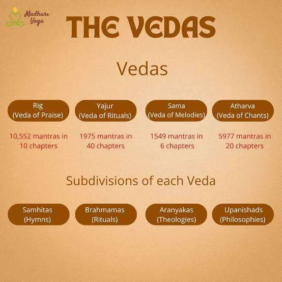
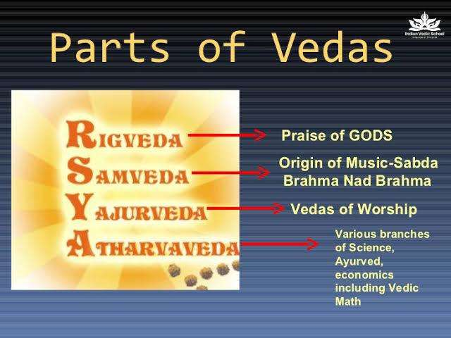
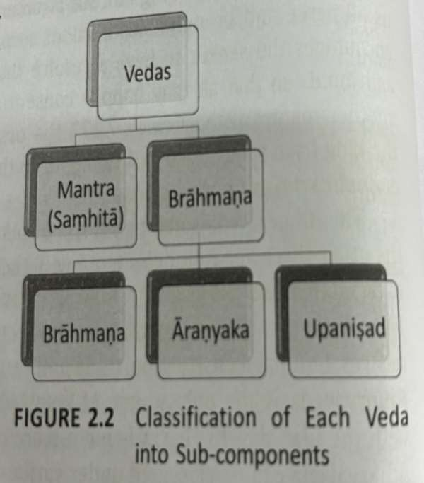

# Iks_Vedas

*Converted from `Iks_Vedas.pdf` on 2026-06-18 10:41*

<!-- page 1 -->

#### Vedas: Vid = to know, vision, to exist

Vedas are more than 5000 years old, during the earlier years it was not in written form = SRUTI It was taught and memorised – for it was a combination of script and chanting = UPASANA (practice) Secondly it had different levels and only those who qualified for higher level would have access to the knowledge. If it was in written form, it would be difficult to control. Over the years, certain portions of the hymns were written and only a few hymn / verses are now available. So WE DO NOT HAVE THE FULL VEDAS in the written form. The essence of the Vedas is to propound that human beings are part of the cosmos. Sage Veda Vyasa – 3000 – 5000 BCE compiled the Vedas and recorded it. He categorized the Vedas into FOUR parts and taught it to his students – which became FOUR schools of study - Rig-Veda - Rishi Paila and subsequently his students - Yajur Veda – Rishi Vaishampayana and subsequently his students - Sama Veda – Rishi Jaimini and subsequently his students - Atharva Veda – Rishi Sumantu and subsequently his students VEDAS cover vast body of knowledge :  Stars, Planets, Plants, Liquids, Chemicals, Food, Animals, Diseases, Cure, Etc

<!-- page 2 -->

### About VEDA:

This word can be derived from 5 verbal roots, 1. To Exist 2. To Know 3. To Discriminate 4. To Obtain 5. To make known Veda indicates a vast body of Knowledge (concerning the eternal spiritual values and Principles and practices ) For the purpose of – Gainful and happy living through deep meditation. Vedas are not merely the scriptures but seen as the fountainhead of Indian Culture and Human Civilization. Indian tradition marks that the Veda is the poetry of God and it neither fades nor becomes stale by the passing of time.

<!-- page 3 -->

#### The 4 Vedas:

1. Rigveda: • Rigveda represents the earliest sacred book of India. • It is the oldest and biggest amongst all the 4 Vedas. • Lofty & interesting set of ideas. Among all the four vedas this is the most voluminous. It describes the fundamental aspects or the essence of the universe. Hymn are related to Earth, Water, Fire, Air, Ether – Elements of Nature – how they combine and manifest in various forms. It is highly mystical form and requires correct understanding. • All the features of classical Sanskrit Poetry can be traced to this Veda. • In this Veda we find the origins of the religious and philosophical development of the most ancient society. • The Rig Vedic verses are essentially the utterances of the Vedic sages on several topics in the form of poetry. • The inherent curiousity and quest for new knowledge of ancient Indians are evident in the suktas. • These Suktas provide a rich repository of creative thinking , opening an individual’s understanding to several aspects of life and their inter connections. • The Nasadiya Sukta – which speculates on the origin of the Universe has attracted several Commentaries  both in Indian & Western Philology. The other suktas that inquired into the origin of the universe include Hiranyagarbha- Sukta and Purusha- Sukta. Hiranyagarbha Sukta was revealed to Sage Prajapathi Paramesti Literal meaning is “Golden Womb”, Purusha Sukta – literally means the PRIMAL BEING or Unmanifested Entity. Ekam sat viprah bahuda vadanti (Rig Ved 1.164.46) Truth is one, the learned ones articulate in different ways

<!-- page 4 -->

2. Yajur Veda: Yajur Veda hymns and verses refer to the procedures of performing different types of Worship . a. Why a particular type of worship has to be performed b.Who is qualified to perform c.Who is qualified to chant the appropriate verses d.What time and day of the year the worship has to be performed e.What is the duration of the worship f.What should be the layout of the worshiping area g.What offerings have to be made. Yajur Veda is the only VEDA which has TWO prominent branches – KRISHNA and SHUKLA KRISHNA YAJUR VEDA – Rishi Vaishampayana SHUKLA YAJUR VEDA  - was directly revealed to Rishi Yagnavalkya It mainly focuses on Yajna and a list of various yajnas are found.

<!-- page 5 -->

• Yajurveda confines itself to the major issue of conducting the sacrifices. • The word Yajurveda is derived from the root Yaj, meaning the worship associated with sacrifice. Many mantras are borrowed from Rig Veda. • The distinguishing aspect is that the Krishna-Yajurveda is more ancient than the Shukla-Yajurveda. • Till the time of Sage Yajñavalkya, Yajurveda was a single scripture. • Sage Yajñavalkya learned Yajurveda from his guru Vaisampayana. • Later, because of some misunderstanding between them, Yajñavalkya is said to have learned the new Veda which is known as Shukla-Yajurveda and the earlier one is known as Krishna-Yajurveda. • Yajnavalkya transferred this knowledge to fifteen of his disciples. • The shakhas of Sukla-Yajuveda are named after these disciples.

<!-- page 6 -->

#### 3.Samaveda (To sing the glory)

• The word Samaveda is derived from the Sanskrit root, ‘Sama’ indicating ‘to please, pacify or satisfy’. • Essentially, it refers to the singing of Rigveda mantras. • The mantras in Saamaveda are typically referred to as ‘Sama’. • It is a Rigveda mantra set to music. Samaveda currently has three branches viz. Kauthuma, Ranayaniya, and Jaiminiya. • However, there are references in Mahabhäsya of Patañjali, Srimad-Bhagavata-Mahapurana, and other sources which suggest that there were 1,000 branches of Saamaveda, indicating different traditions and versatile ways of singing the mantras. • In a yajña, Samaveda is used to please the devataas by singing mantras after making the offering. • Samaveda is divided into two parts: Purvärcikam and Uttararcikam, consisting of a total of 1,875 mantras. Out of these, except 75 mantras, the rest are taken from the Rigveda samhita. • There are more than 150 seers associated with Samaveda. Unlike the other three Vedas, the mantras of the Samaveda, are related to musical scales, similar to the seven scales of classical music. Therefore, in some ways, the origin of Indian classical music lies in the

#### Samaveda.

<!-- page 7 -->

4. Atharvaveda: (Knowledge of Almighty) • The etymology of the word 'Atharvan' brings out the multi-faceted nature and characteristics of this Veda. • It means one which brings wellness, seen by sage Atharvan and one with no falsehood or movement. • As already mentioned, it is generally believed that the Atharvaveda is a later addition to the original set of the three Vedas (Rig-Yajur-Sama), chronologically speaking. • The Atharvaveda priest is known as Brahman, whose main job is overall coordination and monitoring of the Vedic ritual. • Before starting any activity in the yajña, Brahman's permission is sought. When there are deviations or changes, the Brahman steps in and makes the necessary amendments. • In other words, the Atharvaveda priest plays the crucial role of quality control and compliance when rituals are performed. • Viewed from this perspective, the Atharvaveda priest must be a knower of all the other three Vedas to flawlessly execute this task of overall coordination and quality control. • At the highest level, the Atharvaveda-samhita is divided into four books. There are 20 kandas or books in all. Except for Books 15 and 16, the text is in poem form deploying a diversity of Vedic metres. Each kanda is again subdivided into süktas or hymns, and the süktas into mantras. • There are 6,077 mantras, in 736 süktas. About a sixth of the Atharvaveda texts adapts verses from the Rigveda. In particular, the last kanda, i.e., the 20th, has borrowed heavily from the Rigveda- Samhita.

<!-- page 8 -->

*[No extractable text on this page — possibly an image-only page]*

<!-- page 9 -->

Sage Vyäsa organised each Veda into distinct portions considering several aspects. • These divisions in each Veda were based on the material presented, the primary objective and use of the material, the target audience, and the focus. • Accordingly, each Veda is further sub-divided into a two-level hierarchy as shown in figure 2.2. • At the first level, we have the Mantras and Brahmanas. • While the Mantras portion, also known as Samhita has the hymns in praise of devatãs, the Brähmanas have the remaining portions of the Veda. • While the Brähmanas have substantive content addressing the ritualistic aspects, one can still distinctively cull out two other portions within the Brahmanas, namely Aranyakas and Upanishads. • We can therefore divide the Vedas into four portions: Samhita, Brähmana, Aranyaka, and Upanishads.

---
*End of document. Pages processed: 9/9 (0 page(s) had errors).*
