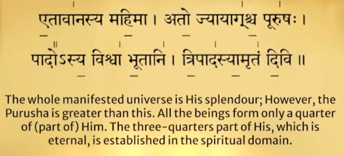
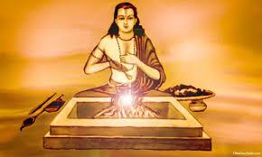
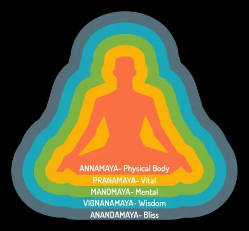
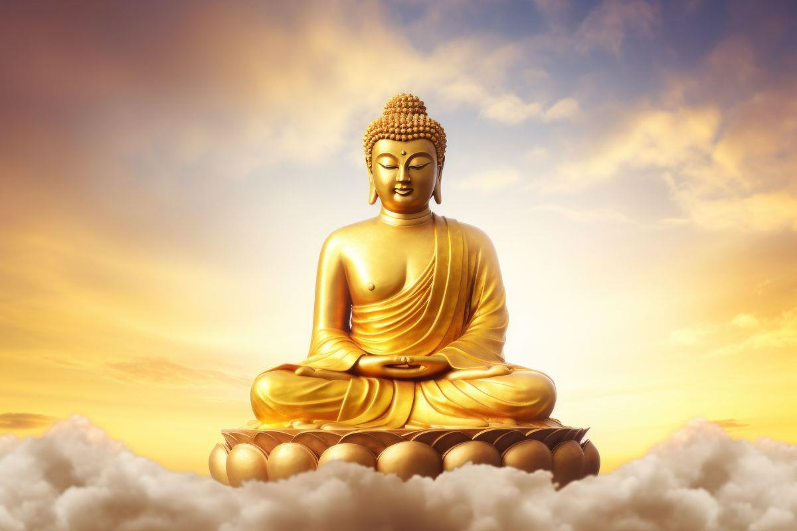
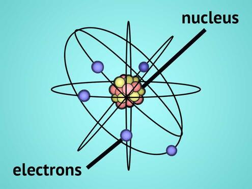

# UNIT 2_VEDAS_123731

*Converted from `UNIT 2_VEDAS_123731.pdf` on 2026-06-18 10:41*

<!-- page 1 -->

#### Vedas: Vid = to know, vision, to exist

• The Vedas, meaning “knowledge,” are the oldest texts of Indian Civilization • It is written in Sanskrit between 1500 and 500 BCE • Vedas are more than 3000 years old, they are considered Shruti (that which was ‘heard’ or revealed to ancient sages. • It was taught and memorised – for it was a combination of script and chanting = UPASANA (practice) • Secondly it had different levels and only those who qualified for higher level would have access to the knowledge. • Over the years, certain portions of the hymns were written and only a few hymn / verses are now available.

<!-- page 2 -->

• The essence of the Vedas is to propound that (a) Energy has manifested into Matter & will finally convert into Energy (b) Beings are part of the cosmic creation and destruction • Sage Veda Vyasa –compiled the Vedas and recorded it. • He categorized the Vedas into FOUR parts and taught it to his students – which became FOUR schools of study - Rig-Veda  - Rishi Paila and subsequently his students - Yajur Veda  – Rishi Vaishampayana and subsequently his students - Sama Veda  – Rishi Jaimini and subsequently his students - Atharva Veda –    Rishi Sumantu and subsequently his students

<!-- page 3 -->

EACH VEDA has FOUR SUB-SECTIONS 1. Samhita – Introduction , Hymns or mantras 2. Brahmana – Theoretical Details of the Different Procedures 3. Aranyaka – Experimental methods and inferences. Explains the symbols used including mudras during the performance of worship 4. Upanishad – Summary, Philosophical Treatises

<!-- page 4 -->

Rig Veda – Rishi Paila : The Veda of Hymns Hiranyagarbha Sukta was revealed to Sage Prajapathi Paramesti, Literal meaning is “Golden Womb”, हहरण्यगर्भः समवर्भर्ाग्रे र्ूर्स्य जार्ः पहर्रेकासीर् । स दाधार पृथ्ीीं ध्यामुर्ेमाीं कस्मै देवायहहवषा हवधेम ॥ hiraṇyagarbhaḥ samavartatāgre bhūtasya jātaḥ patirekāsīta | sa dādhāra pṛthvīṃ dhyāmutemāṃ kasmai devāyahaviṣā vidhema | Golden womb – described as the cosmic womb  floating in the void or primordial source from which the entire universe originated. It symbolizes birth of creation, the seed of all existence. This explanation matches with the Big Bang Theory. Among all the four Vedas this is the most voluminous. It describes the fundamental aspects or the essence of the universe. Hymn are related to Earth, Water, Fire, Air, Ether – Elements of Nature – how they combine and manifest in various forms. It is highly mystical form and requires correct understanding. 4 Purusha Sukta – literally means the PRIMAL BEING. It talks about original or fundamental form of existence, something connected to the earliest state of life

<!-- page 5 -->

Rig Veda: (A) Samhita: Hyms related to the Five Elements – Earth, Water, Fire, Air, Ether In more scientific terminolog = Solids, Liquids, Heat, Gases, Space (B) Brahamana: Detailed description of each of the Five Elements it Characteristics (C) Aranyaka: Combination of elements and its characteristics and manifestations (D) Upanishad : Aitareya – Describes the Manifestation of the Premordial Being –creation of the universe – sustainance and dissolution of the universe; Existance of Universal Consicousness

<!-- page 6 -->

Yajur Veda - Rishi Vaishampayana : The Veda of Rituals Yajur veda hyms and verses refer to the procedures of performing different types of Worship (a)Why a particular type of worship has to be performed (b)Who is qualified to perform (c)Who is qualified to chant the appropriate verses (d)What time and day of the year the worship has to be formed (e)What is the duration of the worship (f)What should be the layout of the worshiping area (g)What offerings have to be made Yajur Veda is the only VEDA which has TWO prominent branches – KRISHNA YAJUR VEDA – Rishi Vaishampayana SHUKLA YAJUR VEDA  -  was directly revealed to Rishi Yagnavalkya 6

<!-- page 7 -->

Yajur Veda: (A) Samhita: Hyms related to the relation between being and Universe In more scientific terminolog = Micro and Macro Level – plant, animals, humans (B) Brahamana: Detailed description on relationbetween various manifestations of the universe (C) Aranyaka: Combination and its characteristics and manifestations (D) Upanishad (Shukla): Isavasya – Structure is fundamentally the same, but it has allotropic forms. Example is:  Carbon – Graphite, Graphene and Diamond. It is possible to convert graphite to diamond. Brihadaranyaka – Compilation of question and answers – so that the students understand it better. Theme is the same – micro to macro level manifestation of the supreme being or universal consiousness.

<!-- page 8 -->

(D) Upanishad (Krishna): Taittiriya – Physical Body, Astral  Body, Mind Body Intellect Body and Self – how one can enter different layers of this body. Katopanishad  – Conversation between a Child and Sage – Is it possible to become ”DEATHLESS” can one live for ever....

<!-- page 9 -->

## Sama Veda

## –

## Rishi

## Jaimini

## : The Veda of

Sama Veda – Rishi Jaimini : The Veda of melodies • The Samaveda contains 1549 verses, except 75 verses taken from the Rigveda. • This Veda is renowned as the foundation of Indian classical music and dance and serves as a treasury of melodious chants. • It is important to note that the Samaveda Samhita is not intended to be read as a conventional text; rather, it is akin to a musical score sheet meant to be heard. • It was specifically compiled for ritualistic purposes, with verses chanted during ceremonies

<!-- page 10 -->

Sama Veda: (A) Samhita: Hyms related to the explanation of the Universal Consciousness and how to connect with it by restraining the senses and the mind (B) Brahamana: Detailed description on relation between mind and food and water and its influence on human body. (C)  Aranyaka: Combination and its characteristics and manifestations (D) Upanishad : CHANDOGYA UPANISHAD (i) Sleep: Rest, Dream, Deep Sleep (ii) Conscious mind, sub-conscious mind and super conscious mind (iii) Food, when eaten, becomes threefold: the grossest part becomes faeces; the middle part flesh and its subtlest part mind. (iv) Water, when drunk, becomes threefold: Its grossest part becomes urine, its middle part blood and its subtlest part Prana. (v) Fire (i.e., in oil, butter, fat.) when eaten becomes threefold: its grossest part becomes bone, its middle part marrow and its subtlest part speech. KENOPANISHAD FIVE SENSE ORGANS – Eyes, Ears, Nose, Tongue and Skin Control of the Mind on these sense organs Conflict in the Mind : Truth and False / Right and Wrong How to overcome Mind and Attain the state of Super Consciousness

<!-- page 11 -->

• The Atharvaveda provides detailed guidance on the daily rituals and procedures of life. • The Paippalada and Saunakiya are the two surviving recensions of the Atharvaveda. • It deals with health, prosperity, practical wisdom • More connected to commom life than Rig, Sam and Yajur

## Athara

Athara Veda – Rishi Sumantu: The Veda of Everyday life

<!-- page 12 -->

Atharva Veda: (A) Samhita: Hyms related to the process of enquiry, the seeker is curious to know the various aspects of the universe and its manifestations (B) Brahamana: Details of how to enquiry, how to practice, nature of someone who is on the path of liberation; (C) Aranyaka: Influence of external factors on internal growth of aspirants / seekers of truth (D) Upanishad : PRASHNA- Understanding of the Universe and the being and how they manifest through a process of Question and Answers; MUNDAKA- Specifically for those who have choosen the path of renunciation; performing action with detachment MANDUKYA – AUM is explained in detail, Sub-conscious, Conscious and Super-conscious states of mind – how it operates in sleep, deep sleep and dream state.

<!-- page 13 -->

## Key Takeaway

#### • Rigveda : Knowledge (Hymns, Philosophy)

#### • Samaveda: Music and Devotion (melody)

#### • Yajurveda: Ritual action (Procedure)

#### • Atharvaveda: Practical wisdom (Life, healing)

#### Together the Vedas = Theory (Rig) + Music/Arts

#### (Sama) + Practical Manual (Yajur) + Applied Life

#### science (Atharva)

#### They cover thought, sound, action and living – the

#### complete spectrum of human and cosmic life

<!-- page 14 -->

VEDANGAS – Essential Elements of Vedas • Nirukta = Etymology, explanation of words • Vyakarana = Grammar and linguistic analysis • Chandas = Meter, the poetic meters, including those based on fixed number of syllables per verse, and those based on fixed number of morae per verse. • Shiksha = Pronunciation phonetics, phonology. • Kalpa = Ritual instructions • Jyotishya = Right time for rituals  and time keeping LOT OF EMPASIS WAS GIVEN TO TIME-PLACE- PRONUNCIATION-TEXT

<!-- page 15 -->

## Vedangas

. • Shiksha ("instruction, teaching"): phonetics, phonology, pronunciation.[This auxiliary discipline has focused on the letters of the Sanskrit alphabet, accent, quantity, stress, melody and rules of euphonic combination of words during a Vedic recitation. • Chandas ("metre"):  This auxiliary discipline has focused on the poetic meters, including those based on fixed number of syllables per verse, and those based on fixed number of morale per verse. • Vyakarana ( "grammar"): grammar and linguistic analysis.[This auxiliary discipline has focused on the rules of grammar and linguistic analysis to establish the exact form of words and sentences to properly express ideas. • Nirukta ("etymology"): etymology, explanation of words, particularly those that are archaic and have ancient uses with unclear meaning. This auxiliary discipline has focused on linguistic analysis to help establish the proper meaning of the words, given the context they are used in. • Kalpa ("proper. fit"): ritual instructions. This field focused on standardizing procedures for Vedic rituals, rites of passage rituals associated with major life events such as birth, wedding and death in family, as well as discussing the personal conduct and proper duties of an individual in different stages of his life. • Jyotisha ("astrology"): Right time for rituals with the help of position of nakshatras and asterisms and astronomy. This auxiliary Vedic discipline focused on time keeping

<!-- page 16 -->

#### Vedanta = Essence of the Vedas

If all the 4 vedas are put together then it will be several thousand pages;  just as a full bible would be 2000 page and a full version of the Quran 600 pages and more. Most people want the essence of these texts (a)Are these texts relevant to us today ? (b)How will it change my life today ? (c)Why should I worry about it today? Vedanta is the CONDENSED or ABRIDGED version of the VEDAS ( all 4 vedas) – Covering THE MOST ESSENTIAL ELEMENTS of the VEDAS; for some one who has limited time and wants some knowledge of the VEDAS, can ready VEDANTA.

<!-- page 17 -->

#### Vedanta = Essence of the Vedas

• The word "Vedanta" is a combination of two Sanskrit words: "Veda", which means "knowledge" or "the whole corpus of vedic texts", and "anta", which means "end" or "the goal of". •  Vedanta can also be interpreted as "the ultimate knowledge of the Vedas" or "the end, conclusion, or finality of knowledge". • Vedanta is a spiritual philosophy. It's based on the idea that our real nature is pure, immortal, and free, and that the purpose of life on Earth is to realize this divinity. • Vedanta teaches methods to help people achieve this goal, and it's considered universal in its application, relevant to all cultures, countries, and religious backgrounds. •  Over time, Vedanta has branched off into three main streams: Advaita, Viśiṣṭādvaita, and Dvaita.

<!-- page 18 -->

Jain= in Sanskrit = to conquer; in this context “one who has conquered death” = NIRVANA or SALVATION Jainism is 2600 years old, not a religion it is a practice. Jainism was taught by tirthankaras 24 Thirthankaras : Rushabadeva to Mahavira (600 BCE) Lord Mahavira spread it widely After the MAHAPARI NIRVANA of MAHAVIRA , two separate schools of thought emerged (a) Svetambaras  - Rituals, prayers, social welfare and spreading the teachings of the thirthankaras (b) Digambaras – absolute or complete renunciation -  steadfast in understanding of the Self – which is the Supreme Self

## Philosophy of J

#### Philosophy of Jainism (700-600 BCE)

<!-- page 19 -->

## Philosophy of Jainism (

## 700

## -

## 600

## BCE)

#### Philosophy of Jainism (700-600 BCE)

Jainism teaches that every soul is divine and can pecome pure through right thinking, right knowledge, and right conduct. Its based on (Ahimsa) and Main Teachings: Ahimsa: Non Noilence Don’t harm any living being in thought, word or action. Anekavedanta(Many sided truth): Truth can be seen in may ways. Aparigraha (Non attachment) : Self-control, Avoid greed and Possessiveness Karma and Moksha : Every action binds karma to the soul. Freedom (Moksha) comes when Karma is removed through right living. Three Jewels RIGHT FAITH: Believing in truth RIGHT KNOWLEDGE:  Understanding Reality correctly RIGHT CONDUCT: Living ethically and with self discipline

<!-- page 20 -->

## Philosophy of Buddha (

## 400

## -

## 500

## BCE)

Philosophy of Buddha (400-500 BCE) Origin: Around 6th century BCE Gautam Buddha born as Prince Siddhartha Gautama  laid the foundation of Buddhism Place: Bodh Gaya Buddhism emphasizes on inner experience and meditation rather than blind belief. Focuses on personal growth and universal harmony not just rituals

<!-- page 21 -->

Four Noble Truth There is suffering/ Desire There is the cause of suffering/Desire The cessation of suffering / Desire The path to end the sufferings / Desire Is Eight Fold Path Right Understanding Right Thought Right Speech Right Action Right Livelihood Right Attitude Right Mindfulness Right Concentration Will lead to NIRVANA Philosophy of Buddha (400-500 BCE) Philosophy of Buddha Desire is the Cause for Suffering Ignorance is the Cause for Desire 21

<!-- page 22 -->

## Universal Human Values

• The purpose of his life upon earth is to follow the law (dharma)  and achieve salvation (moksha) or freedom from his false self (ahamkara) by leading a balanced life in which both material comforts and human passions have their own place and legitimacy. • The four aims are essential for the continuity of life upon earth and for the order and regularity of the world. • They provide structure and meaning to human life and give us a reason to live with a sense of duty, moral obligation and responsibility • Man cannot simply take birth on earth and start working for his salvation right away by means of just dharma alone. • If that is so man would never realize why he would have to seek liberation in the first place. As he passes through the rigors of life and experiences the problem of human suffering, he learns to appreciate the value of liberation. He becomes sincere in his quest for salvation. • So we have the four goals, instead of just one, whose pursuit provides us with an opportunity to learn important lessons and move forward on the spiritual path.

<!-- page 23 -->

## Universal

## Human

## Values

## embedded

## in

## the

Universal Human Values embedded in the Vedic Tradition = PURUSHARTHA  and STAGES OF LIFE: Stage I : Is dominated by NEED, DESIRE, PASSION, = KAMA Stage II : Is dominated by ACQURING, POCESSION, FRIENDS, RESPECT, STATUS IN SOCIETY = ARTHA Stage III: Is dominated by SHARING, THANKS GIVING, PHILONTROPHIC ACTIVITIES = DHARMA Dharma = CODE OF CONDUCT = Truthful, Cleanliness, Well Behaved, Forgiveness, No Hatred, No Jealousy MOKSHA: Salvation, Nirvana, Liberation, STAGE – I STAGE - II F  = Food C = Clothing S  = Shelter F  = Family C = Career Growth S  = Society F  = Fame C = Contentment S  = Spirituality & Salvation STAGE - III

<!-- page 24 -->

(A)How many of you like to play sports ?  How many of you like to participate in dance / drama / such events ? I would like to be part of NCC ; I like adventure sports; (B) How many of you like to read books ? Play Instruments ? Care for the plants, animals, senior citizens, (C) How many of you like to chat on the mobile, chat and relax ? Be at home or with friends and do nothing?

## LET US DO A PERSONALITY

LET US DO A PERSONALITY ASSESSMENT EXCERCISE

## DOMINANT PERSON

DOMINANT PERSONALITY

## SATTVA

## –

## RAJAS

## –

### SATTVA – RAJAS – TAMAS

<!-- page 25 -->

25

## COMBI

COMBINATION OF PERSONALITY TRAITS MANIFEST BASED ON PLACE – TIME – PEOPLE AROUND US 50% of A – 30 %  of B and 20 % of C A B C

#### YOU

## WHO DE

WHO DECIDES YOUR BEHAVIOUR OR THE PERSONALITY TRAITS • MIND OR BRAIN ? DO WE KNOW THE DIFFERENCE ? YOUR MIND IS ALWAYS WORKING, COMPARING, JUDGING, KEEP AN OPEN MIND ! • ENVIRONMENT  - COLLEGE / HOME / WITH FRIENDS / IN FRONT OF PARENTS • WATCH PEOPLE YOUNGER TO YOU;  - YOU SAY HE/ SHE IS IMMATURE • WATCH PEOPLE ELDER TO YOU – HOW YOU REACT  - TOO RIGID AND OLD STYLE OF THINKING

<!-- page 26 -->

26 Mind is Subtle Matter – Science is yet to prove it – if you demonstrate it – you will receive NOBEL PRIZE YOUR MIND DETERMINES YOUR PERSONALITY YOUR MIND HAS THREE BROAD COMPONENTS - Sattva – Positive, Disciplined, Honest, Truthful, Sincere - Rajas – Action, movement, speech, determined efforts - Tamas  - Lazy, Relaxed, No Motivation, Procrastinate, Ignorance, Greedy COMBINATION OF RAJAS AND TAMAS – cruel, hurt people, cowards, create fear among people, get angry easily; RAJAS and SATTVA – brave, supportive, good administrators, musicians,

<!-- page 27 -->

*[No extractable text on this page — possibly an image-only page]*

<!-- page 28 -->

## At the fundamental level

## –

## there are two elements

## –

## m

At the fundamental level – there are two elements – matter & energy or matter (prakriti) and spirit (purusha) So matter and energy manifest in different forms - 100% Energy  = pure consciousness - Ego - Intellect - Mind – is Subtle Matter - Five Sense Organs – Ear, Skin, Nose, Tongue, Eyes - Five Organs of Action – Hands, Legs, Mouth, Excretory Organs - 100 % matter – Earth (bones), Water (Blood), Air (breath), Magnetic field exists – but one cannot see it; or we have not yet developed the technique of seeing the magnetic field A magnetic compass is essential to determine the direction of magnetic field So also PURE CONSCIOUSNESS exists – we are unable to see it or experience it

---
*End of document. Pages processed: 28/28 (0 page(s) had errors).*
