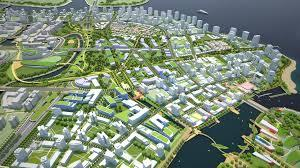
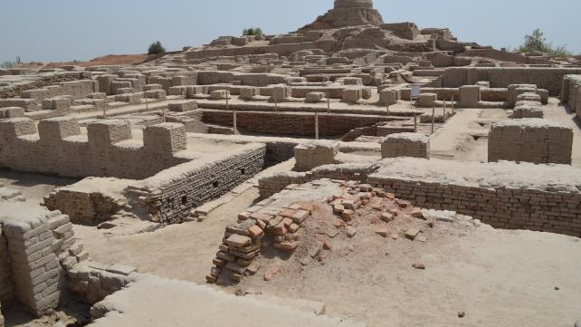
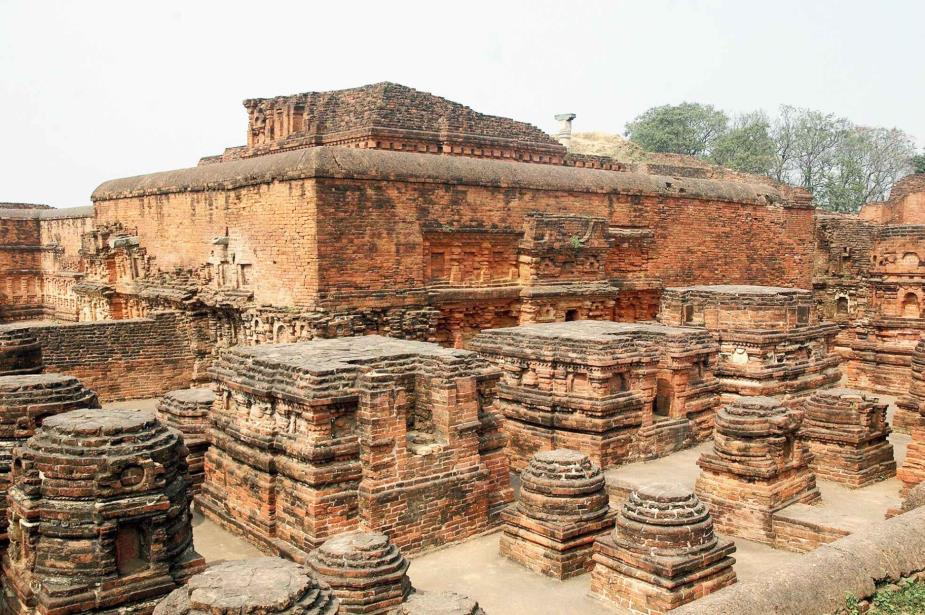
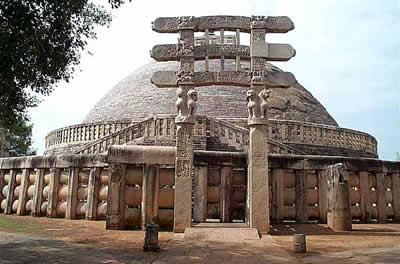
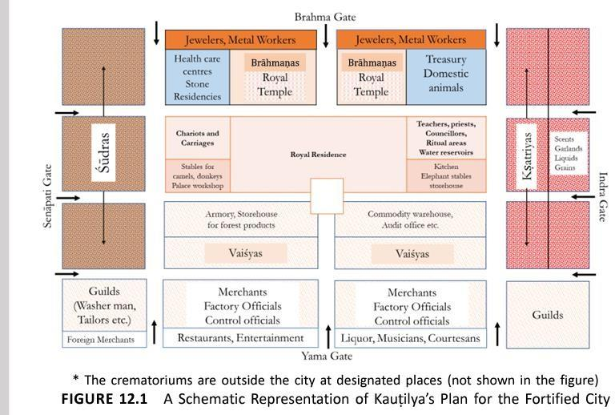
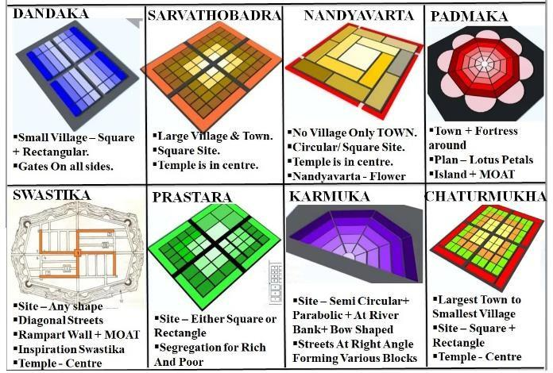
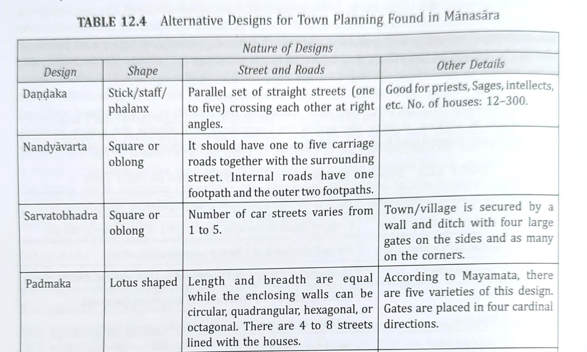
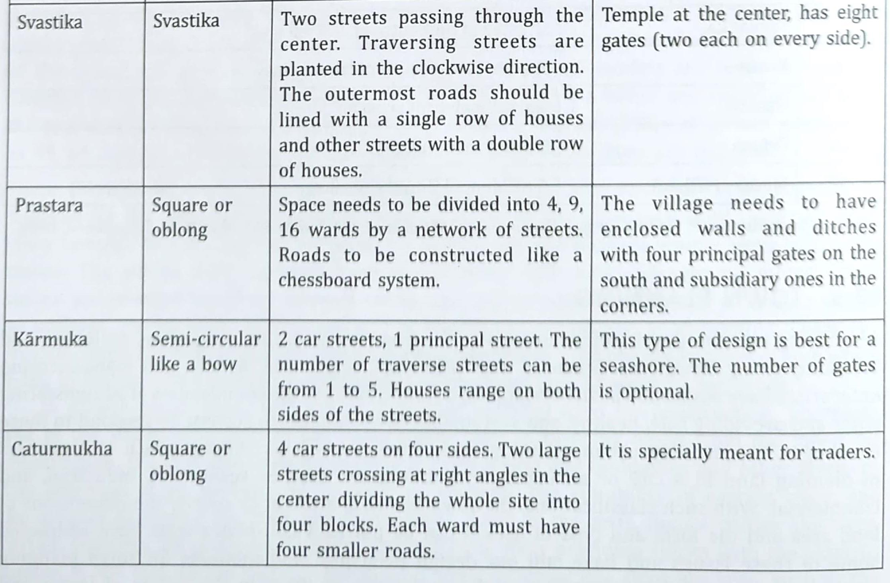

# Unit II - Town Planning

*Converted from `Unit II - Town Planning.pdf` on 2026-06-18 10:41*

<!-- page 1 -->

## Town Planning

Course Name: Indian Knowledge System (FE) Course Instructor : Asst. Prof. Rhuddhi Jambhale Civil Dept

<!-- page 2 -->

Town planning is considered as an art of shaping and guiding the physical growth of the town creating buildings and environments to meet the various needs such as social, cultural, economic and recreational etc. and to provide healthy conditions for both rich and poor to live, to work, and to play or relax, thus bringing about the social and economic well-being for the majority of mankind

### Definition: Town Planning

<!-- page 3 -->

## Ancient India

• ASI has documented town planning structure dating back to 2600 BCE. Sindhu-Saraswathi Civilization or the Indus Valley Civilization – Harappa, Mohenjodaro and Lothal sites • They followed a system of town planning with similarities in their layouts on a rectilinear basis of main east-west routes directed to the citadels and north-south cross routes (Morris 1979).

<!-- page 4 -->

• It was situated between Indus River and the Ghaggar - Hakra River ( Pakistan and North Western India). • These cities were also the earliest instances of Grid iron town planning. • The city proper consisted of two components– a citadel, built on high ground and a lower city where the majority of the population lived

## Harappa & Mohenjudaro

<!-- page 5 -->

## Harappa & Mohenjudaro TP

Main features of town planning in Indus valley civilisation:- • Streets in perfect grid patterns running in North South direction with intersection at right angles • World's first sanitation system. Separate covered drains along the streets for waste water. • All the houses had access to water and drainage facilities. There was Underground sewage and drainage facilities from houses • Impressive dockyards ,granaries, warehouses, brick platforms and protective walls. • Massive citadels protected the city from floods and attackers.

<!-- page 6 -->

## Harappa & Mohenjudaro TP

• Houses opened to inner courtyards and smaller lanes. • Buildings were of masonry construction by Sun dried bricks. • Small houses ranging from 2 rooms to mansions with many rooms were built • Streets within built up areas were narrow. • Distinct zoning for different groups. • Public Structure like Great Bath was built. Helical pumps were used for pumping water in Great bath. • Principal buildings like monastry & bath – indicated religious culture.

<!-- page 7 -->

Vedic period: (400 BCE) • In this period, Vedas as well as books were wrote on town planning. • In ―Vishwa-karmaprakash‖ it was stated that ―first layout the towns and then plan the houses.‖ • ―Shilpshastra‖ wrote by ―Architect mansara‖ discussed study on soil, topography, climatology and various layouts like dandaka, swastika, padmaka, nandyavarta. dandika style nandyavarta style • Buddhist period: (up to 320 CE) :During the period of emperor chandraguptamaurya, kautilya (chanakya) was the chief minister who wrote the famous ―arthashastra‖, a treatise of town planning

### Ancient Texts on TP

<!-- page 8 -->

## Ancient Towns

• Intensive training given to ‗Sthapati‘ (architect or town planner) • Towns usually oblong shape, generally near river banks, sea shore or large lakes. • Typical town consisted of market, streets, public buildings, residences for people, palaces, temples, recreation centres, gardens, tanks, underground passages, city forts etc. Eg: Ayodhya, Patliputra (present patna), Takshasila, Nalanda (early University towns)

<!-- page 9 -->

#### Ayodhya and Patliputra

<!-- page 10 -->

## Factors of Town Planning

Planning of a town is dependent on the various factors: • Soil Type • Climatic Conditions • Topography • Wind Orientation • Orientation to Take Advantage of Sun and Wind

<!-- page 11 -->

## Features of Town Planning

• The towns were highly influenced by the Site conditions. • The towns were generally located along the bank of the water body. • A flowing stream was preferred for Sanitary requirements. • The towns on the river edge were OBLONG shape; to take maximum advantage of the river. • Main Street (King/ Raja Marg) were aligned East-West to get roads purified by the Sun's rays; while the shorter roads were along North — South.

<!-- page 12 -->

*[No extractable text on this page — possibly an image-only page]*

<!-- page 13 -->

## Ancient town classification

<!-- page 14 -->

*[No extractable text on this page — possibly an image-only page]*

<!-- page 15 -->

*[No extractable text on this page — possibly an image-only page]*

<!-- page 16 -->

### Crisp Set of learning from Ancient Indian

### Town Planning

• Here are the principles of ancient Indian town planning that are still relevant today: 1. Grid-based layout – Ensures easy navigation, systematic growth, and better traffic management. 2. Efficient drainage systems – Prevents waterlogging and maintains urban hygiene. 3. Zoning of spaces – Separation of residential, commercial, and public areas avoids congestion. 4. Use of local materials – Encourages eco-friendly and sustainable construction. 5. Orientation and ventilation – Houses planned for natural light and air reduce energy use. 6. Public spaces & utilities – Provision of wells, tanks, and community areas enhances social life. 7. Security & resilience – Fortified designs remind us of the need for safe and disaster-resilient cities.

---
*End of document. Pages processed: 16/16 (0 page(s) had errors).*
