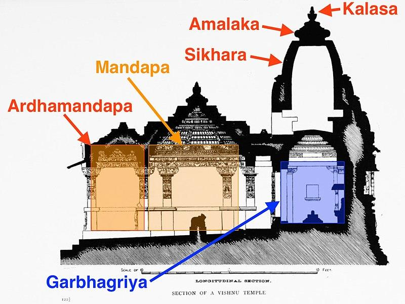

# Unit II -Architechture

*Converted from `Unit II -Architechture.pdf` on 2026-06-18 10:41*

<!-- page 1 -->

## Architechture

Course Name: Indian Knowledge System (FE) Course Instructor : Asst. Prof. Rhuddhi Jambhale Civil Dept. GEC, Farmagudi

<!-- page 2 -->

## Architecture

• Ancient Indian architecture is divided into five major sub- parts: • 1.Harappan Art and Architecture • 2.Mauryan Art and Architecture • 3.Post Mauryan Architecture • 4.South Indian Architecture

<!-- page 3 -->

## Harrapan Architecture

• During Sindhu-Saraswati Civilization large administrative buildings and ritual structures were built • Access routes were provided thoroughfare from one area to another. • Markets and public meetings held in large open courtyards. • Houses and public buildings grouped with shared walls and formed larger blocks & accessed by wide streets. • Most houses had private baths & toilets as well private well

<!-- page 4 -->

## Harappan Architecture

• Mud brick, baked brick & wood or stone were used for the foundation and walls of the houses. The doors ,windows were made from wood. • Building materials - mud bricks and baked bricks, wood and reeds were used. The average size of the bricks was 7 x 12 x 34 cm (for houses) and 10 x 20 x 40 cm for the city walls. The larger bricks have a standard ratio of 1:2:4. • The house floors -hard-packed earth . • Bathing areas and drains - baked brick and stone. • Roofs -wooden beams covered with reeds and packed clay.

<!-- page 5 -->

## Mauryan Architecture

• Mauryan architecture prevalent during the Mauryan Empire flourishedfrom around 322 BCE to 185 BCE • Monumental stone sculpture and architecture became prominent. • The adoption of Buddhism by Ashoka led to the creation of Stupas(dome-shaped structure), Pillars, Caves, Palaces • Stupas were important religious structures. Pillars were created as memorials, and edicts of Ashoka were inscribed on them.

<!-- page 6 -->

## Mauryan Architecture

• Caves were used for meditation and worship. They had intricate carvings and sculptures adorning their interiors. • Palaces were grand structures that were home to the king and the royal family. They often had gardens and courtyards. • Potters played an important role during the Mauryan period. They created various types of pottery, including terracotta figurines and utensils

<!-- page 7 -->

## Post Mauryan Era

• This period was marked by the rule of various dynasties. • The Post-Mauryan period saw the emergence of early temples, a shift from the predominantly stupa-based architecture of the Mauryan era. • These temples often featured images of gods and narratives from Puranas. • The architectural styles varied, with Sandhara, Nirandhara, and Sarvatobhadra being the prominent ones.

<!-- page 8 -->

## Gupta Architecture

• From the beginning of the fourth century CE to the end of the sixth century CE, the Gupta Empire ruled over ancient India. • CAVE ARCHITECTURE: • The earliest religious buildings were cave-temples with one carved doorway and sculptures on the outside. • Inside, there were sculptures for rituals, and walls carved with stories. • For examples Ajanta caves a group of 29 rock-cut caves in Maharashtra, contains paintings exhibiting Buddha’s journey. Here are also instances of mural paintings and fresco technique painting.

<!-- page 9 -->

## Gupta Architecture

• Ellora caves in Charanandri hills are a group of 34 rock-cut caves that exhibit Hindu, Jain, and Buddhist philosophy through art. All caves were built from the 6th to 12th century. Built during Kalachuri, Chalukya and Rashtrakuta dynasty • Elephanta caves, famous for their rock-cut architecture, dating back to 5th to 8th century. • Bagh caves in Dhar district, Madhya Pradesh, consist of 9 caves together. These Buddhist caves are also known as BaghGupha. • Pandav caves (B.C.250- A.D.600) in Nashik are in Trirashmi hill. These caves are magnificent examples of ancient water management systems and Buddha sculptures

<!-- page 10 -->

## Temple Architecture

• The architectural principles of temples in India are described in ShilpaShastras and Vastu Sastras. • While sandstone is the commonest building material, a grey to black basalt can be seen in some of the tenth to twelfth century temple sculptures • Rich in art and architecture, temples became bastions of cultural preservation. Sculptures, paintings, and literature flourished within their walls, reflecting the cultural ethos of the times.

<!-- page 11 -->

*[No extractable text on this page — possibly an image-only page]*

<!-- page 12 -->

## Temples in India

There are three broad styles of Indian temple architecture: • 1.Nagara (northern style), • 2.Vesara (mixed style), and • 3.Dravida (southern style).

<!-- page 13 -->

## Nagara Style

• Nagara, or North Indian, temple architecture originated in northern India in the 5th century AD during the Gupta period. • It's characterized by tall, pyramidal towers called shikharas, which are topped by a bulbous finial called a kalasha. • Style also includes intricate carvings and a curved profile that reflect Hindu cosmology and religious symbolism • Prominent features → Shikaras (Spiral roofs), Garbhagriha (sanctum) &Mandap (pillared hall) • Thus the two major characteristics of this style are the cruciform ground plan and the curvilinear tower

<!-- page 14 -->

## Dravidian Style

• The temple is enclosed within a compound wall. • Gopuram: The entrance gateway is the tallest structure • Vimana: The shape of the main temple tower. It is a stepped pyramid that rises up geometrically (unlike the Nagara style Shikhara that is curving). • At the entrance to the garbhagriha, there would be sculptures of fierce dvarapalas guarding the temple. • Generally, there is a temple tank within the compound. • In many temples, the garbhagriha is located in the smallest tower. It is also the oldest. • Eg: Sriranganathar Temple at Srirangam, Tiruchirappally, Kanchipuram, Thanjavur (Tanjore), Madurai and Kumbakonam.

<!-- page 15 -->

## Vesara Style

• The Chalukyan temple exhibits indigenous qualities in terms of the temple walls and pillar ornamentation. • Dravida towers transformation: by reducing the height of each storey and arranging them in declining order of height from base to top, with a great deal of embellishment on each floor. • Mantapa and Pillars are two unique elements of Chalukya temples: • Mantapa: The mantapa features two types of roofs: domical ceilings (which have a dome-like appearance and are supported by four pillars) and square ceilings (these are vigorously ornamented with mythological pictures). • Pillars: Chalukya temples small ornamental pillars have their unique aesthetic significance.

<!-- page 16 -->

## Cave Architecture

• Cave architecture has a long and rich history in India, dating back to the 2nd century BC. Caves carved out of stone cliffs served as dwellings, places of meditation and worship. • The Ajanta Caves were constructed between 200 BC and 658 AD. The Ajanta Cave consists of 29 Caves, 25 are Viharas, also known as residence caves, and 4 are used as Chaitya, which are known as prayer halls. • Ellora Caves: They are rock-cut Caves. It is famous for the Kailash Temple, the largest Monolithic excavation in the world. • These caves form part of the Sahyadri ranges of the Western Ghats. It consists of 34 caves, of which 17 relate to the Brammarical faith, 12 are Buddhist, and 5 are Jains.

<!-- page 17 -->

## Cave Architecture

• A double-storey and a triple-storey caves can be seen. There is a presence of courtyards in the temples since these were carved out on the sloping sides of the hill. • Barabar Caves are situated in the hilly area near Makhdumpur, 25 km south of Jehanabad district, Bihar. Barabar caves can be dated back to the 3rd Century BC to the times of the Mauryan Empire (322 BCE -185 BCE). Barabar Caves were constructed by emperor Ashoka.

<!-- page 18 -->

Medieval Period Indian architecture is rooted in the history, culture, and religion of India The best-known include the many varieties of • Indo-Islamic architecture: Blend of Islamic arches, domes, minarets with Indian decorative motifs • Rajput architecture: Fortified Palaces, Jharokhas, Chhatris and intricately carved sandstone. • Mughal architecture- Symmetrical gardens, bulbous domes, marble inlay, and grand gateways. • South Indian architecture- Towering Gopurams, pillared halls and richly carved Temples. • Indo-Saracenic architecture: Fusion of Indian, Islamic and European elements with domes, arches and colonnades. This style flourished during the British Colonial Period

<!-- page 19 -->

## Relevance Vastu Shastra

## in Todays world

• Vastu Shastra is still relevant today as many of its principles align with modern needs like Proper sunlight, ventilation and space planning for health and comfort. • It blends science, culture and well being in todays living spaces.

<!-- page 20 -->

• Ensures proper sunlight and ventilation – Vastu guides house orientation to allow natural light and air, making spaces healthy and comfortable. • Promotes health, peace, and positivity – Proper arrangement of rooms helps reduce stress and creates a calm, positive environment. • Balances the five elements – It aligns living spaces with earth, water, fire, air, and space for harmony with nature. • Matches modern sustainable design – Many Vastu ideas support eco-friendly living by saving energy and using natural resources wisely. • Connects people to tradition and culture – Following Vastu maintains cultural roots and provides emotional satisfaction. • Increases demand for homes – Vastu-compliant houses are often preferred in the real estate market.

---
*End of document. Pages processed: 20/20 (0 page(s) had errors).*
