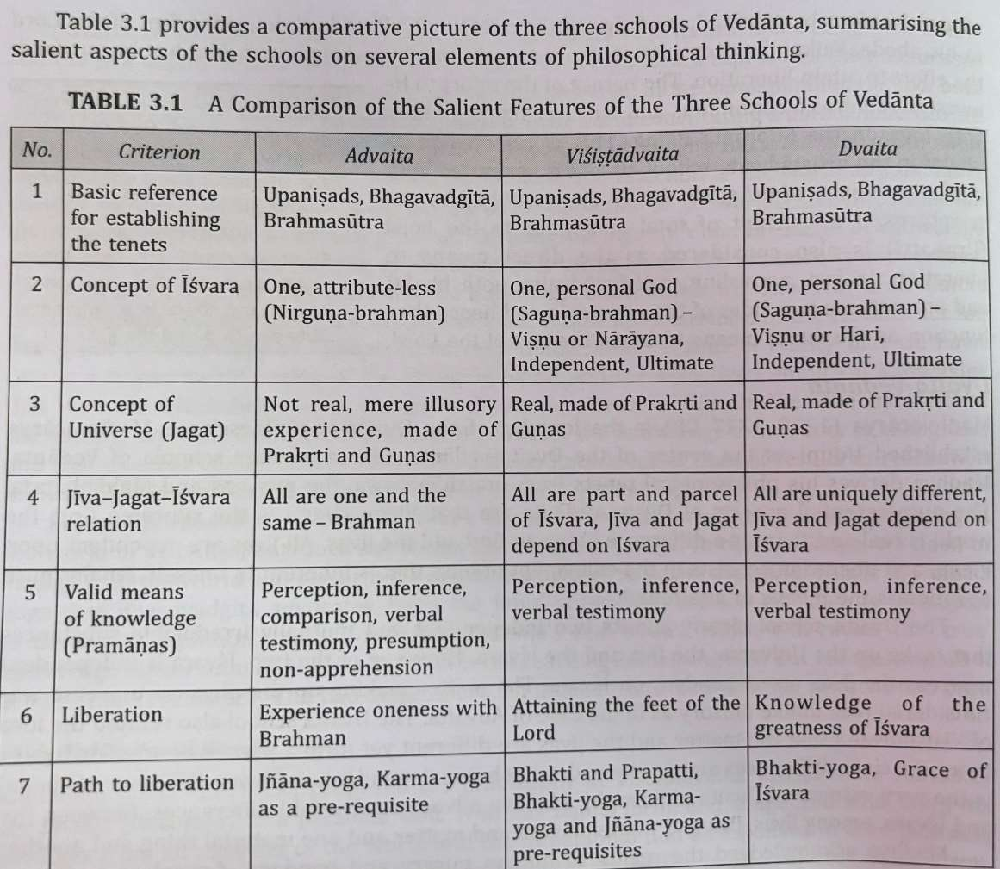

# Upanishads and Vedantas

*Converted from `Upanishads and Vedantas.pdf` on 2026-06-18 10:41*

<!-- page 1 -->

#### Upanishads:

1. The Upanishads {Sanskrit: उपनिषद्} are late Vedic and post-Vedic Sanskrit texts that "document the transition from the archaic ritualism of the Veda into new religious ideas and institutions“. 2. They are the most recent addition to the Vedas, the oldest scriptures, and deal with meditation, philosophy, consciousness, and ontological knowledge. Earlier parts of the Vedas dealt with mantras, benedictions, rituals, ceremonies, and sacrifices. 3. Around 108 Upanishads are known, of which the first dozen or so are the oldest and most important and are referred to as the principal or main (mukhya) Upanishads. 4. The ‘mukhya’ Upanishads are found mostly in the concluding part of the Brahmanas and Aranyakas and were, for centuries, memorized by each generation and passed down orally. Rigveda – Speaks of Universal Conscious - (i) Aitareya Yajur Veda – Speaks of Manifestation – Forms & Shapes – (ii)Taittriya, (iii) Brhadaranyaka, (iv) Isa, (v)Katha Samaveda - Speaks of Characteristics of Different forms – (vi)Chandogya, (vii) Kena Atharva Veda – speaks of Application – uses – (viii)Prasna, (ix) Mundaka, (x) Mandukya Priyanka Verekar (Subject IKS)

<!-- page 2 -->

## Vedantas:

• The ‘mukhya’ Upanishads, along with the Bhagavad Gita and the Brahmasutra,are interpreted in divergent ways in the several later schools of Vedanta. • The central concern of all Upanishads is to discover the relations between ritual, cosmic realities (including gods), and the human body/person,postulating Ātman and Brahman as the "summit of the hierarchically arranged and interconnected universe. • According to Advaita Vedanta, there is no difference. • According to Vishishtadvaita the jīvātman is a part of Brahman, and hence is similar, but not identical. • According to Dvaita, all individual souls (jīvātmans) and matter as eternal and mutually separate entities. Priyanka Verekar (Subject IKS)

<!-- page 3 -->

Priyanka Verekar (Subject IKS)

---
*End of document. Pages processed: 3/3 (0 page(s) had errors).*
