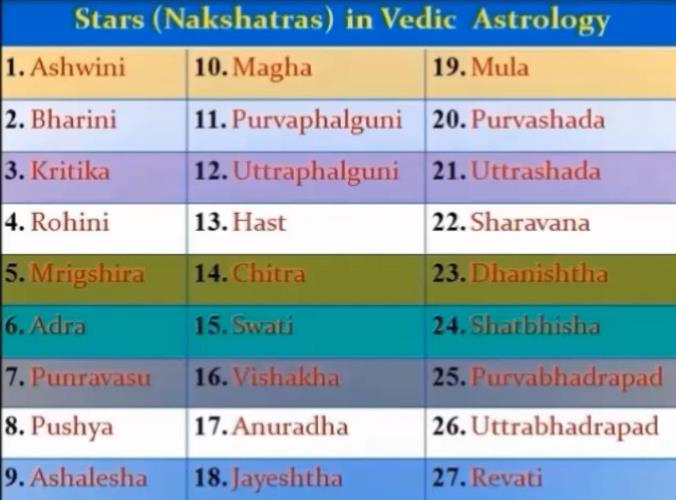
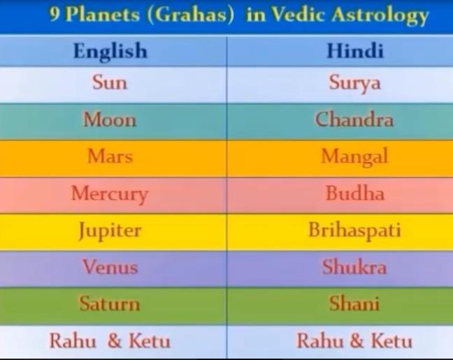
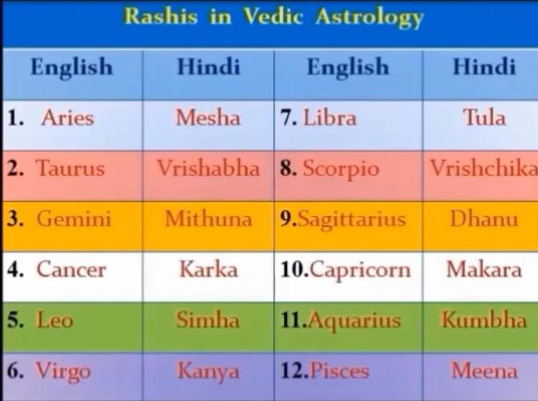
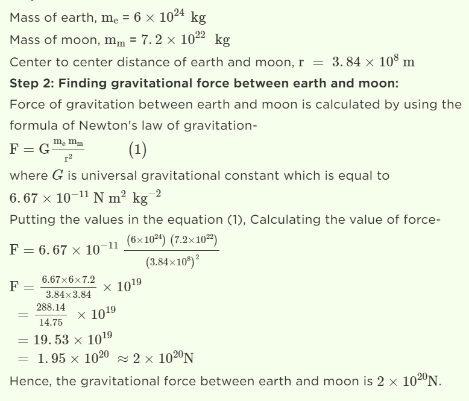
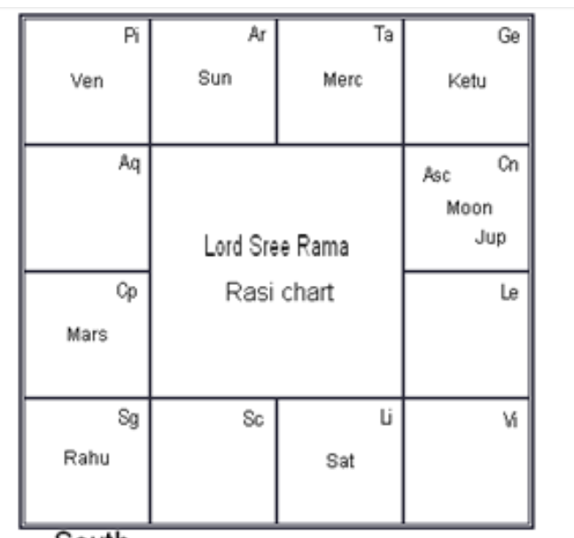
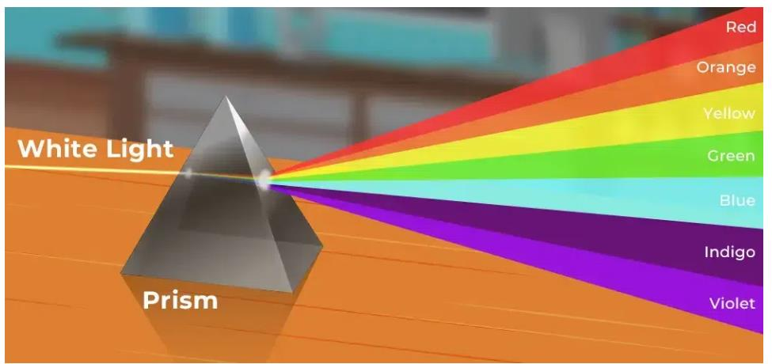
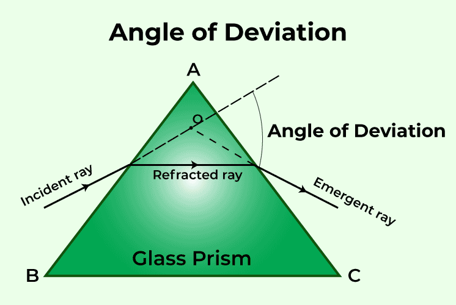
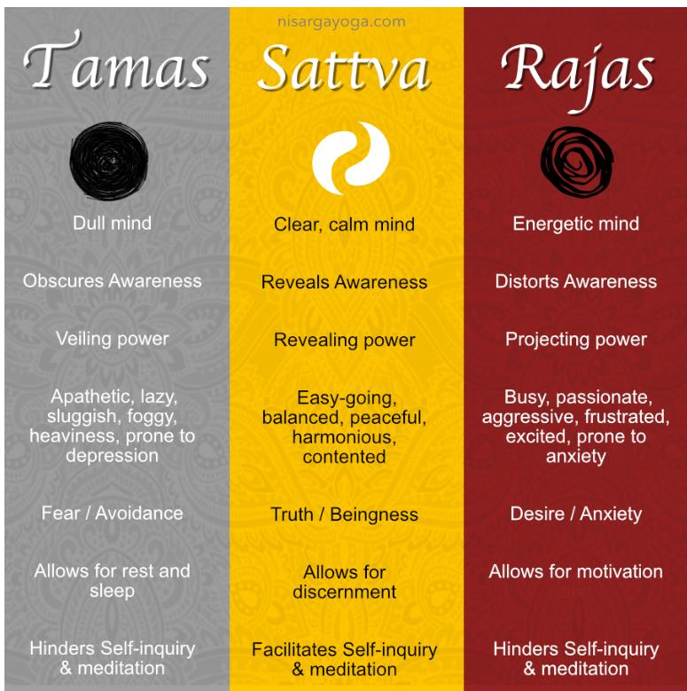

# unit.2. it.2

*Converted from `unit.2. it.2.pdf` on 2026-06-18 10:41*

<!-- page 1 -->

Jyothishya Study of effect of stars and planet on living being on   Earth Each House is associated with a particular set of stars and a particular planet, and there is precision in their movement and hence there is a net effect on the living beings on earth Every being born on the surface of the earth at  a given time and place have certain permanent characteristics (C’) and certain characteristics which change with time/place/people (C”). Effective Personality = C = C’+iC” We readily believe that the Dielectric Constant (E) is a complex number E’ is the real and E” is imaginary and the equation is E = E’ + iE” Man is unable to predict weather accurately, cannot predict earthquake, volcanos and many more; so he is unable to understand the JYOTHISHYA TEXTS.

<!-- page 2 -->

*[No extractable text on this page — possibly an image-only page]*

<!-- page 3 -->

• Earth Diameter : 12742 km; Speed of Rotation: 1670 km/hr = 460 m/s • India = East to West = 3500 km and North to South it is = 3800 km • Distance between Earth and Sun = 150 million km = 150 x 106 km Min = 147 x 106 km and  Max. 152 x 106 km • Distance between Earth and Moon = 3,50,000 km Min = 363,300 km Max = 405,696 km THE CONCEPT OF CHART WAS DEVELOP TO DETERMINE THE RELATIVE POSITIONS OF THE PLANETS. Time take for Earth to go around the sun = 1 year Saturn = 30 years Jupiter = 12 years Mars = 2 years

<!-- page 4 -->

Venus = 0.6 year = approx. 7 months Mercury = 0.25 year = 4 months Rahu & Ketu = 19 years Star = 13.33 deg Total number of Stars = 27 stars One house = 30 deg.

### Moon

### Ketu

### Rahu

### Month of

### September 2024

**Table 1 (page 4):**

| Rahu Moon |  |  | Jupiter | Mars |
| --- | --- | --- | --- | --- |
| Saturn |  | Month of September 2024 |  |  |
|  |  |  |  | Mercury |
|  |  |  | Venus | Sun Ketu |

<!-- page 5 -->

### Mercury

### Month of

### October 2024

**Table 1 (page 5):**

| Rahu |  | Moon | Jupiter | Mars |
| --- | --- | --- | --- | --- |
| Saturn |  | Month of October 2024 |  |  |
|  |  |  |  |  |
|  |  | Venus | Mercury Sun | Ketu |

<!-- page 6 -->

VEDAS BEFORE WE GO INTO VEDAS – WE WILL DISCUSS ABOUT DISPERSION OF LIGHT Man observed Rainbow Position of the colour repeatedly and much before it was formally told to us. Isaac Newton is credited with explaining the dispersion of light. Similarly, knowledge encompassing different aspect of life emerges from texts referred as VEDAS • The Vedas, meaning “knowledge,” are the oldest texts of Humanity

<!-- page 7 -->

• They began as an oral tradition that was passed down through generations before finally being written in Sanskrit between 1500 and 500 BCE • Vedas are more than 3000 years old, during the earlier years it was not in written form = SRUTI • It was taught and memorised – for it was a combination of script and chanting = UPASANA (practice) • Secondly it had different levels and only those who qualified for higher level would have access to the knowledge. • If it was in written form, it would be difficult to control mis-use. • Over the years, certain portions of the hymns were written and only a few hymn / verses are now available. WE DO NOT HAVE THE FULL VEDAS in the written form. • The essence of the Vedas is to propound that (a) Energy has manifested into Matter & will finally convert into Energy (b) Beings are part of the cosmic creation and destruction • The Vedas are structured in four different sections containing Samhita – Brahmana – Aranyaka – Upanishad Similar to Introduction –  Theoretical Details of the Topics – Experimental Methods and Inferences & Conculsions • Sage Veda Vyasa –compiled the Vedas and recorded it. • He categorized the Vedas into FOUR parts and taught it to his students – which became FOUR schools of study - Rig-Veda - Rishi Paila and subsequently his students - Yajur Veda – Rishi Vaishampayana and subsequently his students - Sama Veda – Rishi Jaimini and subsequently his students - Atharva Veda –    Rishi Sumantu and subsequently his students EACH VEDA has FOUR SUB-SECTIONS 1. Samhita – Hymns or mantras 2. Brahmana – Details of the Different Procedures 3. Aranyaka – Explains the symbols used including mudras during the performance of worship 4. Upanishad – Philosophical Treatises 5. Rig Veda:

<!-- page 8 -->

6. (A) Samhita: Hyms related to the Five Elements – Earth, Water, Fire, Air, Ether 7. In more scientific terminolog = Solids, Liquids, Heat, Gases, Space 8. (B) Brahamana: Detailed description of each of the Five Elements it Characteristics 9. (C) Aranyaka: Combination of elements and its characteristics and manifestations 10. (D) Upanishad : Aitareya – Describes the Manifestation of the Premordial Being –creation of the universe – sustainance and dissolution of the universe; Existance of Universal Consicousness 11. Rig Veda – Rishi Paila 12. Among all the four vedas this is the most voluminous. It describes the fundamental aspects or the essence of the universe. 13. Hymn are related to Earth, Water, Fire, Air, Ether – Elements of Nature – how they combine and manifest in various forms. It is highly mystical form and requires correct understanding. 14. Hiranyagarbha Sukta was revealed to Sage Prajapathi Paramesti, Literal meaning is “Golden Womb”, 15. Purusha Sukta – literally means the PRIMAL BEING or Unmanifested Entity. 16. Yajur Veda: 17. (A) Samhita: Hyms related to the relation between being and Universe 18. In more scientific terminolog = Micro and Macro Level – plant, animals, humans 19. (B) Brahamana: Detailed description on relationbetween various manifestations of the universe 20. (C) Aranyaka: Combination and its characteristics and manifestations 21. (D) Upanishad (Shukla): 22. Isavasya – Structure is fundamentally the same, 23. but it has allotropic forms 24. Example is:  Carbon – Graphite, Graphene and Diamond. It is possible 25. to convert graphite to diamond. 26. Brihadaranyaka – Compilation of question and answers – so that the 27. students understand it better. Theme is the same – micro to macro level manifestation of the supreme being or universal consiousness. Upanishad Taittiriya – Physical Body, Astral  Body, Mind Body

<!-- page 9 -->

Intellect Body and Self – how one can enter different layers of this body. Katopanishad  – Conversation between a Child and Sage – Is it possible to become ”DEATHLESS” can one live for ever.... Yajur Veda - Rishi Vaishampayana Yajur Veda is the only VEDA which has TWO prominent branches – KRISHNA and SHUKLA KRISHNA YAJUR VEDA – Rishi Vaishampayana SHUKLA YAJUR VEDA  -  was directly revealed to Rishi Yagnavalkya Yajur veda hyms and verses refer to the procedures of performing different types of Worship (a) Why a particular type of worship has to be performed (b) Who is qualified to perform (c) Who is qualified to chant the appropriate verses (d) What time and day of the year the worship has to be formed (e) What is the duration of the worship (f) What should be the layout of the worshiping area (g) What offerings have to be made Sama Veda: (A) Samhita: Hyms related to the explanation of the Universal Consciousness and how to connect with it by restraining the senses and the mind (B) Brahamana: Detailed description on relation between mind and food and water and its influence on human body. (C)  Aranyaka: Combination and its characteristics and manifestations (D) Upanishad : CHANDOGYA UPANISHAD (i) Sleep: Rest, Dream, Deep Sleep (ii) Conscious mind, sub-conscious mind and super conscious mind (iii) Food, when eaten, becomes threefold: the grossest part becomes faeces; the middle part flesh and its subtlest part mind. (iv) Water, when drunk, becomes threefold: Its grossest part becomes urine, its middle part blood and its subtlest part Prana.

<!-- page 10 -->

(v) Fire (i.e., in oil, butter, fat.) when eaten becomes threefold: its grossest part becomes bone, its middle part marrow and its subtlest part speech. KENOPANISHAD FIVE SENSE ORGANS – Eyes, Ears, Nose, Tongue and Skin Control of the Mind on these sense organs Conflict in the Mind : Truth and False / Right and Wrong How to overcome Mind and Attain the state of Super Consciousness Atharva Veda: (A) Samhita: Hyms related to the process of enquiry, the seeker is curious to know the various aspects of the universe and its manifestations (B) Brahamana: Details of how to enquiry, how to practice, nature of someone who is on the path of liberation; (C) Aranyaka: Influence of external factors on internal growth of aspirants / seekers of truth (D) Upanishad : PRASHNA- Understanding of the Universe and the being and how they manifest through a process of Question and Answers; MUNDAKA- Specifically for those who have choosen the path of renunciation; performing action with detachment MANDUKYA – AUM is explained in detail, Sub-conscious, Conscious and Super-conscious states of mind – how it operates in sleep, deep sleep and dream state. AS YOU CAN SEE THERE IS OVERLAPING OF CONTENTS BETWEEN THE VEDAS; IT IS NOT MUTUALLY EXCLUSIVE, IT IS RELATED BUT THE EMPHASIS GIVEN UNDER EACH VEDA IS DIFFERENT. Sama Veda (To sing the glory) – Rishi Jaimini • The Samaveda contains 1549 verses, except 75 verses taken from the Rigveda. • This Veda is renowned as the foundation of Indian classical music and dance and serves as a treasury of melodious chants. • It is further categorized into two parts: Part-I consists of melodic compositions called Gana,

<!-- page 11 -->

Part II includes a three-verse book called Archika. • It is important to note that the Samaveda Samhita is not intended to be read as a conventional text; rather, it is akin to a musical score sheet meant to be heard. • It was specifically compiled for ritualistic purposes, with verses chanted during ceremonies Atharva Veda • The Atharvaveda provides detailed guidance on the daily rituals and procedures of life. • The Paippalada and Saunakiya are the two surviving recensions of the Atharvaveda. • Many of the hymns in this Veda are charms and magic spells intended to be recited by individuals seeking specific benefits or often by a sorcerer acting on their behalf. Samhita • Samhita literally means "put together, joined, union", a "collection", and "a methodically, rule-based combination of text or verses". • Saṃhitā also refers to the most ancient layer of text in the Vedas, consisting of mantras, hymns, prayers, litanies and benedictions • The Vedic Samhitas were chanted during ceremonies and rituals, and parts of it remain the oldest living part of Hindu tradition Brahmana • The Brahmanas are Vedic śruti works attached to the Samhitas (hymns and mantras) of the Rig, Sama, Yajur, and Atharva Vedas. • They are a secondary layer or classification of Sanskrit texts embedded within each Veda, which explain and instruct on the performance of Vedic rituals • The Brahmanas are prose texts that comment on and explain the solemn rituals as well as expound on their meaning and many connected themes. Each of the Brahmanas is associated with one of the Samhitas or its recensions Brahmana (can be loosely translated as 'explanations of sacred knowledge or doctrine' or 'Brahmanical explanation • In addition to explaining the symbolism and meaning of the Samhitas, Brahmana literature also expounds scientific knowledge of the Vedic Period, including observational astronomy and, particularly in relation to altar construction, geometry.

<!-- page 12 -->

• Divergent in nature, some Brahmanas also contain mystical and philosophical material Aranyaka • The Aranyakas are a part of the ancient Indian Vedas concerned with the meaning of ritual sacrifice. • They typically represent the later sections of the Vedas, and are one of many layers of Vedic texts • Aranyakas describe and discuss rituals from various perspectives • Aranyakas, however, neither are homogeneous in content nor in structure • Aranyakas are sometimes identified as karma-kanda , ritualistic action/sacrifice section, Upanishads • The Upanishads  are late Vedic and post-Vedic Sanskrit texts that "document the transition from the archaic ritualism of the Veda into new religious ideas and institutions • They are the most recent addition to the Vedas, the oldest scriptures of Hinduism, and deal with meditation, philosophy, consciousness, and ontological knowledge. • The Upanishads are widely known, and their diverse ideas, interpreted in various ways, informed later traditions of Hinduism. • The central concern of all Upanishads is to discover the relations between ritual, cosmic realities (including gods), and the human body/person VEDANGAS – Essential Elements of Vedas Nirukta = Etymology = Words / Context Vyakarana = Grammer Chandas = Meter Shiksha = Pronunciation Kalpa = Ritual Jyotishya = Time

<!-- page 13 -->

Vedangas • Shiksha ("instruction, teaching"): phonetics, phonology, pronunciation.[This auxiliary discipline has focused on the letters of the Sanskrit alphabet, accent, quantity, stress, melody and rules of euphonic combination of words during a Vedic recitation. • Chandas ("metre"):  This auxiliary discipline has focused on the poetic meters, including those based on fixed number of syllables per verse, and those based on fixed number of morae per verse. • Vyakarana ( "grammar"): grammar and linguistic analysis.[This auxiliary discipline has focused on the rules of grammar and linguistic analysis to establish the exact form of words and sentences to properly express ideas. • Nirukta ("etymology"): etymology, explanation of words, particularly those that are archaic and have ancient uses with unclear meaning. This auxiliary discipline has focused on linguistic analysis to help establish the proper meaning of the words, given the context they are used in. • Kalpa ("proper. fit"): ritual instructions. This field focused on standardizing procedures for Vedic rituals, rites of passage rituals associated with major life events such as birth, wedding and death in family, as well as discussing the personal conduct and proper duties of an individual in different stages of his life. • Jyotisha ("astrology"): Right time for rituals with the help of position of nakshatras and asterisms and astronomy. This auxiliary Vedic discipline focused on time keeping Vedanta = Essence of the Vedas If all the 4 vedas are put together then it will be several thousand pages;  just as a full bible would be 2000 page and a full version of the Quran 600 pages and more. Most people want the essence of these texts (a) Are these texts relevant to us today ? (b) How will it change my life today ? (c) Why should I worry about it today? Vedanta is the CONDENSED or ABRIDGED version of the VEDAS ( all 4 vedas) – Covering THE MOST ESSENTIAL ELEMENTS of the VEDAS; for some one who has limited time and wants some knowledge of the VEDAS, can ready VEDANTA. If you get interested in the CONTENTS, then one can take up a detailed study of each of the VEDAS.

<!-- page 14 -->

• The word "Vedanta" is a combination of two Sanskrit words: "Veda", which means "knowledge" or "the whole corpus of vedic texts", and "anta", which means "end" or "the goal of". • Vedanta can also be interpreted as "the ultimate knowledge of the Vedas" or "the end, conclusion, or finality of knowledge". • Vedanta is a spiritual philosophy. It's based on the idea that our real nature is pure, immortal, and free, and that the purpose of life on Earth is to realize this divinity. • Vedanta teaches methods to help people achieve this goal, and it's considered universal in its application, relevant to all cultures, countries, and religious backgrounds. • Over time, Vedanta has branched off into three main streams: Advaita, Viśiṣṭādvaita, and Dvaita. Philosophy of Mahavira – Jain (700-600 BCE) Jain= in Sanskrit = to conquer; in this context “one who has conquered death” = NIRVANA or SALVATION 24 Thirthankaras : Rushabadeva to Mahavira (600 BCE) After the MAHAPARI NIRVANA of MAHAVIRA , two separate schools of thought emerged (a) Svetambaras  - Rituals, prayers, social welfare and spreading the teachings of the thirthankaras (b) Digambaras – absolute or complete renunciation -  steadfast in understanding of the Self – which is the Supreme Self (c) TRANSITORY NATURE OF THE WORLD (d) – Space (akasha) (e) – Time (kala) (f) – Action (dharma) (g) – Inertia (being Static) (adharma) (h) Passion and Action (Karma) : Performing Action will result in attachment (i) Matter is bonded to the soul, soul needs to be detached from matter, (j) The method by which this detachment can be brought about is through following the great masters. (k) RIGHT FAITH – (l) RIGHT KNOWLEDGE –

<!-- page 15 -->

(m) RIGHT CONDUCT ( lot of stress on AHIMSA – Non-Violence) Philosophy of Buddha (400-500 BCE) Desire is the Cause for Suffering -Ignorance is the Cause for Desire HE PRACTICED WHAT HE PREACHED HE SAID DO NOT ACCEPT WHAT I SAY IF YOU EXPERIENCE THE SAME ONLY THEN YOU ACCEPT IT IF NOT YOU HAVE EVERY RIGHT TO QUESTION ME Four Noble Truth There is suffering There is the cause of suffering The cessation of suffering The path to end the sufferings Is Eight Fold Path Right Understanding Right Thought Right Speech Right Conduct Right Livelihood Right Efforts Right Mindfulness Right Concentration Will lead to NIRVANA Universal Human Values • The purpose of his life upon earth is to follow the law (dharma)  and achieve salvation (moksha) or freedom from his false self (ahamkara) by leading a balanced life in which both material comforts and human passions have their own place and legitimacy.

<!-- page 16 -->

• The four aims are essential for the continuity of life upon earth and for the order and regularity of the world. • They provide structure and meaning to human life and give us a reason to live with a sense of duty, moral obligation and responsibility • Man cannot simply take birth on earth and start working for his salvation right away by means of just dharma alone. • If that is so man would never realize why he would have to seek liberation in the first place. As he passes through the rigors of life and experiences the problem of human suffering, he learns to appreciate the value of liberation. He becomes sincere in his quest for salvation. • So we have the four goals, instead of just one, whose pursuit provides us with an opportunity to learn important lessons and move forward on the spiritual path. • Universal Human Values embedded in the Vedic Tradition = PURUSHARTHA  and STAGES OF LIFE: • Stage I : Is dominated by NEED, DESIRE, PASSION, = KAMA • Stage II : Is dominated by ACQURING, POCESSION, FRIENDS, RESPECT, STATUS IN SOCIETY = ARTHA • Stage III: Is dominated by SHARING, THANKS GIVING, PHILONTROPHIC ACTIVITIES = DHARMA • Dharma = CODE OF CONDUCT = Truthful, Cleanliness, Well Behaved, Forgiveness, No Hatred, No Jealousy • MOKSHA: Salvation, Nirvana, Liberation, • STAGE – I • F  = Food • C = Clothing • S  = Shelter STAGE - II • F  = Family • C = Career Growth • S  = Society STAGE - III F  = Fame C = Contentment

<!-- page 17 -->

S  = Spirituality & Salvation Dharma • The first of the goals is dharma, • Dharma is an obligatory duty to be performed by an individual in accordance with the rules prescribed Artha • Artha means wealth = physical or intellectual or good deeds • recognizes the importance of not just material wealth for the overall happiness and well being of an individual. • A house holder requires wealth, because he has to perform many duties to uphold dharma and take care of the needs of his family and society. • A person should not seek wealth for wealth sake but to uphold dharma and help the members of his family and society achieve their goals. Kama • Kama in a broader sense means Desire or Passion • Without Desire nothing is achieved. • Desire must be controlled or regulated • Desire or Greed is the root cause of human suffering. • Desire leads delusion and bondage. Moksha • The pursuit of dharma regulates the life of a human being and keeps him on the righteous path. • The pursuit of artha and kama enrich his experience and impart to him valuable lesson. • The pursuit of moksha or salvation liberates him and lead him to the world Brahman. The pursuit of dharma usually begins in the early age when one is initiated into religious studies.

<!-- page 18 -->

• The pursuit of artha and kama begins in most cases after one becomes a householder. The pursuit of moksha however is the most important of all aims and can begin at any time. • The other aims are preparatory for this final aim. • However, in most cases, though not correctly, moksha becomes an important pursuit in the old age during vanaprastha or the age of retirement. • Moksha is both a purushartha and a paramartha (transcendental aim), which is important not only for men but also for the divine beings SATTVA – RAJAS – TAMAS COMBINATION OF PERSONALITY TRAITS MANIFEST BASED ON PLACE – TIME – PEOPLE AROUND US WHO DECIDES YOUR BEHAVIOUR OR THE PERSONALITY TRAITS • MIND OR BRAIN ? DO WE KNOW THE DIFFERENCE ? • ENVIRONMENT  - COLLEGE / HOME / WITH FRIENDS / IN FRONT OF PARENTS • WATCH PEOPLE YOUNGER TO YOU;  - YOU SAY HE/ SHE IS IMMATURE • WATCH PEOPLE ELDER TO YOU – HOW YOU REACT  - TOO RIGID AND OLD STYLE OF THINKING YOUR MIND DETERMINES YOUR PERSONALITY YOUR MIND HAS THREE BROAD COMPONENTS - Sattva – Positive, Disciplined, Honest, Truthful, Sincere - Rajas – Action, movement, speech, determined efforts - Tamas  - Lazy, Relaxed, No Motivation, Procrastinate, Ignorance, Greedy COMBINATION OF RAJAS AND TAMAS – cruel, hurt people, cowards, create fear among people, get angry easily; RAJAS and SATTVA – brave, supportive, good administrators, musicians,

<!-- page 19 -->

At the fundamental level – there are two elements – matter & energy or matter (prakriti) and spirit (purusha) So matter and energy manifest in different forms - 100% Energy  = pure consciousness - Ego - Mind – is Subtle Matter - Five Sense Organs – Ear, Skin, Nose, Tongue, Eyes - Five Organs of Action – Hands, Legs, Mouth, Excretory Organs - 100 % matter – Earth (bones), Water (Blood), Air (breath)

<!-- page 20 -->

- Magnetic field exists – but one cannot see it; or we have not yet developed the technique of seeing the magnetic field - A magnetic compass is essential to determine the direction of magnetic field - So also PURE CONSCIOUSNESS exists – we are unable to see it or experience it AYURVEDA Let us understand the fundamental difference between the two types of medication (1) Chemical Sources Vs Natural Sources (2) Instant Relief Vs Long Term Relief (3) Life Long Medication Vs Health Food – Life Style (4) Significant Side Effect Vs Negligible Side Effects 1 billon Rs = 100 crores ; 1 USD = Rs. 85 9.7 billion USD = 9.7x85x100 = 82,450 crores – global market for Ayurveda remedies AYURVEDA = AYUSH + VEDA = Life + Knowledge • Sage Agnivesha compiled the Agnivesha Samhita • Sage Charaka was a physician, he compiled the Charaka Samhita • Sage Vagabhat was a disciple of Sage Charaka, made significant contributions to Ayurveda • Sage Sushruta was a surgeon who compiled the Sushurta Samhita Which includes Plastic surgery, Neurosurgery, Orthopaedics, Pediagtrics, etc Initial days it was use of plants, vegetables and fruits as medicines Then some of the metallic elements became part of the cure In later years, chemically prepared products came into use – we moved to allopathic system Follow Healthy Life Style – this will prevent disease Once you observe the Symptoms – Take Medication immediately Symptoms – delayed – leads to Medical Treatment / Surgery Disease not treated completely will re-occur or may do a permanent damage to the body.

<!-- page 21 -->

AYURVEDA classify the body into THREE major components VATA – Space and Air (gases) PITTA -  Fire / Energy (heat) and Water (liquid) KAPHA -  Water (liquids) and Earth (solids) Kapha Components can have varying percentages of Solid and Liquid Example: Bones are mostly solid; while Blood is mostly liquid = both are Kapha by classification Similarly : Various organs of the body, tissues, fat, muscle, bone marrow Sub-classification of Kapha 1. Kledaka Kapha : Stomach and Intestine 2. Avalambaka Kapha : Lungs and Heart 3. Bodhaka Kapha: Tongue and Food Track 4. Tarpaka Kapha: Brain 5. Shelshmaka Kapha: Joints, Ligaments Pitta Components can have varying percentages of Liquid and Energy (Heat) Example: Chemical Reactions can be endothermic or exothermic or at constant temp. Adding Salt to Water : Endothermic reaction – it absorbs heat Adding Sugar to Water: Viscosity increases, temperature remains constant Adding Baking soda to Water: Exothermic reaction – it generates heat Hence to some extent affect the behaviour of the person. Sub-classification of Pitta 1. Pachaka Pitta : Enzymes present in the Stomach and Intestine 2. Ranjaka Pitta : Bone Marrow (synthesis of blood), lever, kidney

<!-- page 22 -->

3.  Sadhaka Pitta: Cells and Enzymes Present in the Brain 4.  Alochaka Pitta: Cells and Enzymes Eyes and Ears 5.  Bhrajaka Pitta: Cells and Enzymes Skin Vata Components can have varying percentages of Gases & Voids (Air & Space) Example: Breathing – Inhale and Exhale : inhale Oxygen and Exhale: Carbon Dioxide Typical capacity is 400-500 mL per breath Avg person inhales and exhales = 12-20 times in a minute Inhale in one nostril and exhale in the other nostril and it switches every 90 sec to 120 sec. Sub-classification of Vata 1. Prana Vayu : Heart and Lungs 2. Udana Vayu : Speech 3. Samana Vayu: Stomach and Intestine gases 4. Vyana Vayu: Hearing and Sensing 5. Apana Vayu: Gases that are discharged Influence of Vatta – Pitta – Kapha on Personality Dominated by Vata: Quick in Action, Slim to Moderate Built Speech = low to medium Grasp fast but memory is less Neurological Problems Dominated by Pitta: Fond of food, they sweat easily Impulsive behaviour Moderate to heavy built Issues with muscles & Joints Speech is loud and sharp Dominated by Kapha:

<!-- page 23 -->

Heavy body Speech is soft Slow in movement & Eating Limited knowledge FIVE KOSHAS The theory of Panchkosha is elucidated magnificently in Taittirya Upanishad (Sri Aurobindo, 1981) through the way of dialogue between guru Varun and his son Bhrigu the five layers or sheaths of the human body and mind that make up a person's personality Panchkosha theory is based on two words panch + kosha. Panch means five and Kosha mean sheaths, layers, covers, cocoon etc. It is said that just as the silk-worm is covered within its cocoon, as a shelter around it, a human being too is covered with the five layers or sheaths which range from the coarsest to the subtlest one. (a) Close your nose for sometime, you become breathless – your vital body begin to react (b) When you sleep – you get dreams – the mind is active, the physical body is at rest (c) You read a lot, and suddenly you get a “great idea” – Intellectual body is active (d) When the self leaves the body – it is called death. Means FIVE layers Or it is ‘technically’ FIVE Vaults, like the locker in which we store valuables, One needs to have the right key to Open each of these Vaults Annamaya Kosha: The physical layer, or food sheath Pranamaya Kosha: The life force energy layer, or vital air sheath Manomaya Kosha: The mind layer Vigyanamaya Kosha: The intellectual layer Anandamaya Kosha: The inner self, or bliss sheath The five Koshas are guarded by the three gunas. Every individual i.e. Purusha has a nature i.e Prakriti made up of the three Gunas. The Three Gunas are sattva guna, rajas guna and tamas guna. Guna

**Table 1 (page 23):**

|  Annamaya Kosha: The physical layer, or food sheath |
| --- |
|  Pranamaya Kosha: The life force energy layer, or vital air sheath |
|  Manomaya Kosha: The mind layer |
|  Vigyanamaya Kosha: The intellectual layer |
|  Anandamaya Kosha: The inner self, or bliss sheath |

<!-- page 24 -->

means quality, ability or trait. The amalgamation of these three qualities in different proportions makes the Prakriti i.e. nature of an individual. All these three gunas work together in union, as nothing is controlled by one guna.  The body is guarded by tamoguna, but rajas and sattva also affect it in a modest way.  Similarly, Ananda Maya kosha is guarded by sattva guna, but the outline of other two gunas can also be found.  The mind is also known as intellect is guarded by rajoguna, but there is a trace of the other two gunas “the quantum of the gunas in each kosha can be changed. For example, the body is predominantly tamasic, but by the practices of yoga, sattvic food and a regular physical activity, there can be increase in sattva guna in the body. In the same way, you can change the quantum of the gunas in each kosha”. When you change the quantum of the gunas in these five koshas through the yoga practices, a balance is created and when the balance is created, then greater awareness takes place. These five koshas are separate classifications. You can experience them during your yoga practice. When you meditate, you pierce through or penetrate each and every kosha.

---
*End of document. Pages processed: 24/24 (0 page(s) had errors).*
